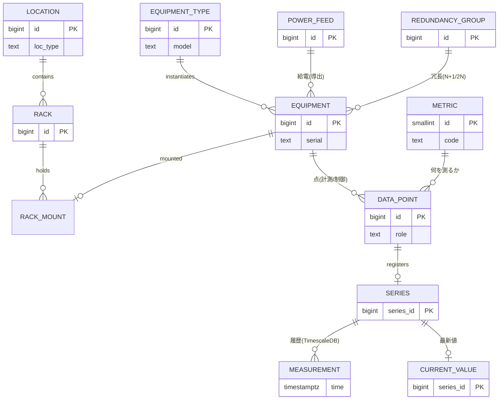
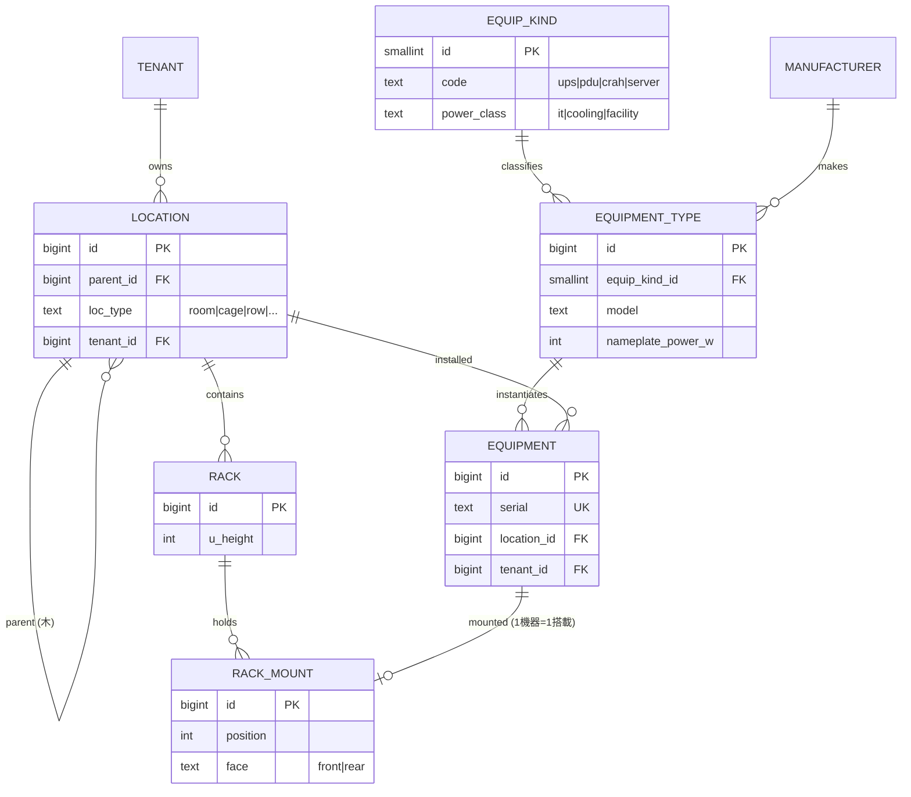
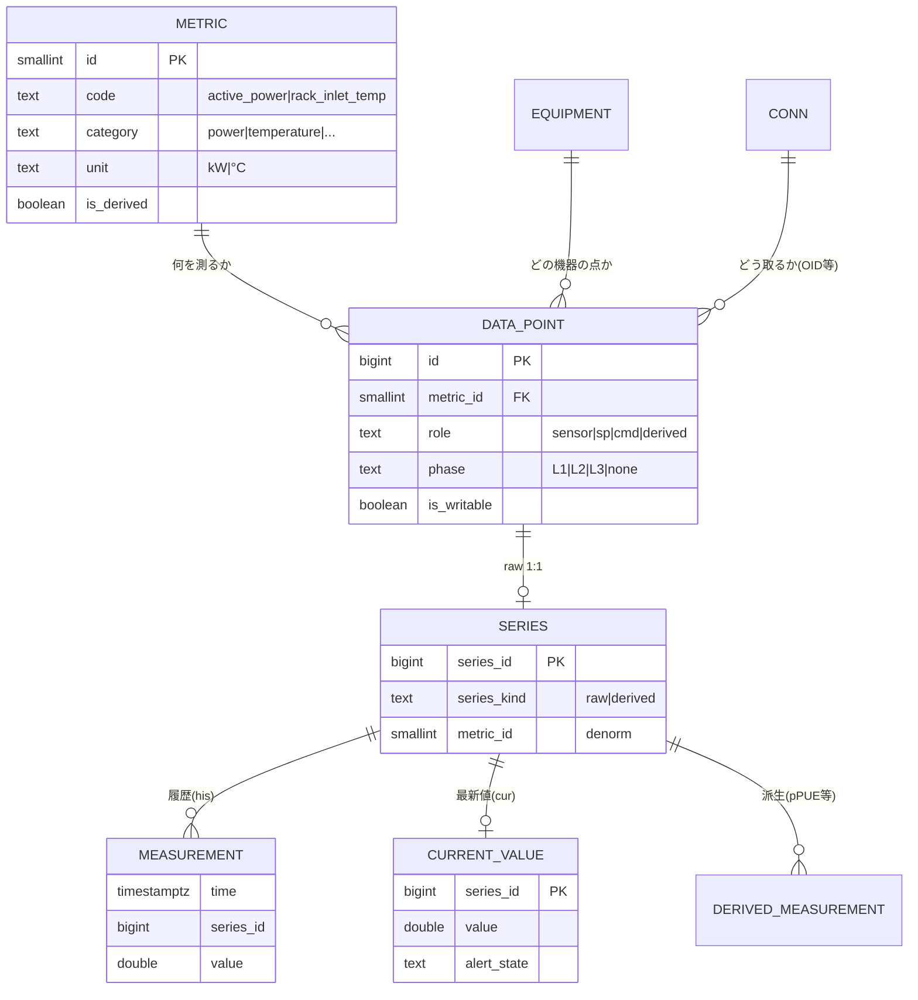
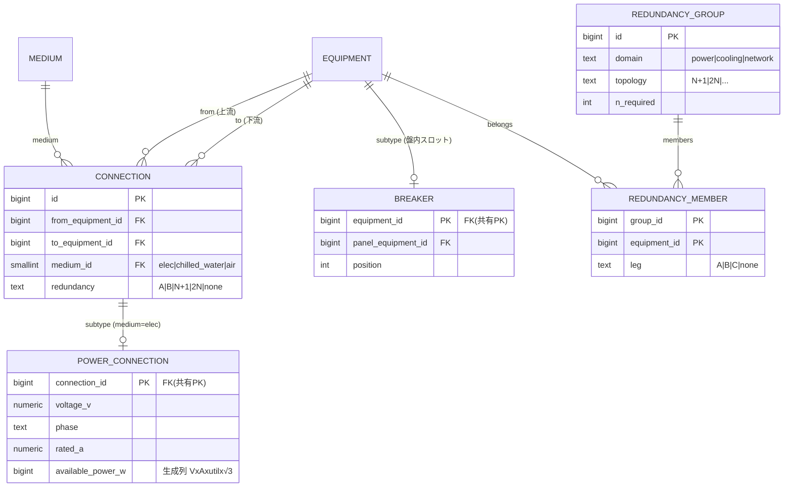
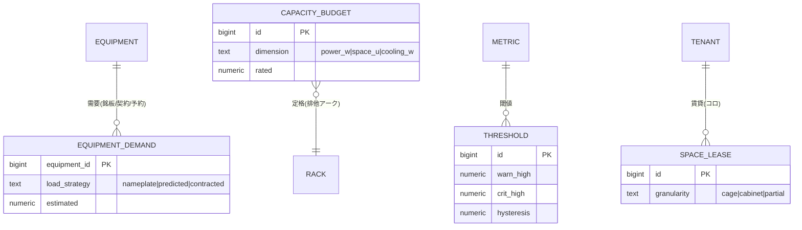

# 00. Overview — チーム共有 & 相互レビュー用

> 初見のメンバーが **ER 図をたどって 10 分で全体像を掴み**、レビューに参加するための概要。各図に短い解説を添える。
> 完全な属性・制約は [03章（確定設計）](./03-finalists.md)、網羅 ER は [05章](./05-er-diagram.md)。

## これは何か

データセンターを統合管理する DCIM パッケージの **RDBMS スキーマ**。構成・資産・配電・冷却・容量はリレーショナルに、
時系列（計測値）は **TimescaleDB** に置く。EMS/BMS/IT を横断し、**ゆくゆく制御（設定値・指令）も視野**に入れる。
狙いは「**ドメイン知識を DB 制約で担保（ゆるい IoT スキーマにしない）**」「**多 DC へ横展開できるパッケージ**」。

---

## 1. 全体スパイン（まずこれ）

中核の流れは2本 ──「**空間に機器が載り、機器に点があり、点が時系列を生む**」と「**機器は配電・冷却され、冗長を組む**」。

**読み方**：左から右へ「場所→ラック→機器」、機器から下に「点→時系列」。`EQUIPMENT_TYPE` は型番（Genome）で、実機 `EQUIPMENT` を生む。
`METRIC` は「何を測るか」のカタログ。配電（`POWER_FEED`）と冗長（`REDUNDANCY_GROUP`）は機器に対して横から効く。
時系列だけ TimescaleDB 側（`series_id` だけが越境し、ここに FK は張らない）。

---

## 2. 空間と資産（どこに・何が在るか）

**解説**：`LOCATION` は Region→…→Row までを1本の**隣接リスト木**で表す（配下集約は閉包テーブルで高速化・[03章L2](./03-finalists.md)）。
`RACK` だけは固定アンカーで専用表にし、U の物理重なりは占有U行＋複合 UNIQUE で DB が禁止する。
**型番 `EQUIPMENT_TYPE`（EcoStruxure の Genome 相当）と実機 `EQUIPMENT` を分離**し、新機種はデータ追加だけで増やせる（DDL 不要）。
`EQUIP_KIND` は機器の種類（UPS/PDU/CRAH…）を分類し、`power_class` で pPUE の IT/施設を判別する。

---

## 3. 計測（何を・どう取り・どう貯めるか）

**解説**：「何を測るか」は **`METRIC` という1つのフラットなカタログ**（量・単位・型を1行に。`rack_inlet_temp` のように位置も
コードに織り込む）。`DATA_POINT` が「その機器のその metric を、どの**役割**(sensor/設定値 sp/指令 cmd)で、どの相で取るか」を表し、
コネクタ `CONN` 経由で OID 等にマップする。**役割を点の属性にしたことで、同じ量の「実測センサ／設定値／指令」が自然に共存**でき、
ゆくゆくの制御に開いている。時系列は履歴 `MEASUREMENT`(hypertable) と最新値 `CURRENT_VALUE` に分け、`SERIES` 台帳が両者と点を結ぶ。
pPUE 等の派生値も `is_derived` な metric として同じ枠で流す（[10章](./10-room-group-derived-metrics.md)）。

---

## 4. 配電・冷却・冗長（どう供給され、どう冗長か）

**解説**：受電設備・変圧器・UPS・盤・breaker・PDU は**すべて `EQUIPMENT` ノード**で、その間を **汎用 `CONNECTION`（`medium` 付き）
＋ 電気サブタイプ `POWER_CONNECTION`（PK 共有）** で結ぶ ── 受電→変圧器→UPS→分電盤→PDU→ラックのチェーンがグラフになる。
「どの機器がどの機器に給電/冷却するか」の多段トレースは、この `CONNECTION` グラフを辿る**導出ビュー `v_equip_flow`**で得る（手で別グラフを持たない）。
冷却も同じ `CONNECTION`（medium=chilled_water/air）で表す（将来 `cooling_connection` サブタイプ）。
**冗長は `REDUNDANCY_GROUP` ＋メンバーで「意図」を一級に持つ**：N+1/2N とメンバー（A系/B系の `leg`）を宣言し、
「2N の A/B が本当に独立電源か（SPOF 検出）」「N+1 で1台落ちても容量が足りるか」を**物理（v_equip_flow/容量）と突き合わせて検証**する。

---

## 5. 容量・監視・テナント（運用の制約）

**解説**：容量は WP-150 の5要素（空間/電力/電力分配/冷却/冷却分配）＋重量/ポートを `CAPACITY_BUDGET`(定格) と
`EQUIPMENT_DEMAND`(需要) で持ち、**stranded = 予約 − 実測**（死蔵容量）を出す。需要は推定負荷戦略（銘板/予測/コロ契約）で評価。
監視は `THRESHOLD`（severity と hysteresis）。テナント/コロは加算モジュール（cage 境界・契約電力・賃貸 `SPACE_LEASE`・[08章](./08-tenancy-colocation.md)）。
`CAPACITY_BUDGET`/`THRESHOLD` のスコープは多態キーでなく**排他アーク FK**（対象ごとに NOT NULL FK＋「ちょうど1つ」）で参照整合を保つ。

---

## 主要な設計判断（なぜこの形か・[02章](./02-candidate-patterns.md)）

| 判断 | 採用 | 一言 |
|---|---|---|
| 点の定義 | **`metric` フラットカタログ** | 量・単位・型を1行。位置はコードに織り込む（〜100 行で爆発しない） |
| 役割 | **`data_point.role`** | 制御を見据え、sensor/sp/cmd を点の属性に |
| connectivity | **物理 path＝真実源、フローは導出** | 並行する別グラフを持たない |
| 冗長 | **`redundancy_group` + member** | 意図(N+1/2N)を持ち、SPOF/容量で物理を検証 |
| スコープ参照 | **排他アーク FK** | 多態キー（type+id）をやめ参照整合を DB に残す（固定3対象） |
| 階層 | **閉包テーブル / 親参照ツリー** | `ltree`/拡張に依存しない（移植可・[09章](./09-portability.md)） |

## ドキュメントの歩き方

| 章 | 内容 |
|---|---|
| [01](./01-research-and-domain.md) | ドメイン知識＋参照モデル調査（EcoStruxure/Haystack/NetBox）＋ reify パターン |
| [02](./02-candidate-patterns.md) | 設計が割れた判断点の比較と採否 |
| [03](./03-finalists.md) | **確定設計（L1〜L10 の ER＋制約）**（必読） |
| [04](./04-validation-queries.md) | 代表ユースケースの検証 SQL |
| [05](./05-er-diagram.md) | 網羅 ER（ドメイン別＋俯瞰） |
| [06](./06-self-review.md) | アンチパターン是正・残課題（必読） |
| [08](./08-tenancy-colocation.md) | テナント/コロ拡張 |
| [09](./09-portability.md) | ポータビリティ（LCD・別エンジン移植） |
| [10](./10-room-group-derived-metrics.md) | 部屋グループ & 派生メトリクス（pPUE） |
| [11](./11-standards-gap-analysis.md) | 標準・法規ギャップ分析 |

## レビューで特に見てほしい点

1. **`metric` カタログの粒度** — 位置/相をコードに織り込む方針で、横断クエリが `category` ＋命名で足りるか。
2. **A/B 系の持ち方** — 導出を真実源とし、多用時に `equipment.power_side` を非正規化する案で良いか。
3. **`redundancy_group` の検証** — 2N 独立性・N+1 容量充足をどこまで自動検証するか。
4. **排他アーク化の範囲** — threshold/capacity_budget 以外に多態キー（type+id）が残っていないか（[06章](./06-self-review.md)）。カスタム属性層（旧 entity_tag）は不採用。
5. **制御（writable）の作り込み度** — 今は `is_writable` フラグでシームのみ。優先配列・write 監査の本実装段階。
