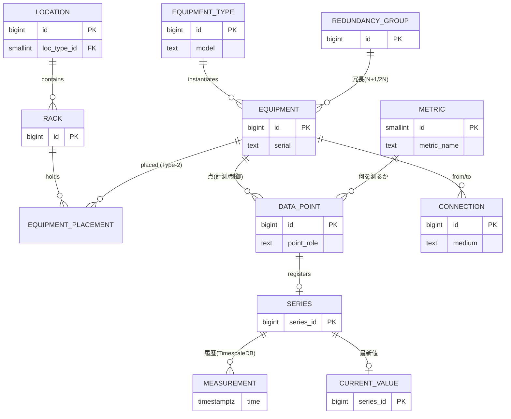
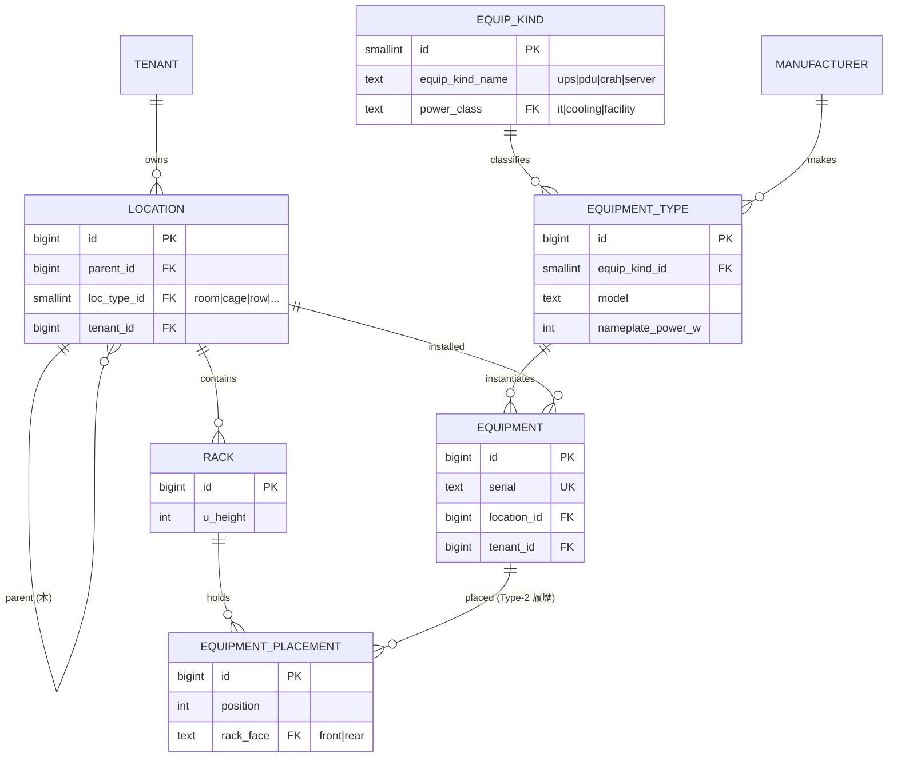
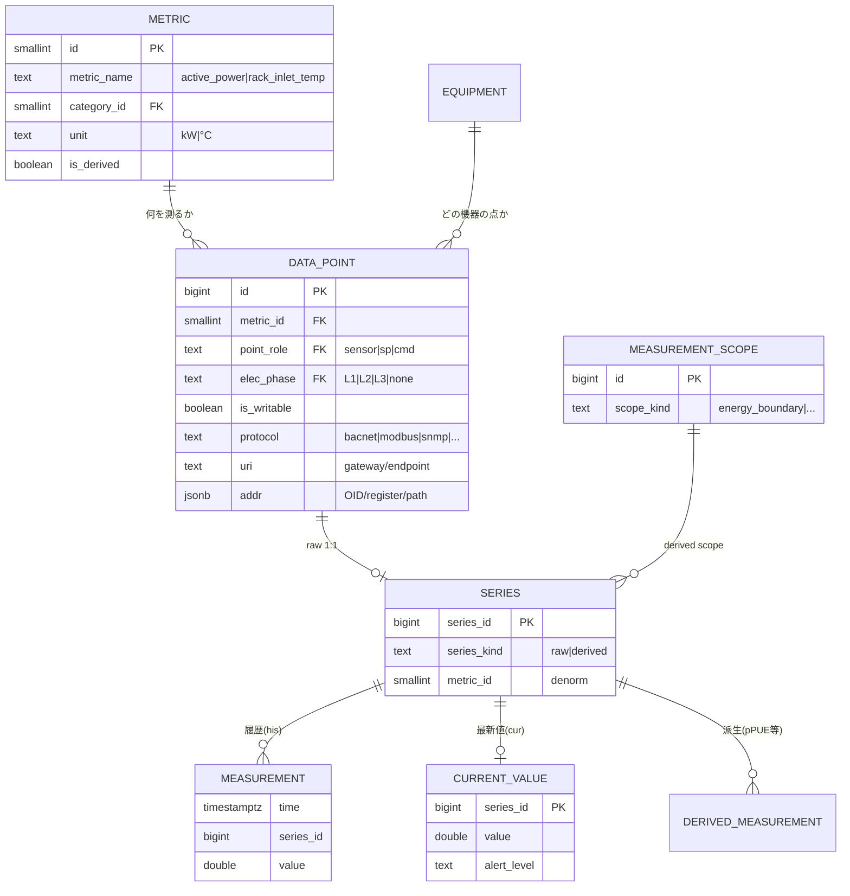
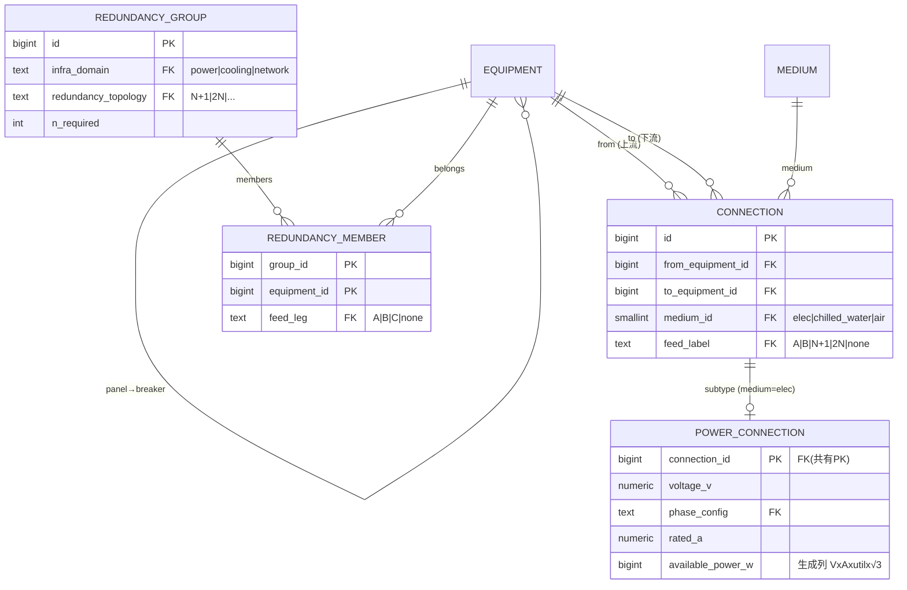
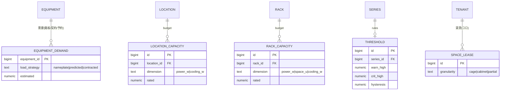
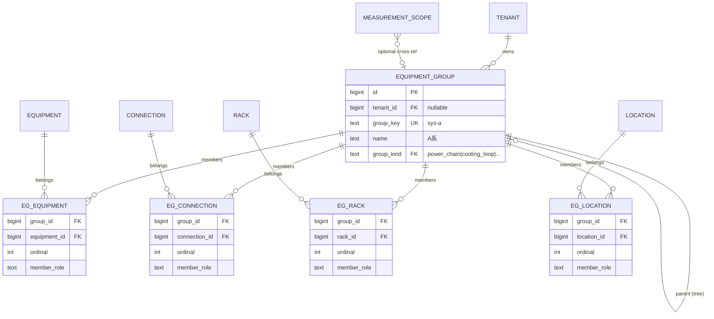

# 00. Overview — チーム共有 & 相互レビュー用

> 初見のメンバーが **ER 図をたどって 10 分で全体像を掴み**、レビューに参加するための概要。
> 各図に短い解説を添える。
> 完全な属性・制約・網羅 ER は [03章（確定設計）](./03-finalists.md)。

## これは何か

データセンターを統合管理する DCIM パッケージの **RDBMS スキーマ**。
構成・資産・配電・冷却・容量はリレーショナルに持ち、時系列（計測値）は **TimescaleDB** に置く。
EMS/BMS/IT を横断し、将来の制御（設定値・指令）も視野に入れる。

狙いは、**ドメイン知識を DB 制約で担保すること**と、**多 DC へ横展開できるパッケージにすること**。
つまり「ゆるい IoT スキーマ」にしない。

---

## 1. 全体スパイン（まずこれ）

中核の流れは2本 ──「**空間に機器が載り、機器に点があり、点が時系列を生む**」と「**機器は配電・冷却され、冗長を組む**」。

**読み方**：左から右へ「場所→ラック→機器」、機器から下に「点→時系列」。
`EQUIPMENT_TYPE` は型番（Genome）で、実機 `EQUIPMENT` を生む。
`METRIC` は「何を測るか」のカタログ。
配電・冷却は `CONNECTION` から導出し、冗長の意図は `REDUNDANCY_GROUP` が持つ。
時系列だけ TimescaleDB 側に置き、`series_id` だけを越境させる（ここに FK は張らない）。

---

## 2. 空間と資産（どこに・何が在るか）

**解説**：`LOCATION` は Region→…→Row までを1本の**隣接リスト木**で表す（配下集約は閉包テーブルで高速化・[03章 L1](./03-finalists.md)）。
`RACK` だけは固定アンカーで専用表にし、U の物理重なりは占有U行＋複合 UNIQUE で DB が禁止する。
`EQUIPMENT.location_id` は設置先の空間を直に指す。
ラック搭載機器はこれに加えて `EQUIPMENT_PLACEMENT` を持ち、ラック ID・U 位置・面を表す。
つまり `location_id` は空間集約用、`equipment_placement` はラック内の物理搭載詳細用。
**型番 `EQUIPMENT_TYPE`（EcoStruxure の Genome 相当）と実機 `EQUIPMENT` を分離**し、新機種はデータ追加だけで増やせる（DDL 不要）。
`EQUIP_KIND` は機器の種類（UPS/PDU/CRAH…）を分類し、`power_class` で pPUE の IT/施設を判別する。

---

## 3. 計測（何を・どう取り・どう貯めるか）

**解説**：「何を測るか」は **`METRIC` という1つのフラットなカタログ**で表す。
量・単位・型を1行に置き、`rack_inlet_temp` のように位置も `metric_name` へ織り込む。
`DATA_POINT` は「その機器のその metric を、どの**役割**(sensor/設定値 sp/指令 cmd)で、どの相で取るか」を表す。
取得アドレスは `DATA_POINT.protocol` / `uri` / `addr` で OID や register へマップする。

役割を点の属性にしたことで、同じ量の「実測センサ／設定値／指令」が自然に共存できる。
時系列は履歴 `MEASUREMENT`(hypertable) と最新値 `CURRENT_VALUE` に分け、`SERIES` 台帳が両者と点を結ぶ。
pPUE 等の派生値も `is_derived` な metric として同じ枠で流す（[10章](./10-measurement-scope-derived-metrics.md)）。
ただし派生値は `DATA_POINT` ではなく、計測スコープに紐づく derived `SERIES` として持つ。

---

## 4. 配電・冷却・冗長（どう供給され、どう冗長か）

**解説**：受電設備・変圧器・UPS・盤・breaker・PDU は**すべて `EQUIPMENT` ノード**として持つ。
breaker は専用表を作らず、`equip_kind='breaker'` の `EQUIPMENT` 行として、親盤・盤内位置・定格を持つ。
その間を **汎用 `CONNECTION`（`medium` 付き）＋ 電気サブタイプ `POWER_CONNECTION`（PK 共有）** で結ぶ。
これにより、受電→変圧器→UPS→分電盤→PDU→ラックのチェーン全体がグラフになる。

「どの機器がどの機器に給電/冷却するか」の多段トレースは、この `CONNECTION` グラフを辿る
**導出ビュー `v_equip_flow`**で得る。手で別グラフを持たない。
冷却も同じ `CONNECTION`（medium=chilled_water/air）で表す（将来 `cooling_connection` サブタイプ）。
**冗長は `REDUNDANCY_GROUP` ＋メンバーで「意図」を一級に持つ**：N+1/2N とメンバー（A系/B系の `feed_leg`）を宣言し、
「2N の A/B が本当に独立電源か（SPOF 検出）」「N+1 で1台落ちても容量が足りるか」を、
**物理（v_equip_flow/容量）と突き合わせて検証**する。

---

## 5. 容量・監視・テナント（運用の制約）

**解説**：容量は WP-150 の5要素（空間/電力/電力分配/冷却/冷却分配）＋重量/ポートを、
種別テーブル分割（`LOCATION_CAPACITY` / `RACK_CAPACITY`）(定格) と `EQUIPMENT_DEMAND`(需要) で持つ。
需要は推定負荷戦略（銘板/予測/コロ契約）で評価し、**stranded = 予約 − 実測**（死蔵容量）を出す。

監視は `THRESHOLD`（series ごとの warn/crit と hysteresis）。
テナント/コロは加算モジュールとして扱う（cage 境界・契約電力・賃貸 `SPACE_LEASE`・[08章](./08-tenancy-colocation.md)）。
容量のスコープは種別テーブル分割（`LOCATION_CAPACITY` / `RACK_CAPACITY`）で表す。スコープごとに専用テーブルを持ち、FK 整合性を DB が担保する。`THRESHOLD` は `series_id` に直結する。
`target_type + target_id` 型の多態キーは使わない。

---

## 6. 論理グルーピング（A系/B系を名前で束ねる）

**解説**：「A系」「北棟冷却ループ」のように、物理階層（location 木）にも冗長意図（redundancy_group）にも
KPI 境界（measurement_scope）にも収まらない**運用上の名前付きグループ**を表す。
メンバーは種別テーブル分割（`EG_EQUIPMENT` / `EG_CONNECTION` / `EG_RACK` / `EG_LOCATION`）で持つ。
種別ごとに専用テーブルを分けることで、FK 整合性を DB が担保する。
connection を含めることで、パワーチェーンのボトルネック分析（`MIN(available_power_w)`）や
A/B 合流点（STS）での正確な系統分離が可能になる。

`measurement_scope`（10 章）は KPI 算出の閉じた境界で、`member_role` 語彙（`input_meter` / `it_load`）や
ライフサイクル（`valid_from`/`valid_to`）が異なるため別テーブル。
scope → group のオプション FK で「このスコープはこのグループに対応する」を緩く結ぶ。
詳細は [14 章](./14-logical-grouping.md)。

---

## 主要な設計判断（なぜこの形か）

| 判断 | 採用 | 一言 |
|---|---|---|
| 点の定義 | **`metric` フラットカタログ** | 量・単位・型を1行。位置は `metric_name` に織り込む（〜100 行で爆発しない） |
| 役割 | **`data_point.point_role`** | 制御を見据え、sensor/sp/cmd を点の属性に |
| 接続 | **物理 connection＝真実源、フローは導出** | 並行する別グラフを持たない |
| 冗長 | **`redundancy_group` + member** | 意図(N+1/2N)を持ち、SPOF/容量で物理を検証 |
| 横断参照 | **種別テーブル分割** | 多態キー（type+id）をやめ、参照先の種別ごとに専用テーブルを分けて FK 整合性を担保する |
| 閾値 | **`threshold.series_id`** | 評価対象の `current_value.series_id` に直結し、既定値は series 作成時に展開 |
| 論理グルーピング | **equipment_group（14章）** | 運用上の名前付きグループ。measurement_scope / redundancy_group とは別概念・別テーブル |
| 階層 | **閉包テーブル / 親参照ツリー** | `ltree`/拡張に依存しない（移植可・[09章](./09-portability.md)） |

## ドキュメントの歩き方

| 章 | 内容 |
|---|---|
| [01](./01-research-and-domain.md) | ドメイン知識＋参照モデル調査（EcoStruxure/Haystack/NetBox）＋ reify パターン |
| [03](./03-finalists.md) | **確定設計（L1〜L9 の ER＋全体俯瞰＋制約）**（必読） |
| [04](./04-validation-queries.md) | 代表ユースケースの検証 SQL |
| [08](./08-tenancy-colocation.md) | テナント/コロ拡張 |
| [09](./09-portability.md) | ポータビリティ（LCD・別エンジン移植） |
| [10](./10-measurement-scope-derived-metrics.md) | 計測スコープ & 派生メトリクス（pPUE） |
| [11](./11-standards-gap-analysis.md) | 標準・法規ギャップ分析 |
| [12](./12-ecostruxure-schema-research.md) | EcoStruxure IT スキーマ調査 |
| [13](./13-raw-vs-derived-telemetry.md) | raw / derived テレメトリの区別 |
| [14](./14-logical-grouping.md) | 論理グルーピング（A系/B系・冷却ループ等） |

## レビューで特に見てほしい点

1. **`metric` カタログの粒度** — 位置/相を `metric_name` に織り込む方針で、横断クエリが `metric_category` ＋命名で足りるか。
2. **A/B 系の持ち方** — `connection` グラフからの導出（v_equip_flow）に加え、運用名は `equipment_group`（14章）で持つ。集計・ボトルネック分析・保守計画に使う。
3. **`redundancy_group` の検証** — 2N 独立性・N+1 容量充足をどこまで自動検証するか。
4. **横断参照の範囲** — equipment/connection/rack/location を指す箇所が種別テーブル分割で統一されているか。カスタム属性層（旧 entity_tag）は不採用。
5. **制御（writable）の作り込み度** — 今は `is_writable` フラグで拡張点だけを用意している。優先配列・write 監査は本実装段階で決める。
