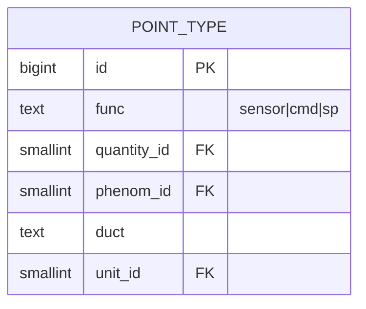
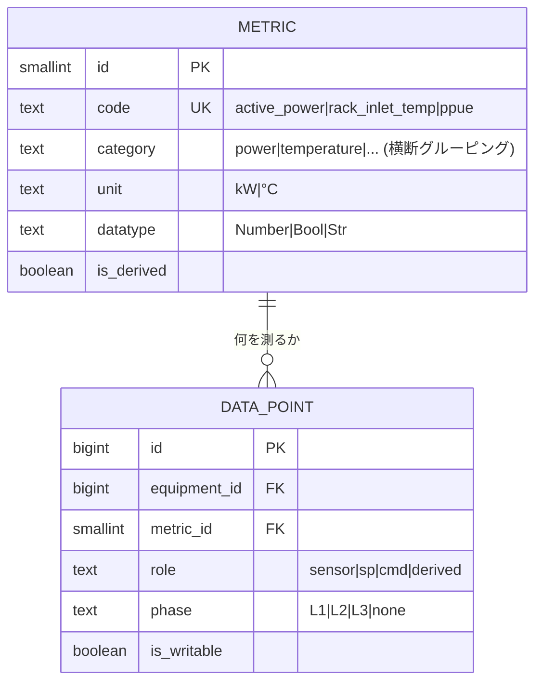
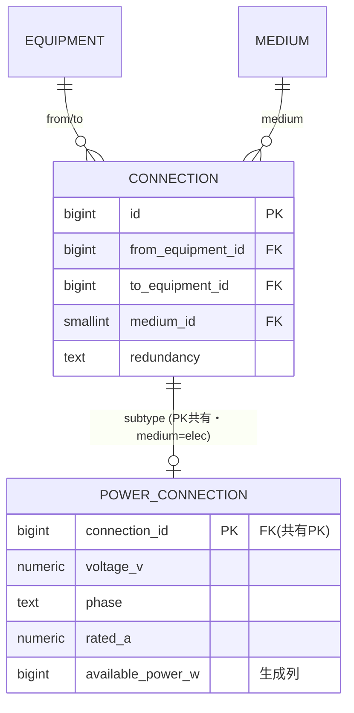
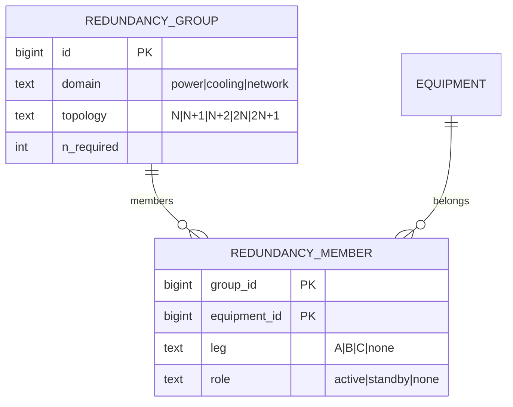

# 02. 設計判断 — 悩みどころの数パターン比較

[01章](./01-research-and-domain.md) のドメイン知識・参照モデル調査・RDBMS パターンを踏まえ、**設計が割れる判断点**を
2〜3 パターンずつ比較し採否を決める。確定 DDL/ER は [03章](./03-finalists.md)、全体 ER は [05章](./05-er-diagram.md)。

> **基本姿勢**: データセンターの実体モデルを関係的に持ち、分類は参照表 FK で添える。Haystack/Brick は*発想の参考*に留め、
> メタモデル（万能 def / 多重継承 DAG /「何でも指せる」ref）は持ち込まない。
>
> **表記方針**: 各案の構造は **Mermaid ER 図**で示す（属性は1属性1行）。CHECK 等の明示が要る所だけ SQL を併記。
> 評価軸: **D=ドメイン制約の強さ / F=可変性 / P=ポータビリティ（LCD・[09章](./09-portability.md)）/ C=実装運用コスト**。

| # | 判断点 | 採用 |
|---|--------|------|
| B | 点の定義 | **B2 フラット `metric` カタログ**（3軸 point_type を廃止） |
| C | 電力/冷却の表現 | **C3 物理＝真実源 + 導出フロー**（並行グラフを持たない） |
| D | 機器種別の階層 | **D1 親参照ツリー**（DAG はオプション） |
| E | スコープ参照 | **E2 排他アーク FK**（多態キーを廃止） |
| F | 冗長構成 | **F2 `redundancy_group` + member**（意図を一級に） |

---

> **判断 A（長尾属性/カスタム属性の格納）は廃止** — カスタム属性層（旧 `tag_def`/`entity_tag`）は初盤のスコープ外とし不採用。
> 必要になれば、関係的スーパータイプ（共通基底表への FK）で整合を保ったまま後付けする（型なし多態 `type`+`id` は採らない）。

---

## 判断 B — 点の定義（最重要の簡素化）

「何を測るか」をどうモデル化するか。Haystack 流の3軸合成（機能×量×主体）か、フラットなカタログか。

### B1. 3軸 point_type カタログ（却下）

`point_type(func, quantity_id, phenom_id, duct, unit_id, ...)` の組合せ表。



- D=3 / F=3 / P=4 / C=2。**却下理由**: (1) DCIM には過剰（HVAC/BMS 由来の精密合成は不要）、(2) `func` は型でなく**点の役割＝インスタンス属性**のはず、(3) `kind`/`unit` は量に関数従属し組合せ行に置くと更新異常、(4) nullable な phenom/duct を含む UNIQUE は NULL を異物扱いせず**重複防止が破れる**。

### B2. フラット `metric` カタログ（★採用）

量・単位・型・既定集約を1行に。medium/位置（吸気/排気・冷水往/還）は**コードに織り込む**（`rack_inlet_temp`）。役割・相は `data_point` 側へ。



```sql
-- 1機器内で同義の点は1つ（全列 NOT NULL でキーが確実に効く）
DATA_POINT: UNIQUE (equipment_id, metric_id, role, phase)
```

- D=5 / F=5 / P=5 / C=5 → **B2**。単位整合は metric が単位を1つ持つことで自動成立（読み値は単位を持たない）。横断は `category` 1列。
  **役割を `data_point.role` にしたことで、同一機器・同一量で「実測センサ／設定値 sp／指令 cmd」が共存**でき、制御に開いている。
  DCIM の点は数えられる量（〜100）なので組合せ爆発も起きない（Redfish/Prometheus と同じ作法）。

---

## 判断 C — 電力/冷却の表現

受電→変圧器→UPS→変圧器→分電盤→PDU→rack の**電力チェーン全体**（と冷却チェーン）をどう持つか。専用テーブル群か、汎用接続か。

| 案 | 方式 | D | F | P | C | 判定 |
|---|---|---|---|---|---|---|
| C1 | 専用テーブル群（power_panel/breaker/power_feed） | 4 | 3 | 5 | 3 | ✕ 末端の分岐回路しか表せず上流チェーン（受電/変圧器/UPS）を欠く |
| C2 | 型なし多態の汎用エッジ | 3 | 5 | 4 | 4 | ✕ 参照整合が DB 外 |
| **C3** | **`equipment` ノード + 汎用 `connection`(medium) + 電気サブタイプ `power_connection`(CTI)** | 5 | 5 | 5 | 4 | **★採用** |



> 受電設備・変圧器・UPS・盤・breaker・PDU は**すべて `equipment` ノード**、その間を `connection`（汎用エッジ・`medium`）で結ぶ。電気固有
> （電圧/相/定格A/供給可能W）は **`power_connection` サブタイプ（PK 共有 CTI）**に型付きで（nullable スパース回避）。`power_feed` は廃止（吸収）。
> 多段トレース・A系B系・dual-cord・SPOF は `connection` を辿る **`v_equip_flow`（導出ビュー）**で（基底エッジ1つ＋ビュー1つ＝真実源は1つ）。
> 冷却も同じ `connection`（medium=chilled_water/air）で、将来 `cooling_connection` サブタイプを同型追加。

---

## 判断 D — 機器種別の階層（tree か DAG か）

機器分類（UPS/PDU/CRAH…）に階層を持たせ「全 HVAC」を引きたい。多重継承（DAG）は要るか。

| 案 | 方式 | D | F | P | C | 判定 |
|---|---|---|---|---|---|---|
| **D1** | **`equip_kind.parent_id` 親参照ツリー**（読み多なら閉包） | 4 | 5 | 5 | 5 | **★採用** |
| D2 | DAG 閉包（多重親・path_count） | 5 | 5 | 5 | 2 | △ 実需が出たら拡張 |

> DCIM の機器分類は実用上ほぼツリー。多重継承は稀で、必要になったら D2（閉包＋path_count）へ拡張。Haystack の DAG は内部に持ち込まない。

---

## 判断 E — スコープ参照（多態キー vs 排他アーク）

`threshold`（metric/equipment/location）/ `capacity_budget`（location/rack）は「どの対象を指すか」が複数あり得る。どう参照整合を保つか。

| 案 | 方式 | D | P | 判定 |
|---|---|---|---|---|
| E1 | 多態キー `(scope_type, scope_id)` | 2 | 5 | ✕ 実 FK が張れない（Karwin アンチパターン） |
| **E2** | **排他アーク**（対象ごと nullable FK ＋「ちょうど1つ」CHECK） | 5 | 5 | **★採用** |

```sql
THRESHOLD: metric_id FK NULL, equipment_id FK NULL, location_id FK NULL,
           CHECK ( num_nonnull(metric_id, equipment_id, location_id) = 1 )   -- 実FKで整合
```

> 「DB が弾く」思想で参照整合を DB の外にこぼさない。08章 `space_lease`（suite/cage→location, cabinet→rack）で既出の手法を横展開。

---

## 判断 F — 冗長構成（A/B 系・N+1/2N の組）

UPS の A系/B系、N+1 の CRAH バンク等の「冗長な機器の組」をどう管理するか。

| 案 | 方式 | 判定 |
|---|---|---|
| F1 | 機器に冗長属性を直付け / 物理から都度導出のみ | △ 「意図（N+1/2N）」が持てない |
| **F2** | **`redundancy_group` + `redundancy_member`(leg/role)** | **★採用** |



> 冗長の**意図**を第一級に持ち（room_group と同じ群+所属パターン）、物理（A/B が独立電源か＝SPOF、N+1 が容量充足か）と
> **突き合わせて検証**する（intent×reality）。A/B 系の所属自体は物理 path から導出（多用時のみ `equipment.power_side` を非正規化）。

---

## まとめ — 採用構成

| 判断 | 採用 | 一言 |
|------|------|------|
| B 点の定義 | **フラット `metric` カタログ** | 量・単位・型を1行、役割/相は data_point へ |
| C 電力/冷却 | 物理＝真実源 + 導出フロー | 並行グラフを持たない（v_equip_flow） |
| D 階層 | 親参照ツリー | DAG はオプション |
| E スコープ参照 | 排他アーク FK | 多態キー廃止で参照整合を DB に残す |
| F 冗長 | `redundancy_group` + member | 意図を持ち物理で検証 |

確定 DDL/ER は [03章](./03-finalists.md)、全体 ER は [05章](./05-er-diagram.md)、検証クエリは [04章](./04-validation-queries.md)。
