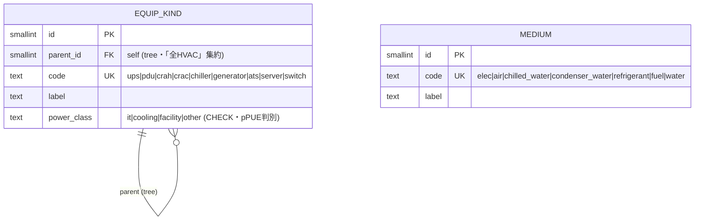
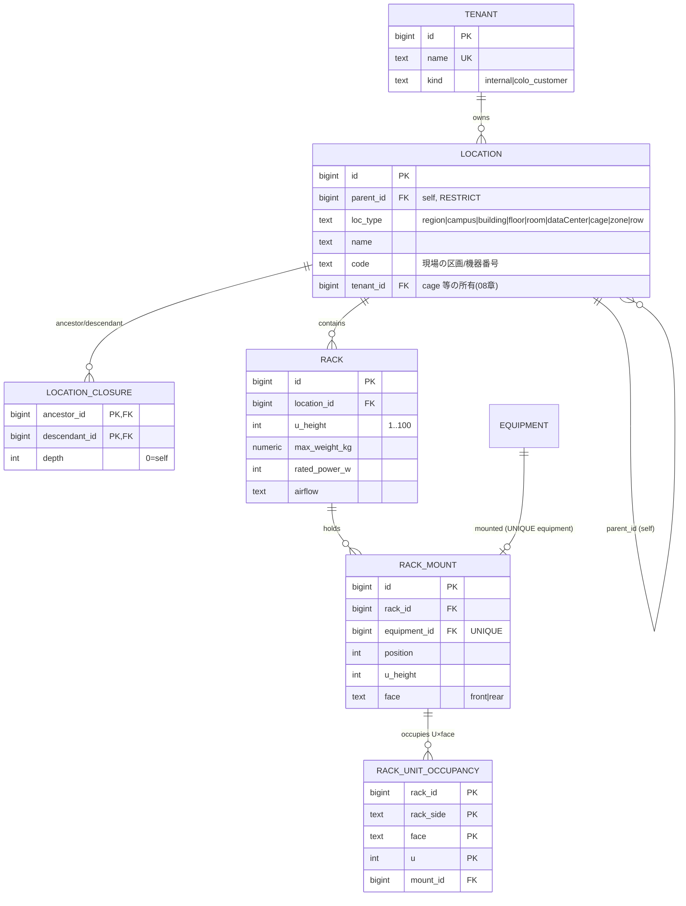
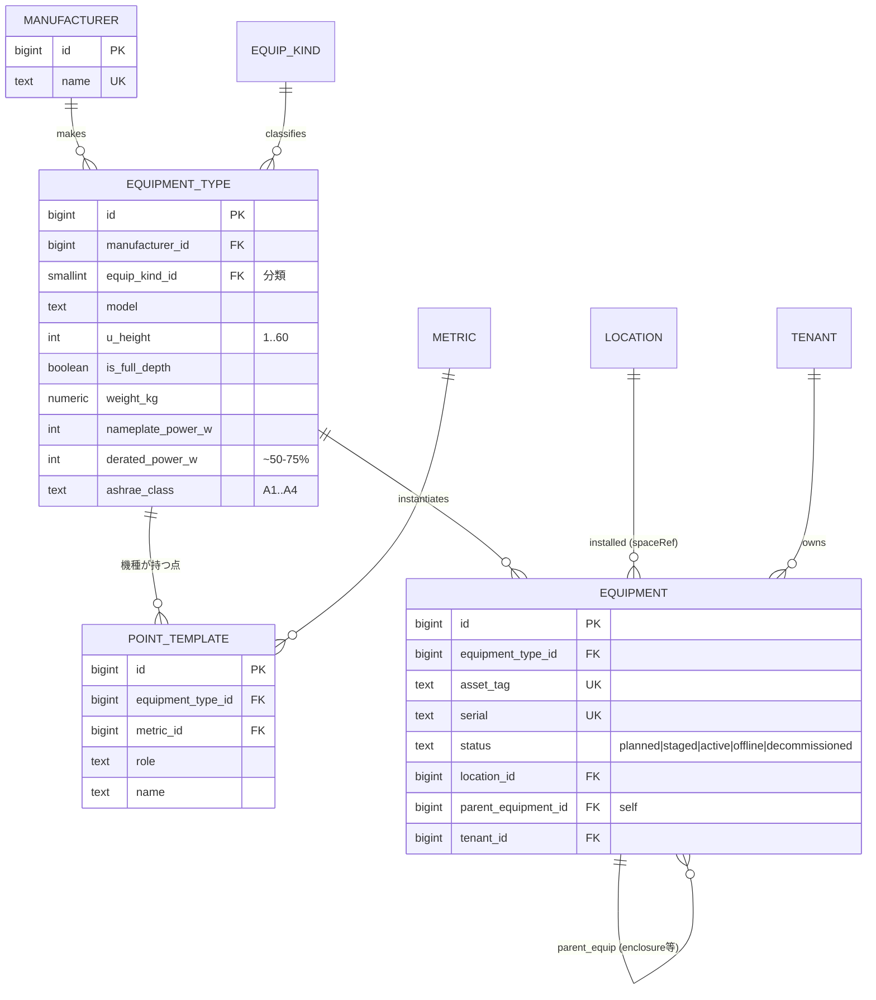
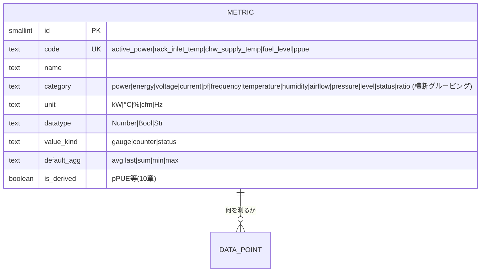
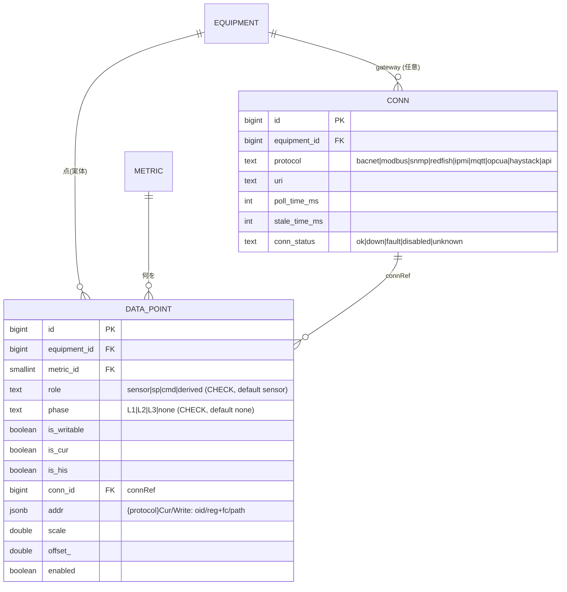
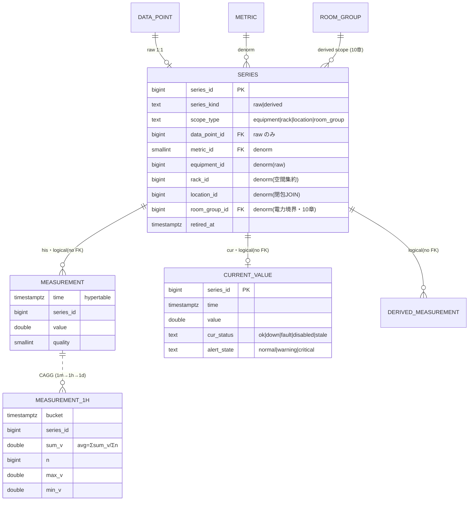
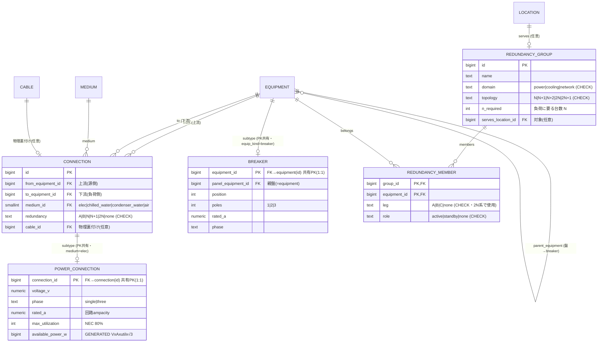
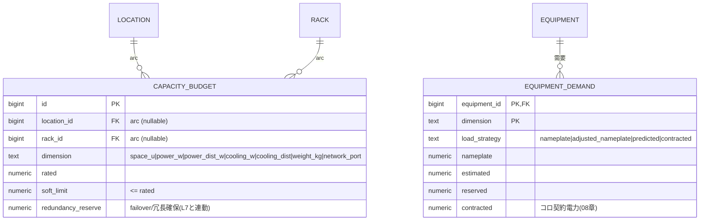
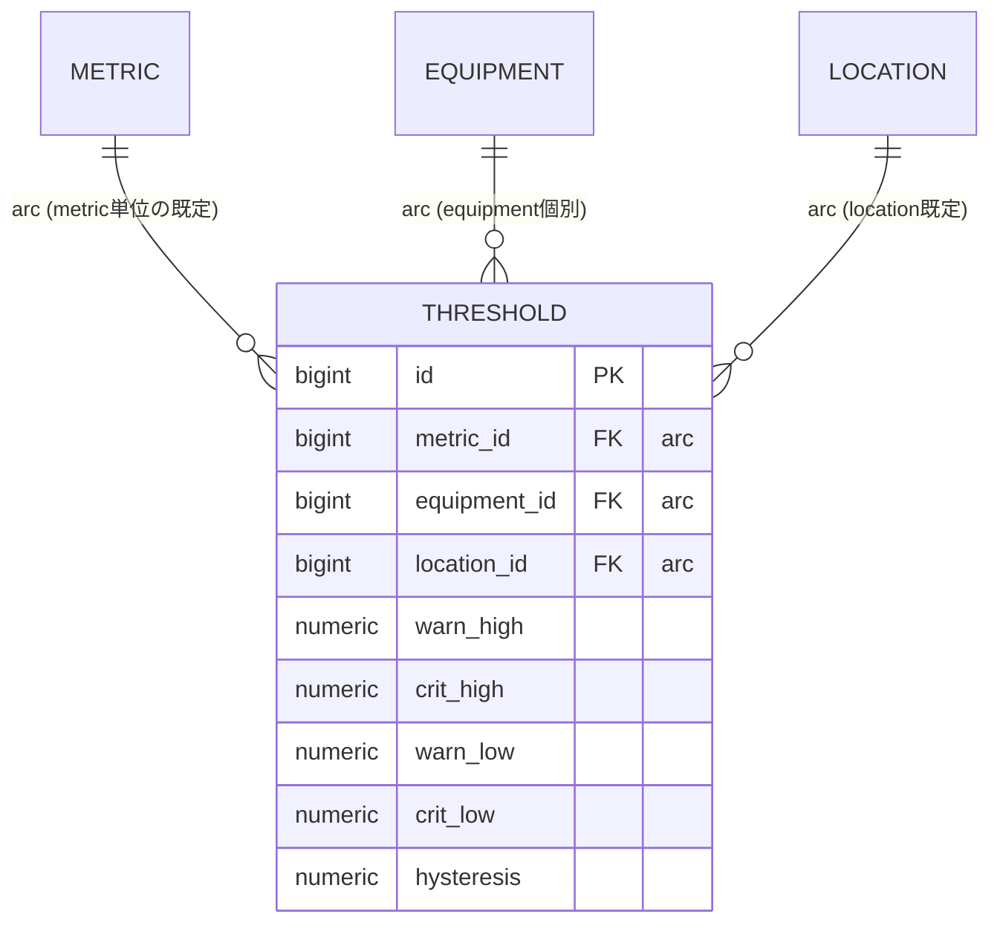

# 03. 確定設計 — Semantic-Typed DCIM

DCIM パッケージの RDBMS スキーマ確定案。**EcoStruxure IT のドメインモデル**（power path / Genome / 容量 / 冷却 / 冷長）を
型付きで取り込み、必要な意味づけだけを**素直な参照表＋FK**で持つ。通奏低音は「**ゆるい IoT スキーマにせず、
ドメイン知識を DB 制約で担保する**」（[01章](./01-research-and-domain.md)）。判断の経緯は [02章](./02-candidate-patterns.md)、全体俯瞰は [05章](./05-er-diagram.md)、
初見者向け概要は [00章](./00-overview.md)。

## 設計の骨子

中核は**データセンターの実体モデル**（空間・資産・配電・冷却・容量・計測）を関係モデルで持ち、ドメイン制約を DB に効かせること。
意味づけ（種類・量）は素直な**参照表＋FK**で添える。実装上の指針（判断根拠は [02章](./02-candidate-patterns.md)）:

- **connectivity の真実源は1つ** — 物理 path（`panel→breaker→feed→port→cable`）を真実源とし、電力フロー / A系B系 / dual-cord は
  そこから**導出**する（並行する別グラフを手で維持しない）。
- **分類は参照表への FK** — 種類・量は `equip_kind` / `metric` への FK で貼る（EAV や汎用オントロジにしない）。
- **Haystack/Brick は発想の参考**で互換は必須にしない（必要なら境界で後付けマッピング）。汎用 def / 多重継承 DAG /「何でも指せる」ref は持ち込まない。

> **表記方針**: テーブルは **Mermaid ER 図**で示す。CHECK 制約・生成列・複合 FK・排他アークなど ER で表せない
> ドメイン制約のみ SQL 抜粋を併記する。

> **横断制約**: **LCD（[09章](./09-portability.md)）**＝拡張は timescaledb のみ・PG 固有機能に依存しない。
> **マルチテナント/コロ（[08章](./08-tenancy-colocation.md)）**＝ `tenant` 所有・`cage` 境界・contracted power を加算。

```
L1 参照カタログ   equip_kind(tree) / medium（分類・FKで貼るだけ）
L2 空間           location 木(+closure) / rack / 占有U行
L3 資産           equipment_type(Genome) → equipment（定義/実体分離）
L4 メトリック     metric（フラットカタログ：何を・単位・型・既定集約）
L5 収集           conn + data_point（equipment×metric×role×phase + 取得アドレス）
L6 時系列         series 台帳 / measurement(his) / current_value(cur) / CAGG / derived(pPUE:10章)
L7 電力・冷却・冗長 equipment ノード ＋ connection/power_connection(CTI) ＋ redundancy_group / v_equip_flow(導出)
L8 容量           capacity_budget / equipment_demand（WP-150 × 推定負荷戦略・排他アーク）
L9 監視           threshold（severity / hysteresis・排他アーク）
```

---

## L1. 参照カタログ — 分類（FK で貼るだけ）

分類用の小さな参照表は2つだけ。機器の種類（`equip_kind`）と媒体（`medium`）。汎用 def も DAG も持たない。



> `equip_kind` は機器分類のツリー（多重継承の実需が出たら閉包へ拡張・[02章D](./02-candidate-patterns.md)）。`medium` は L7 の
> 電力/冷却フローの媒体に使う。固定の小集合（role/phase/dimension/severity 等）は各所で **CHECK enum** とし、テーブルを作らない。

---

## L2. 空間層

`location` 隣接リスト＝真実源 ＋ `location_closure`（`ltree` 不使用 LCD）。`rack` は固定アンカー。U 物理重なり禁止は
**占有U行＋複合UNIQUE**（拡張ゼロ LCD）。



```sql
CHECK ( loc_type IN ('region','campus') OR parent_id IS NOT NULL )      -- ルート以外は親必須
-- U: position + u_height - 1 <= rack.u_height は CONSTRAINT TRIGGER（親値参照）
-- フルデプス機器は front/rear 両面に占有U行 → 片面機器と必ず衝突（複合PKで原子的拒否）
```

---

## L3. 資産層 — Genome（equipment_type）→ 実機（equipment）

EcoStruxure の **Genome = 型番テンプレート** → 実機インスタンス化（NetBox 流 定義/実体分離）。`equip_kind` FK で意味づけ。



> `UNIQUE (manufacturer_id, model)` で型番一意、`serial`/`asset_tag` で個体一意。`point_template` は機種が持つ点の雛形で、
> 実機作成時に `data_point`（L5）へ展開。**「意味ある点の組合せ」はここ（機種）に在る** ── グローバルな意味カタログを作らない。

---

## L4. メトリック — フラットカタログ

「何を測るか」は**1つのフラットなカタログ**。量・単位・データ型・既定集約を1行に持つ。medium/position（吸気/排気・冷水往/還）は
**コードに織り込む**（`rack_inlet_temp` / `chw_supply_temp`）。Redfish/Prometheus/EcoStruxure と同じ作法で、DCIM の点は数えられる量（〜100）。



> 単位整合は **metric 行が単位を1つ持つ**ことで成立（読み値は単位を持たないので「power に °C」は起こり得ない）。横断は `category` 1列
> （「全温度点」= `category='temperature'`）。旧 3軸（quantity×phenomenon×func×duct のカタログ）は**廃止**（[02章B](./02-candidate-patterns.md)）。

---

## L5. 収集 — conn + data_point（equipment×metric×role×phase）

点（`data_point`）= ある機器のある metric を、ある**役割**で、ある**相**で取得する設定。Haystack コネクタ規約（`{protocol}Cur/His/Write`）を
`conn`＋`data_point` に正規化。`role` で sensor / sp（設定値）/ cmd（指令）/ derived を区別 ── **制御を見据えた一級の軸**。



```sql
-- 1機器内で同義の点は1つ。キー列は全て NOT NULL（phase は 'none' センチネル）→ UNIQUE が確実に効く
UNIQUE (equipment_id, metric_id, role, phase)
-- 例(CRAH): (温度,supply,role=sensor) 実測 / 同 (role=sp, is_writable) 設定 / (percent,role=cmd) ファン指令 が共存
-- writable の 16+1 段優先配列は制御本実装時に別表 write_level。今は is_writable フラグでシームのみ
```

---

## L6. 時系列 — his(measurement) / cur(current_value) / 派生(10章)

his＝`measurement` hypertable、cur＝`current_value`。Narrow＋`series` 台帳（`series_id` だけ TSDB へ越境・FK 越境なし [09章](./09-portability.md)）。



```sql
CHECK ( (series_kind='raw' AND data_point_id IS NOT NULL AND scope_type='equipment')
     OR (series_kind='derived' AND data_point_id IS NULL) )
```

> ロールアップ・派生 hypertable・部屋グループは [10章](./10-room-group-derived-metrics.md)。圧縮 `compress_segmentby=series_id`・retention は [09章](./09-portability.md)。

---

## L7. 電力・冷却・冗長 — equipment グラフ ＋ 接続（CTI）＋ 冗長グループ

受電設備・変圧器・UPS・発電機・盤(panel)・breaker・PDU はすべて **`equipment` ノード**。その間の接続を **汎用 `connection`
（`medium` 付きエッジ）＋ 電気サブタイプ `power_connection`（PK 共有 CTI）** で表す。これで **受電→変圧器→UPS→変圧器→分電盤→
PDU→rack/機器**のチェーン全体がグラフになる（`power_feed` は廃止＝その役割を connection＋power_connection が吸収）。
`v_equip_flow` はこのグラフを辿る**導出ビュー**。冗長の**意図**は `redundancy_group`（room_group と同じ群+所属）。
breaker は equipment の薄いサブタイプ（盤内スロット）。



```sql
CONNECTION:        CHECK (from_equipment_id <> to_equipment_id)
POWER_CONNECTION:  available_power_w = round(voltage_v*rated_a*max_utilization/100.0
                                     * CASE WHEN phase='three' THEN 1.732 ELSE 1 END)::bigint  -- STORED
BREAKER:           UNIQUE (panel_equipment_id, position)
-- 例: 受電設備 -[elec]-> 変圧器 -[elec]-> UPS -[elec]-> 変圧器 -[elec]-> 分電盤 -[elec]-> PDU -[elec]-> rack/機器
-- v_equip_flow = connection を辿る再帰ビュー（medium で絞る）。上流トレース/A・B系/SPOF はこの上で（[04章]）
-- CTI 整合: connection.medium='elec' ⟺ power_connection 行あり / equip_kind='breaker' ⟺ breaker 行あり → サービス層検証
-- 将来: 冷却サブタイプ `cooling_connection`（flow・往/還温度）を同型で追加（基底 connection は無改造）
-- A/B 系は connection.redundancy ＋ v_equip_flow 由来。多用時 equipment.power_side を非正規化(構成変更時に再計算)
-- redundancy 検証(intent×reality): 2N は leg=A/B が独立 root か(SPOF・[04章UC-5])、N+1 は 1台落ちても容量充足か(L8)
```

---

## L8. 容量 — WP-150 × 推定負荷戦略（排他アーク）

容量5要素（空間/電力/電力分配/冷却/冷却分配）＋重量/ポート。需要は推定負荷戦略で評価し **stranded = reserved − actual**。
スコープ（location/rack/breaker）は**多態キーをやめ排他アーク FK**で参照整合を担保。



```sql
-- 排他アーク: スコープ対象はちょうど1つ（多態キー(scope_type,scope_id)を廃止し実FKで整合）
CAPACITY_BUDGET: CHECK ( num_nonnull(location_id, rack_id) = 1 )   -- 回路容量は power_connection.available_power_w / breaker.rated_a が持つ
-- 過剰容量分類(spare/idle/safety/stranded/active・WP-150)・「予約 ≤ rated」「負荷 ≤ 回路(power_connection.available_power_w)」は監視ビュー/サービス層([09章])
```

---

## L9. 監視 — threshold（severity / hysteresis・排他アーク）

severity は informational/warning/critical、しきい値 high/low、hysteresis でチャタリング抑制。スコープは排他アーク FK。



```sql
CHECK ( num_nonnull(metric_id, equipment_id, location_id) = 1 )    -- 排他アーク
CHECK (crit_high IS NULL OR warn_high IS NULL OR crit_high >= warn_high)
-- 評価優先: equipment > location > metric既定。alert_state は current_value に同居(L6)
```

---

## 効くドメイン制約（まとめ）

| 制約 | 実装 | 由来 |
|------|------|------|
| 単位整合（power に °C 不可） | `metric` 行が単位を1つ保持（読み値は単位を持たない） | フラットカタログ |
| 1機器に同義の点は1つ | `data_point UNIQUE(equipment,metric,role,phase)`（全列 NOT NULL） | — |
| 制御の役割区別 | `data_point.role`（sensor/sp/cmd/derived） | EcoStruxure/BMS |
| 「全 HVAC / 全 UPS」集約 | `equip_kind.parent_id` ツリー（DAG はオプション） | — |
| ブレーカ位置・容量 | `breaker`(equipment subtype) `UNIQUE(panel,position)` + `rated_a` | EcoStruxure power path |
| 供給可能電力 = V×A×util×√3 | `power_connection.available_power_w`（生成列・bigint） | NEC + 三相 |
| 電力チェーンの表現 | `connection`(汎用エッジ・medium) ＋ `power_connection`(電気サブタイプ・PK共有) | 受電→変圧器→UPS→盤→PDU→rack |
| U 物理重なり禁止 | 占有U行 + 複合UNIQUE（拡張ゼロ） | LCD（09章） |
| 冗長の意図と検証 | `redundancy_group` + member（leg/role）→ SPOF/容量で reality 検証 | EcoStruxure 冗長 |
| スコープ参照の整合 | `capacity_budget`/`threshold` の**排他アーク FK**（固定対象・多態キー廃止） | 関係設計 |
| 電力/冷却フロー・A/B系 | `connection` グラフからの**導出**（v_equip_flow）。並行グラフを持たない | 真実源を1つに |

> 集約制約（予約 ≤ 定格・SPOF・温湿度逸脱・冗長充足）は行間集約のため**サービス層/監視ビュー**で担保
> （移植性のため DB トリガに依存させない・[09章](./09-portability.md)）。検証クエリは [04章](./04-validation-queries.md)。
