# 03. 確定設計 — Semantic-Typed DCIM

DCIM パッケージの RDBMS スキーマ確定案。
**EcoStruxure IT のドメインモデル**（power path / Genome / 容量 / 冷却 / 冗長）を型付きで取り込み、
必要な意味づけだけを**参照表＋FK**で持つ。

基本方針は「**ゆるい IoT スキーマにせず、ドメイン知識を DB 制約で担保する**」こと
（[01章](./01-research-and-domain.md)）。
初見者向け概要は [00章](./00-overview.md)。
本章をスキーマと ER 図の正本とし、旧 05 章の全体 ER は本章へ統合した。

## 設計の骨子

中核は、**データセンターの実体モデル**（空間・資産・配電・冷却・容量・計測）を関係モデルで持ち、
ドメイン制約を DB に効かせること。
意味づけ（種類・量）は**参照表＋FK**で添える。
実装上の指針は次の通り:

- **接続の真実源は1つ** — `equipment` 間の物理接続を `connection` に保存し、電気固有の属性だけを
  `power_connection` に分ける。電力フロー / A系B系 / dual-cord はそこから**導出**する。
- **分類は必要な場所の参照表へ寄せる** — `equip_kind` は資産層、`medium` は接続層に置く。
  独立した「参照カタログ」レイヤは作らない。
- **収集接続は `data_point` に内包する** — `conn` 表は持たない。プロトコル・URI・アドレスは点の属性として保持する。
- **Haystack/Brick は発想の参考**で互換は必須にしない。必要になれば境界で後付けマッピングする。
  汎用 def / 多重継承 DAG /「何でも指せる」ref は持ち込まない。

> **表記方針**: テーブルは **Mermaid ER 図**で示す。CHECK 制約・生成列・複合 FK・共通スーパーテーブルなど ER で表せない
> ドメイン制約のみ SQL 抜粋を併記する。

> **横断制約**: **LCD（[09章](./09-portability.md)）**＝拡張は timescaledb のみ・PG 固有機能に依存しない。
> **マルチテナント/コロ（[08章](./08-tenancy-colocation.md)）**＝ `tenant` 所有・`cage` 境界・contracted power を加算。

```
L1 空間             location 木(+closure) / rack / equipment.location_id / 占有U行
L2 資産             equip_kind(tree) / equipment_type(Genome) → equipment（定義/実体分離）
L3 メトリック       metric（フラットカタログ：何を・単位・型・既定集約）
L4 点・収集         data_point（equipment×metric×point_role×elec_phase + protocol/uri/addr。機器由来の点だけ）
L5 時系列           series 台帳 / measurement(raw) / current_value(cur) / rollup / derived(pPUE:10章)
L6 電力・冷却・冗長 equipment ノード ＋ connection/power_connection(CTI) ＋ redundancy_group / v_equip_flow(導出)
L7 容量             location_capacity / rack_capacity / equipment_demand（WP-150 × 推定負荷戦略）
L8 監視             threshold（series_id に紐づく閾値）
L9 論理グルーピング  equipment_group / eg_*（型別JOINテーブル・14章）
```

---

## 全体俯瞰（主要結節点）

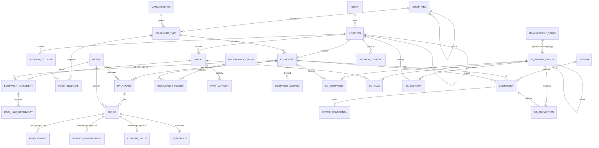

> **「現在＝denorm 列」と「履歴＝Type-2 表」を対で持つのが本設計の一貫パターン**:
>
> | 関係 | 現在(denorm) | 履歴(Type-2 SCD) |
> |---|---|---|
> | 機器 ↔ 配置 | `equipment.location_id` | `equipment_placement`（現在 = `valid_to IS NULL`） |
> | テナント ↔ 空間占有 | `location.tenant_id` | `space_lease`（08章） |
> | テナント ↔ 資産所有 | `equipment.tenant_id` | `equipment_ownership`（08章） |
>
> 現在列は集約・フィルタの高速化用、Type-2 表が履歴の真実源。`location_id`/`tenant_id` を別途 Type-2 化はしない（履歴は対応する SCD 表が持つ）。

---

## L1. 空間層

`location` 隣接リスト＝真実源 ＋ `location_closure`（`ltree` 不使用 LCD）。
機器の配置は **`equipment_placement`（Type-2 SCD・`valid_from`/`valid_to`）**で履歴保持し、現在配置 = `valid_to IS NULL`。
`rack` は固定アンカーで、U 物理重なり禁止は**現在配置の占有U行＋複合UNIQUE**（拡張ゼロ LCD）で担保する。

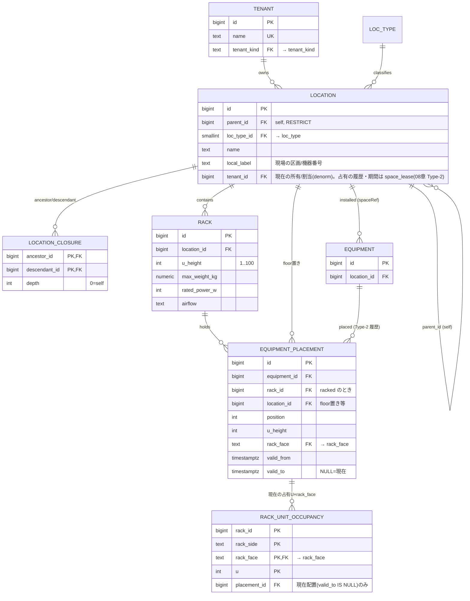

```sql
-- ルート以外は親必須（loc_type_id は FK → loc_type で制限済み。region/campus のみルート許可）
CHECK ( loc_type_id IN (SELECT id FROM loc_type WHERE loc_type_name IN ('region','campus')) OR parent_id IS NOT NULL )
-- ※ サブクエリ CHECK は PG 非推奨のため、実運用ではサービス層で検証する
-- 配置は Type-2 SCD: 現在配置 = valid_to IS NULL。機器ごとに現在配置は高々1
--   → 部分UNIQUE (equipment_id) WHERE valid_to IS NULL（PG / LCD代替は09章）。同一機器の有効期間の重複はサービス層で禁止
-- U: position + u_height - 1 <= rack.u_height は CONSTRAINT TRIGGER。U物理重なり禁止は「現在配置」の占有U行のみ
--   フルデプス機器は front/rear 両面に占有U行 → 片面機器と必ず衝突（複合PKで原子的拒否）
-- 移設時: 旧 placement に valid_to を打ち、新 placement＋占有U行を挿入（履歴は残る）
```

---

## L2. 資産層 — equip_kind / Genome（equipment_type）→ 実機（equipment）

EcoStruxure の **Genome = 型番テンプレート** → 実機インスタンス化（NetBox 流 定義/実体分離）。
`equip_kind` はここで機器を分類する小マスタとして使う。独立レイヤにはしない。

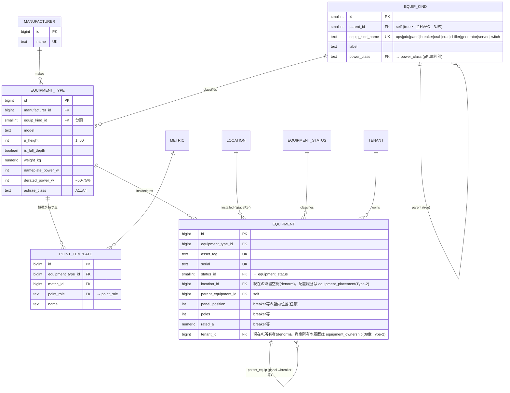

```sql
EQUIPMENT_TYPE: UNIQUE (manufacturer_id, model)
EQUIPMENT:      UNIQUE (parent_equipment_id, panel_position)  -- panel_position NULL は対象外扱い
```

> `point_template` は機種が持つ点の雛形で、実機作成時に `data_point`（L4）へ展開する。
> `equipment.location_id` は設置先の空間を直接指す。
> ラック搭載機器は、これに加えて `equipment_placement` でラック ID・U 位置・面を持つ。
> `location_id` は空間集約用、`equipment_placement` はラック内の物理搭載詳細用と役割を分ける。
> breaker は専用表にしない。
> `equipment(equip_kind_name='breaker')` と `parent_equipment_id` / `panel_position` / `rated_a` で表す。
> **「意味ある点の組合せ」は機種側に置く**。
> グローバルな意味カタログは作らない。

---

## L3. メトリック — フラットカタログ

「何を測るか」は**1つのフラットなカタログ**。
量・単位・データ型・既定集約を1行に持つ。
medium/position（吸気/排気・冷水往/還）は**metric_name に織り込む**（`rack_inlet_temp` / `chw_supply_temp`）。
Redfish/Prometheus/EcoStruxure と同じ作法で、DCIM の点は数えられる量（〜100）。

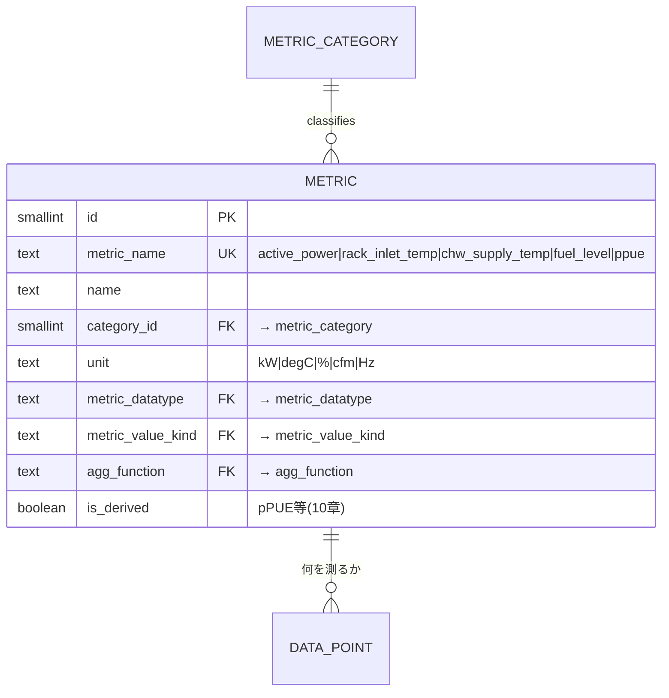

> 単位整合は **metric 行が単位を1つ持つ**ことで成立する。
> 読み値は単位を持たないので、「power に degC」は起こり得ない。
> 横断は `metric_category` で行う（「全温度点」= `metric_category.category_name='temperature'`）。
> 旧 3軸（quantity×phenomenon×func×duct のカタログ）は**廃止**。

---

## L4. 点・収集 — data_point（equipment×metric×point_role×elec_phase）

点（`data_point`）= ある機器のある metric を、ある**役割**で、ある**相**で持つ定義。
直接取得する点はプロトコル・エンドポイント・取得アドレスを持つ。
他の点から計算する点（例: V×A→W）は `protocol_id = NULL`・`addr` に計算元を記述する。
どちらも同じ `data_point` 行であり、series_kind は `raw`。消費者はこの区別を意識しない。
`point_role` で sensor / sp（設定値）/ cmd（指令）を区別する。
pPUE 等の**複数機器をまたぐ集計値**だけが `data_point` ではなく L5 の derived `series` として扱われる。

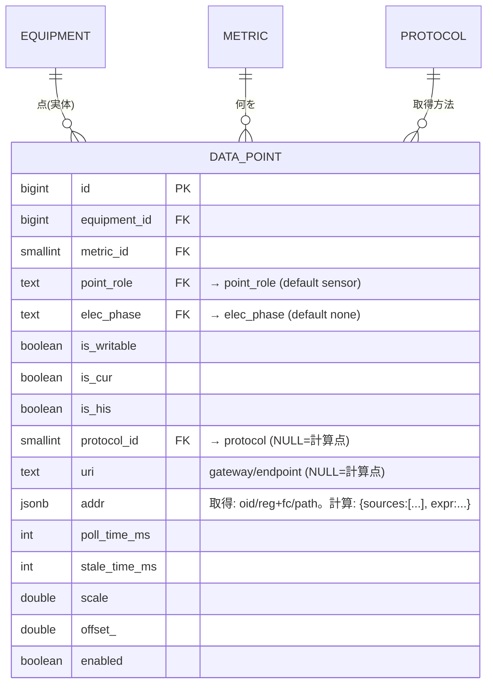

```sql
-- 1機器内で同義の点は1つ。キー列は全て NOT NULL（elec_phase は 'none' センチネル）→ UNIQUE が確実に効く
UNIQUE (equipment_id, metric_id, point_role, elec_phase)
-- protocol_id は nullable: NULL = 計算点（V×A→W 等）。計算元と式は addr JSONB に記述する
-- 計算点も直接取得点も同じ data_point。series_kind は両方 raw。消費者はこの差を意識しない
-- 例(CRAH): (温度,supply,point_role=sensor) 実測 / 同 (point_role=sp, is_writable) 設定 / (percent,point_role=cmd) ファン指令 が共存
-- writable の 16+1 段優先配列は制御本実装時に別表 write_level。今は is_writable フラグで拡張点だけを用意
```

---

## L5. 時系列 — raw / rollup / cur / derived

時系列は、**機器ごと・メトリックごとに物理テーブルを切らない**。
`series_id` を軸にした Narrow テーブルへ集約し、分割単位は性能と retention が変わる**ライフサイクル別**にする。
RDBMS 側の `series` 台帳だけが `data_point` / `metric` / `equipment` / `rack` / `location` / `measurement_scope` を知り、
TSDB 側へは整数の `series_id` だけを渡す（FK 越境なし・[09章](./09-portability.md)）。

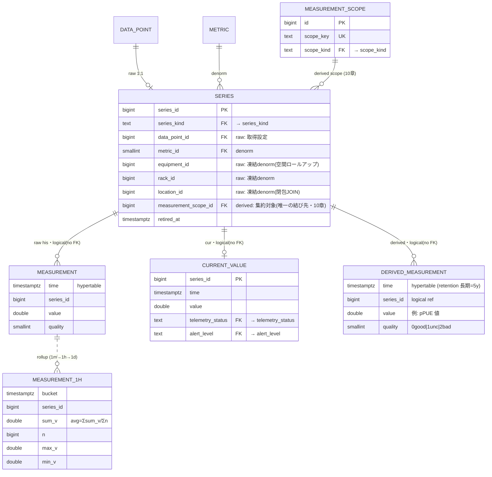

```sql
-- ★ scope_type(多態判別)は廃止。raw か derived かで結び先が一意に決まる:
--   raw     → data_point + 凍結 denorm(equipment/rack/location)。集約対象ではなく「生値の出所」
--   derived → measurement_scope_id 一本(集約対象)。location/rack 単独集約も measurement_scope(メンバー1個)で表す
CHECK ( (series_kind='raw'     AND data_point_id IS NOT NULL AND measurement_scope_id IS NULL)
     OR (series_kind='derived' AND data_point_id IS NULL     AND measurement_scope_id IS NOT NULL) )
-- ★ series は data_point より長生きする（時系列の追跡を切らさない）:
--   data_point_id FK は ON DELETE SET NULL（CASCADE 不可。消すと measurement の series_id が孤児化）。
--   series の意味は自己完結（metric_id/equipment_id/rack_id/location_id を取込時点で凍結保持）→ data_point の設定変更では揺れない。
-- ★ retire-not-mutate: 取得対象を別物に転用する時は、生きた series を書き換えず
--   旧 series に retired_at を打って新 series を作る（過去データは旧 series_id の凍結意味のまま残る）。
```

### TSDB テーブル分割方針（性能）

| テーブル | 役割 | 物理分割・索引 | 理由 |
|---|---|---|---|
| `measurement` | raw の firehose | 時間チャンク + `(series_id, time DESC)`。圧縮は `segmentby=series_id`、必要時だけ `series_id` hash partition | 書き込みが append になり、単一系列・期間読みが最速。機器別/メトリック別テーブルの爆発を避ける |
| `measurement_1m/1h/1d` | ダッシュボード・長期集計 | bucket + `series_id`。avg は `sum_v+n` で段階集計 | 期間に応じて raw/1m/1h/1d を切替。長期 retention でも即答しやすい |
| `derived_measurement` | pPUE 等の低頻度 KPI | raw と別 hypertable / 別 TTL | 派生 KPI は保持期間が長い。raw と混ぜると retention と圧縮設定が衝突する |
| `current_value` | 最新値 | RDBMS か KV 的な UPSERT 表。PK は `series_id` | ダッシュボード・監視は最新値を 1 行参照できる |

> 機器ごと / メトリックごとのテーブル分割は採らない。
> テーブル数・continuous aggregate・retention policy が機器数や点数に比例して増え、運用とプランニングが破綻しやすい。
> `series` に `metric_id` / `equipment_id` / `rack_id` / `location_id` を非正規化しておけば、
> RDBMS 側で対象 `series_id` を先に解決し、TSDB では Narrow な範囲スキャンだけで済む。
> pPUE のように機器へ直接結びつかない値は `data_point` にせず、`measurement_scope` に紐づく
> derived `series` として持つ。
> ロールアップ・派生 hypertable・計測スコープは [10章](./10-measurement-scope-derived-metrics.md)。
> 圧縮・retention のエンジン差分は [09章](./09-portability.md) の時系列アダプタが吸収する。

---

## L6. 電力・冷却・冗長 — equipment グラフ ＋ connection（CTI）＋ 冗長グループ

受電設備・変圧器・UPS・発電機・盤(panel)・breaker・PDU はすべて **`equipment` ノード**。
その間の接続を **汎用 `connection`（`medium` 付きエッジ）＋ 電気サブタイプ `power_connection`（PK 共有 CTI）** で表す。
これで **受電→変圧器→UPS→変圧器→分電盤→PDU→rack/機器**のチェーン全体がグラフになる
（`power_feed` は廃止＝その役割を connection＋power_connection が吸収）。
`v_equip_flow` はこのグラフを辿る**導出ビュー**。
冗長の**意図**は `redundancy_group` が持つ。
breaker は専用表にせず、`equipment(equip_kind_name='breaker')` と `parent_equipment_id` / `panel_position` / `rated_a` で表す。

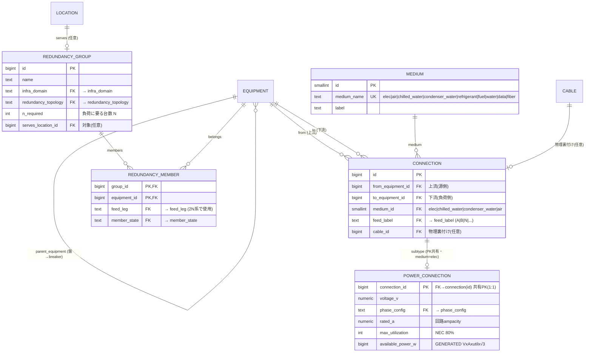

```sql
CONNECTION:        CHECK (from_equipment_id <> to_equipment_id)
POWER_CONNECTION:  available_power_w = round(voltage_v*rated_a*max_utilization/100.0
                                     * CASE WHEN phase_config='three' THEN 1.732 ELSE 1 END)::bigint  -- STORED
EQUIPMENT:         UNIQUE (parent_equipment_id, panel_position)  -- breaker等の盤内位置
-- 例: 受電設備 -[elec]-> 変圧器 -[elec]-> UPS -[elec]-> 変圧器 -[elec]-> 分電盤 -[elec]-> PDU -[elec]-> rack/機器
-- v_equip_flow = connection を辿る再帰ビュー（medium で絞る）。上流トレース/A・B系/SPOF はこの上で（04章）
-- CTI 整合: medium.medium_name='elec' ⟺ power_connection 行あり → サービス層検証
-- breaker は equipment の分類・親子・盤内位置として扱い、専用 breaker 表は作らない
-- 将来: 冷却サブタイプ `cooling_connection`（flow・往/還温度）を同型で追加（基底 connection は無改造）
-- A/B 系は connection.feed_label ＋ v_equip_flow 由来。運用上の名前付きグループ（「A系」等）は equipment_group(14章)で持つ
-- 冗長検証: 2N は feed_leg=A/B が独立 root か(SPOF・04章UC-5)、N+1 は 1台落ちても容量充足か(L7)
```

---

## L7. 容量 — WP-150 × 推定負荷戦略

容量5要素（空間/電力/電力分配/冷却/冷却分配）＋重量/ポート。
需要は推定負荷戦略で評価し **stranded = reserved − actual**。
スコープ（location/rack）は**型別テーブル**で分離する（排他アーク FK は廃止）。
`location_capacity` と `rack_capacity` はカラム構成が同一だが、FK 先が異なるため別テーブルとする。
回路容量は容量テーブルではなく、`power_connection.available_power_w` と breaker 機器の `rated_a` が持つ。

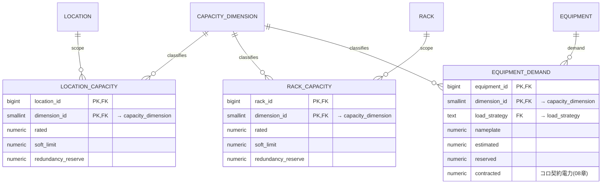

```sql
-- 排他アーク FK (num_nonnulls CHECK) は廃止。location / rack は型別テーブルで分離。
-- 過剰容量分類(spare/idle/safety/stranded/active・WP-150)・「予約 ≤ rated」「負荷 ≤ 回路(power_connection.available_power_w)」は監視ビュー/サービス層(09章)
-- 全容量を横断で見たい場合は UNION ALL ビュー:
CREATE VIEW capacity_budget_all AS
  SELECT 'location' AS scope_type, location_id AS scope_id, dimension_id, rated, soft_limit, redundancy_reserve FROM location_capacity
  UNION ALL
  SELECT 'rack', rack_id, dimension_id, rated, soft_limit, redundancy_reserve FROM rack_capacity;
```

---

## L8. 監視 — threshold（series に紐づく）

severity は informational/warning/critical、しきい値 high/low、hysteresis でチャタリング抑制。
評価対象は常に `current_value.series_id` なので、閾値も `series_id` に直結させる。
metric / location / equipment の既定値は、series 作成時に `threshold_template` から具体的な `threshold` 行へ展開する。
これにより、評価時は優先順位探索をせず `series_id` の 1 行を見るだけでよい。

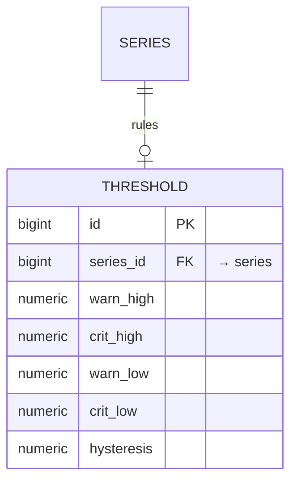

```sql
THRESHOLD: UNIQUE (series_id)
CHECK (crit_high IS NULL OR warn_high IS NULL OR crit_high >= warn_high)
CHECK (crit_low  IS NULL OR warn_low  IS NULL OR crit_low  <= warn_low)
-- alert_level は current_value に同居(L5)。threshold_template からの展開・更新はサービス層。
```

---

## L9. 論理グルーピング — equipment_group（A系/B系・冷却ループ等）

物理階層（location 木）にも冗長意図（redundancy_group）にも KPI 境界（measurement_scope）にも収まらない、
**運用上の名前付き論理グループ**。「A系」「北棟冷却ループ」「Phase-3 デプロイ対象」等を表す。
メンバーは**型別 JOIN テーブル**（`eg_equipment` / `eg_connection` / `eg_rack` / `eg_location`）で持つ。
排他アーク FK は廃止し、新種別の追加は `ALTER TABLE` ではなく `CREATE TABLE` で行う。
measurement_scope（10 章）との棲み分け・統合判断の詳細は [14 章](./14-logical-grouping.md)。

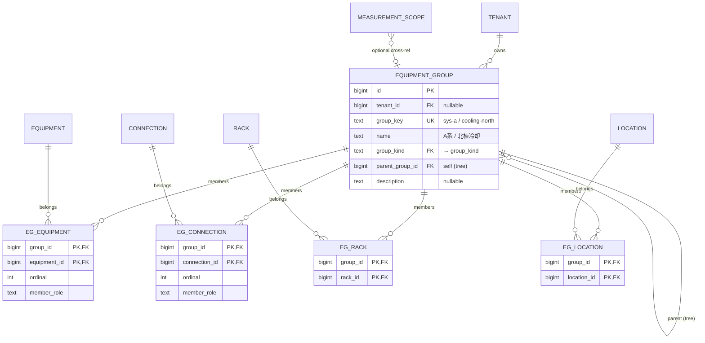

```sql
-- measurement_scope へのオプション FK（橋渡し）
ALTER TABLE measurement_scope ADD COLUMN
    equipment_group_id BIGINT REFERENCES equipment_group(id);

-- 全メンバー一覧ビュー
CREATE VIEW equipment_group_all_members AS
  SELECT group_id, 'equipment' AS member_type, equipment_id AS target_id, ordinal, member_role FROM eg_equipment
  UNION ALL
  SELECT group_id, 'connection', connection_id, ordinal, member_role FROM eg_connection
  UNION ALL
  SELECT group_id, 'rack', rack_id, NULL, NULL FROM eg_rack
  UNION ALL
  SELECT group_id, 'location', location_id, NULL, NULL FROM eg_location;
```

> **connection を含める理由**: A/B 合流点（STS）では conn-A は A系、conn-B は B系だが、
> 「グループ内 equipment 間の connection は暗黙所属」ルールでは STS 経由で混在する。
> またボトルネック分析（`MIN(available_power_w)`）・保守計画（切断すべき回線リスト）に必要。
> rack / location を含めることで「A系が給電するラック群」「A系の担当フロア」も表現できる。
>
> **measurement_scope との棲み分け**: group は運用上の名前付きまとまり（集計・可視化・影響分析）。
> scope は KPI 算出の閉じた境界（pPUE の分子/分母を定義）。`member_role` 語彙・ライフサイクル・制約が異なるため別テーブル。
> scope → group のオプション FK で「このスコープはこのグループに対応する」を緩く結ぶ。
>
> **entity 種別拡張**: 将来 circuit 等の新種別が必要になったら、`eg_circuit` テーブルを `CREATE TABLE` するだけでよい。
> 既存テーブルの `ALTER TABLE`（nullable FK 列追加 + CHECK 修正）は不要。

---

## 型制約 — 自由入力厳禁・text CHECK 全廃

type 系カラムはすべて**参照テーブルの FK**で制限する。`text` カラムに `CHECK IN(...)` を付けるパターンは使わない。

### 方針: 2 段階の参照テーブル

| 種別 | PK | 用途 | 例 |
|------|-----|------|-----|
| **マスタ参照テーブル** | `smallint id` + `text UK` | 大量行から参照される／メタデータ（label・ordinal・unit）を持つ | equip_kind, metric, loc_type |
| **enum テーブル** | `text PK`（値そのもの） | 少量行から参照される／値 2〜6 個の固定集合 | point_role, rack_face, alert_level |

enum テーブルは `text PK` なので JOIN なしで人間が読める値がそのまま入る。
FK 制約が有効値の集合を保証し、CHECK は不要になる。

### マスタ参照テーブル（smallint id PK — 既存 3 + 新設 5 = 計 8）

```mermaid
erDiagram
    LOC_TYPE {
        smallint id PK
        text loc_type_name UK "region|campus|building|floor|room|dataCenter|cage|zone|row"
        text label
        int depth_ordinal "0=region ... 8=row"
    }
    EQUIPMENT_STATUS {
        smallint id PK
        text status_name UK "planned|staged|active|offline|decommissioned"
        text label
        int lifecycle_order
    }
    PROTOCOL {
        smallint id PK
        text protocol_name UK "bacnet|modbus|snmp|redfish|ipmi|mqtt|opcua|haystack|api"
        text label
    }
    METRIC_CATEGORY {
        smallint id PK
        text category_name UK "power|energy|voltage|current|pf|frequency|temperature|humidity|..."
        text label
    }
    CAPACITY_DIMENSION {
        smallint id PK
        text dimension_name UK "space_u|power_w|power_dist_w|cooling_w|cooling_dist|weight_kg|network_port"
        text label
        text dimension_unit "U|W|W|W|cfm|kg|port"
    }
```

> 既存の `equip_kind`・`medium`・`metric` も同じ `smallint id PK` パターン。

### enum テーブル（text PK — 新設 22）

旧 text + CHECK を置き換える。テーブル名 = カラム名になるので、用途が自明になる。

```sql
-- 各テーブルは text PK 1列のみ（label を持たせてもよい）
CREATE TABLE tenant_kind        (tenant_kind       TEXT PRIMARY KEY); -- internal, colo_customer
CREATE TABLE rack_face          (rack_face         TEXT PRIMARY KEY); -- front, rear
CREATE TABLE power_class        (power_class       TEXT PRIMARY KEY); -- it, cooling, facility, other
CREATE TABLE metric_datatype    (metric_datatype   TEXT PRIMARY KEY); -- Number, Bool, Str
CREATE TABLE metric_value_kind  (metric_value_kind TEXT PRIMARY KEY); -- gauge, counter, status
CREATE TABLE agg_function       (agg_function      TEXT PRIMARY KEY); -- avg, last, sum, min, max
CREATE TABLE point_role         (point_role        TEXT PRIMARY KEY); -- sensor, sp, cmd
CREATE TABLE elec_phase         (elec_phase        TEXT PRIMARY KEY); -- L1, L2, L3, none
CREATE TABLE series_kind        (series_kind       TEXT PRIMARY KEY); -- raw, derived
CREATE TABLE telemetry_status   (telemetry_status  TEXT PRIMARY KEY); -- ok, down, fault, disabled, stale
CREATE TABLE alert_level        (alert_level       TEXT PRIMARY KEY); -- normal, warning, critical
CREATE TABLE feed_label         (feed_label        TEXT PRIMARY KEY); -- A, B, N, N+1, 2N, none
CREATE TABLE phase_config       (phase_config      TEXT PRIMARY KEY); -- single, three
CREATE TABLE infra_domain       (infra_domain      TEXT PRIMARY KEY); -- power, cooling, network
CREATE TABLE redundancy_topology(redundancy_topology TEXT PRIMARY KEY); -- N, N+1, N+2, 2N, 2N+1
CREATE TABLE feed_leg           (feed_leg          TEXT PRIMARY KEY); -- A, B, C, none
CREATE TABLE member_state       (member_state      TEXT PRIMARY KEY); -- active, standby, none
CREATE TABLE load_strategy      (load_strategy     TEXT PRIMARY KEY); -- nameplate, adjusted_nameplate, predicted, contracted
CREATE TABLE group_kind         (group_kind        TEXT PRIMARY KEY); -- power_chain, cooling_loop, network_fabric, project, custom
CREATE TABLE scope_kind         (scope_kind        TEXT PRIMARY KEY); -- energy_boundary, cooling_boundary, tenant_boundary, custom
CREATE TABLE derivation_method  (derivation_method TEXT PRIMARY KEY); -- topology, manual, import
CREATE TABLE scope_status       (scope_status      TEXT PRIMARY KEY); -- candidate, active, retired
```

### カラム名の変更一覧（味気ない名前 → 用途が自明な名前）

| テーブル | 旧カラム | 新カラム | FK 先 |
|----------|---------|---------|-------|
| tenant | kind | tenant_kind | → tenant_kind |
| equipment_placement | face | rack_face | → rack_face |
| rack_unit_occupancy | face | rack_face | → rack_face |
| equip_kind | power_class | power_class | → power_class |
| metric | datatype | metric_datatype | → metric_datatype |
| metric | value_kind | metric_value_kind | → metric_value_kind |
| metric | default_agg | agg_function | → agg_function |
| point_template | role | point_role | → point_role |
| data_point | role | point_role | → point_role |
| data_point | phase | elec_phase | → elec_phase |
| series | series_kind | series_kind | → series_kind |
| current_value | cur_status | telemetry_status | → telemetry_status |
| current_value | alert_state | alert_level | → alert_level |
| connection | redundancy | feed_label | → feed_label |
| power_connection | phase | phase_config | → phase_config |
| redundancy_group | domain | infra_domain | → infra_domain |
| redundancy_group | topology | redundancy_topology | → redundancy_topology |
| redundancy_member | leg | feed_leg | → feed_leg |
| redundancy_member | role | member_state | → member_state |
| equipment_demand | load_strategy | load_strategy | → load_strategy |
| equipment_group | group_kind | group_kind | → group_kind |
| measurement_scope | scope_kind | scope_kind | → scope_kind |
| measurement_scope | derivation | derivation_method | → derivation_method |
| measurement_scope | status | scope_status | → scope_status |
| location | code | local_label | （FK なし・自由テキスト、区画識別子） |
| measurement_scope | code | scope_key | （FK なし・UK、スコープの一意識別子） |
| equipment_group | code | group_key | （FK なし・UK、グループの一意識別子） |

> **`code` カラムの廃止**: 参照テーブルの `code UK` は `{テーブル名}_name`（例: `loc_type_name`）に改名。
> ドメインテーブルの `code` は用途に応じた名前（`local_label`、`scope_key`、`group_key`）に改名。
> **text PK enum テーブル**: カラム名 = テーブル名にすることで `JOIN` 時に `USING(point_role)` が使え、可読性が高い。
> **自由入力テキストは `local_label` 等の「識別子」カラムのみ**。型分類カラムに自由テキストは一切ない。

---

## 効くドメイン制約（まとめ）

| 制約 | 実装 | 由来 |
|------|------|------|
| 単位整合（power に degC 不可） | `metric` 行が単位を1つ保持（読み値は単位を持たない） | フラットカタログ |
| 1機器に同義の点は1つ | `data_point UNIQUE(equipment_id, metric_id, point_role, elec_phase)`（全列 NOT NULL） | — |
| 制御の役割区別 | `data_point.point_role`（sensor/sp/cmd） | EcoStruxure/BMS |
| 「全 HVAC / 全 UPS」集約 | `equip_kind.parent_id` ツリー（DAG はオプション） | — |
| ブレーカ位置・容量 | `equipment(equip_kind_name='breaker')` + `UNIQUE(parent_equipment_id,panel_position)` + `rated_a` | EcoStruxure power path |
| 供給可能電力 = V×A×util×√3 | `power_connection.available_power_w`（生成列・bigint） | NEC + 三相 |
| 電力チェーンの表現 | `connection`(汎用エッジ・medium) ＋ `power_connection`(電気サブタイプ・PK共有) | 受電→変圧器→UPS→盤→PDU→rack |
| U 物理重なり禁止 | 占有U行 + 複合UNIQUE（拡張ゼロ） | LCD（09章） |
| 冗長の意図と検証 | `redundancy_group` + member（feed_leg/member_state）→ SPOF/容量で現実構成を検証 | EcoStruxure 冗長 |
| スコープ参照の整合 | `location_capacity` / `rack_capacity` 型別テーブル（排他アーク FK は廃止） | 関係設計 |
| 閾値評価 | `threshold.series_id` を `current_value.series_id` に直結。既定値は template から展開 | 監視実装 |
| 電力/冷却フロー・A/B系 | `connection` グラフからの**導出**（v_equip_flow）。並行グラフを持たない | 真実源を1つに |
| 論理グルーピング（A系/B系） | `equipment_group` + 型別 JOIN テーブル `eg_*`（14 章）。measurement_scope/redundancy_group とは別概念 | DC 運用 |
| 型制約（自由入力厳禁） | type 系カラムはすべて**参照テーブル FK**（マスタ 8 + enum 22）。text CHECK 全廃 | ドメイン整合 |
| TSDB 分割 | `measurement` raw / rollup / `derived_measurement` / `current_value`。機器別・メトリック別テーブルは作らない | 性能・運用性 |

> 集約制約（予約 ≤ 定格・SPOF・温湿度逸脱・冗長充足）は行間集約のため**サービス層/監視ビュー**で担保
> （移植性のため DB トリガに依存させない・[09章](./09-portability.md)）。検証クエリは [04章](./04-validation-queries.md)。
