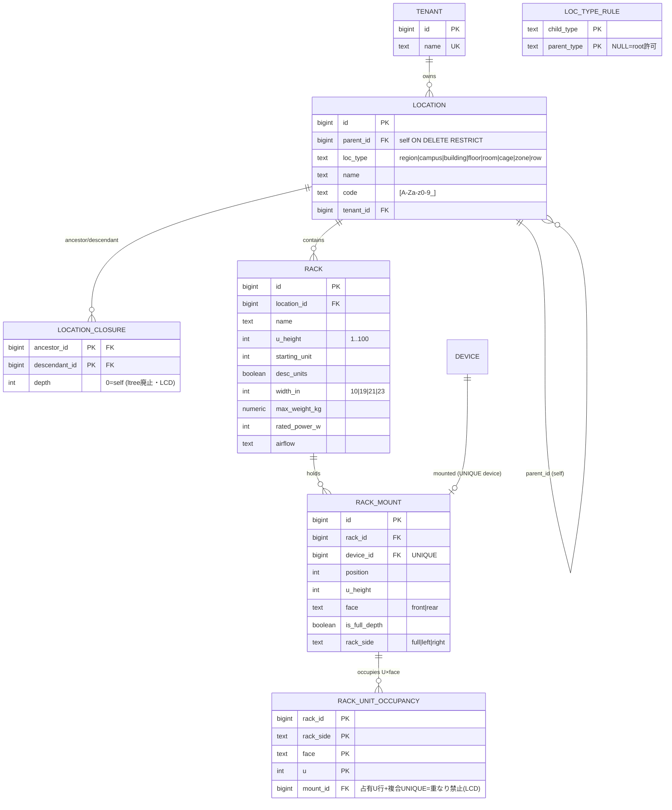
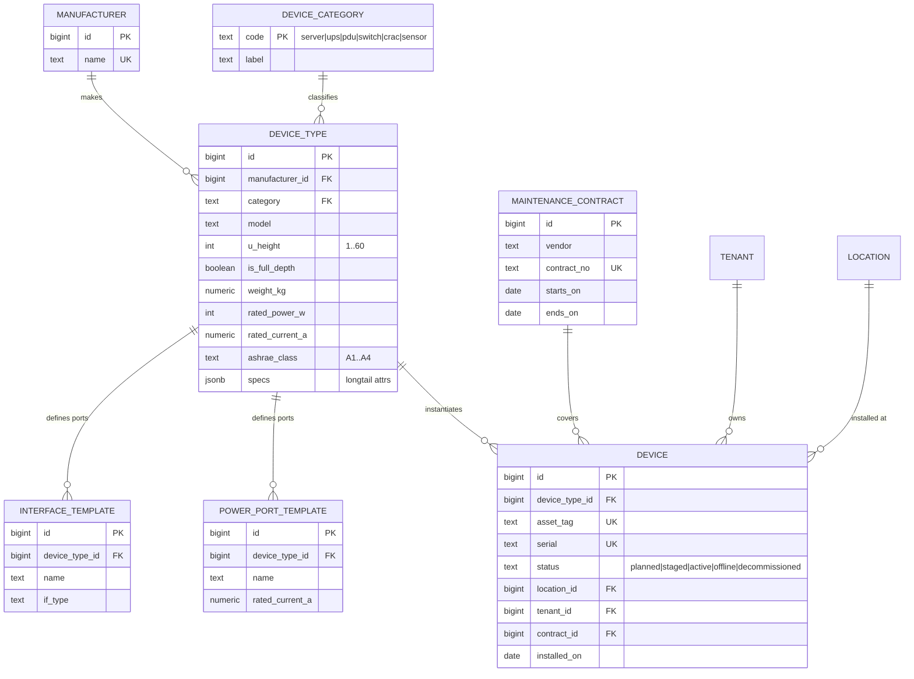
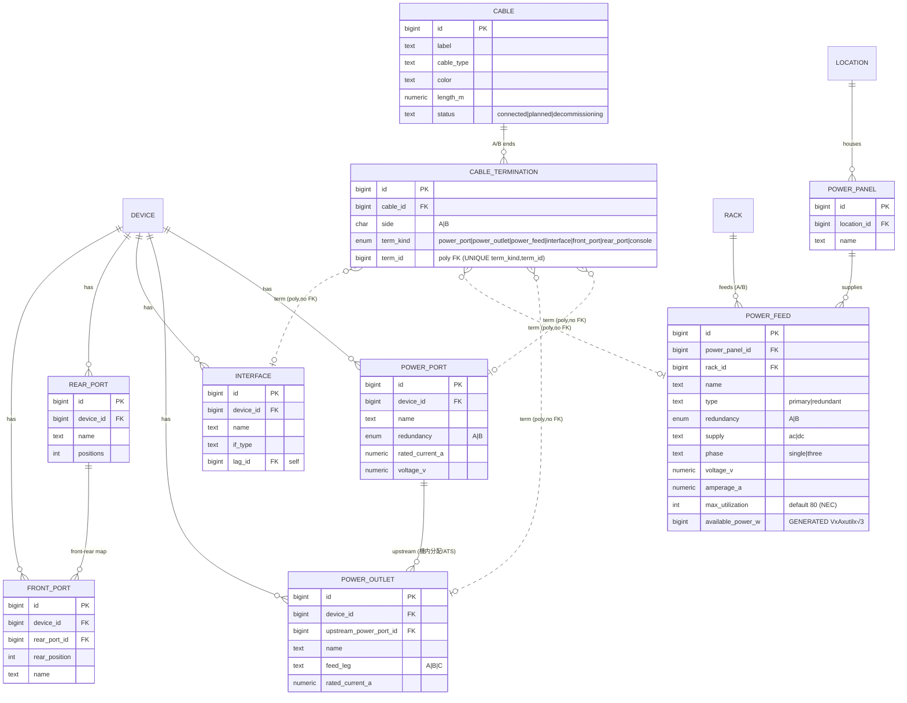
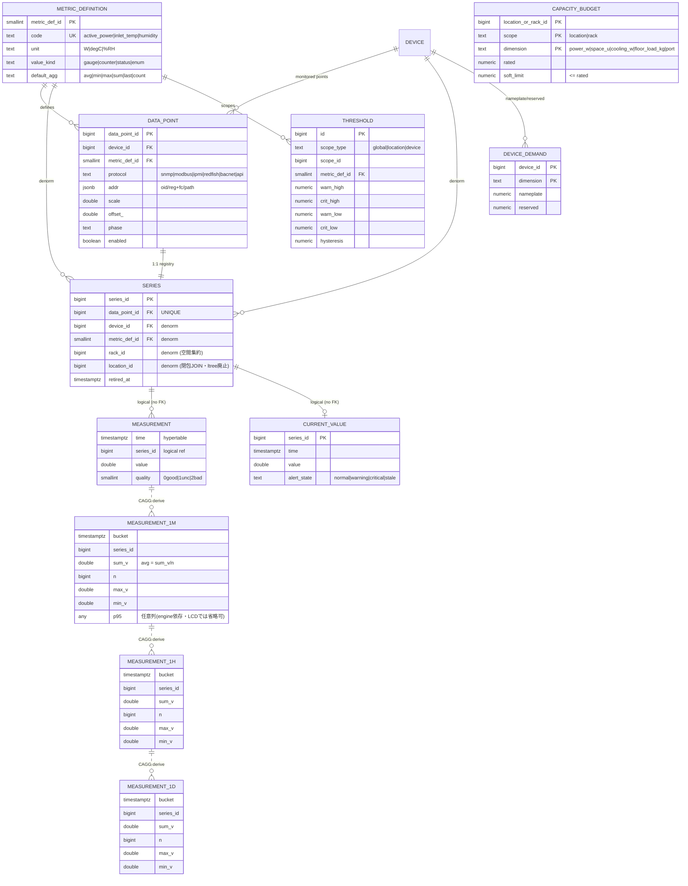
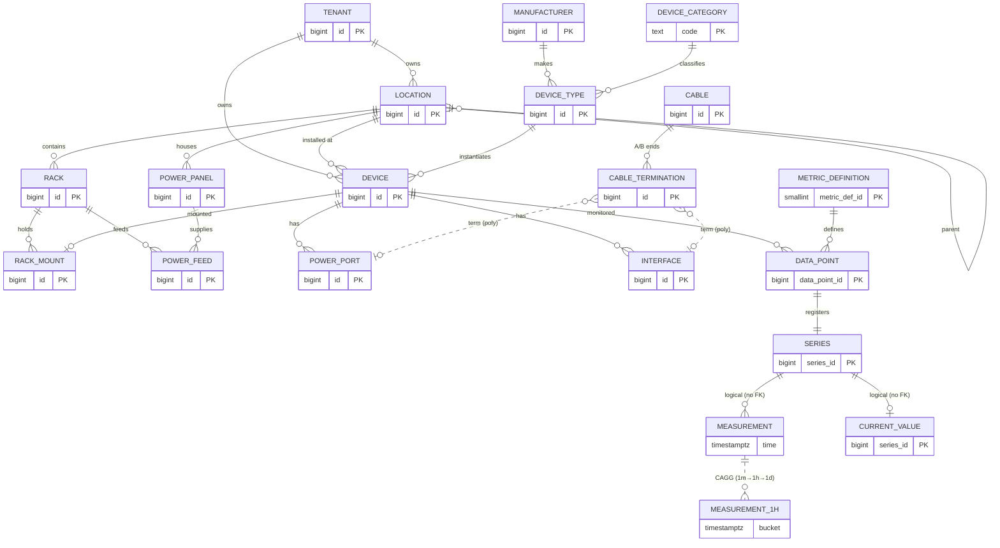

# 05. ER 図（推奨案 P05）

推奨案 **P05「パッケージ標準」**（[03-finalists.md](./03-finalists.md)）のリレーショナルモデルを
Mermaid ER 図で可視化する。可読性のため**ドメイン別に分割**し、最後に全体俯瞰を置く。

> **凡例・前提**
> - 時系列（`measurement` / `measurement_1m|1h|1d` / `current_value`）は **TimescaleDB** 側。
>   hypertable には **実 FK を張らない**（チャンク DROP/圧縮を阻害するため）。`series_id` による
>   **論理参照**は図中 `logical(no FK)` と注記する。
> - `cable_termination.term_id` は **多態 FK**（`term_kind` で参照先が変わる）で実 FK が張れない。
>   図では代表的な参照先への論理リンクとして示す。
> - 集約 CAGG（`measurement_1m/1h/1d`）は hypertable から派生する**マテリアライズドビュー**。

---

## 5.1 空間階層（Space）

`Rack` を固定アンカーとして専用テーブル化し、`Site〜Row` は汎用 `location` 木（隣接リスト＋**閉包テーブル**）。
U 位置は **`rack_unit_occupancy` の占有U行 + 複合UNIQUE**で物理重なり禁止（[09章](./09-portability.md)の LCD 化）。

> `LOC_TYPE_RULE` は親子関係のホワイトリスト（`location` の親子検証）。`LOCATION_CLOSURE` は配下/祖先を
> 標準 JOIN で引く（`ltree` 廃止）。**U 重なり禁止は `RACK_UNIT_OCCUPANCY` の複合主キー**で担保
> （`EXCLUDE`/`btree_gist`/range 型を使わない LCD 化。フルデプスは front/rear 両面に占有行）。

---

## 5.2 機器マスタ（Asset）

型番（`device_type`）に固有属性とポートテンプレート、実機（`device`）に個体属性（NetBox 流の定義/実体分離）。
コア数値は型付き列、ロングテール属性は `specs jsonb`。

> `(manufacturer_id, model)` 一意 / `serial`,`asset_tag` 一意。`UNIQUE(manufacturer_id, model)` は
> ER 図の属性 UK では複合表現できないため本文補足。`*_TEMPLATE` は実機作成時に実コンポーネント
> （`interface`/`power_port` 等）へ展開される。

---

## 5.3 配線トポロジー（Power & Network）

種別別ポート（`power_port`/`power_outlet`/`interface`/`front_port`/`rear_port`）と
`cable`/`cable_termination`（実体モデル）。電力上流は `power_panel → power_feed`。

> `CABLE_TERMINATION (term_kind, term_id)` の UNIQUE が「ポート片側1接続」を保証。多態のため実 FK は
> 張れず、整合は検証トリガ＋定期チェック（厳格版は kind 別テーブル分割 + UNION ビュー）。
> 電力トレースは `power_arc` ビュー上の `WITH RECURSIVE`、end-to-end は `CablePath` 相当キャッシュ。

---

## 5.4 テレメトリ & 集約（Telemetry / Aggregation）

収集定義（`metric_definition`/`data_point`/`series`）と TimescaleDB 側（Narrow `measurement` + 階層 CAGG +
`current_value`）。キャパシティ・閾値も含む。**点線（logical/derived）は実 FK なし**。

> `CAPACITY_BUDGET` は `scope`（location/rack）で対象が変わる多態キー、`THRESHOLD` は
> `scope_type`（global/location/device）優先で評価。いずれも集約制約（予約合計 ≤ 定格 等）は
> 行間集約のため CONSTRAINT TRIGGER／監視ビューで担保（[04 章](./04-validation-queries.md)）。

---

## 5.5 全体俯瞰（主要エンティティと結節点）

ドメイン間の結節点のみを示した俯瞰図。詳細属性は 5.1〜5.4 を参照。

---

## 5.6 図に表れない主要制約（再掲）

ER 図のカーディナリティ／FK では表現しきれない、本設計の肝となる制約:

| 種別 | 制約 | 実装 |
|------|------|------|
| 一意 | ラック U の物理重なり禁止 | `RACK_UNIT_OCCUPANCY` 複合主キー `(rack_id, rack_side, face, u)`（占有U行・拡張ゼロ・全エンジン移植可。full-depth は front/rear 両面に占有行） |
| 複合一意 | 型番一意 | `DEVICE_TYPE UNIQUE(manufacturer_id, model)` |
| 複合一意 | ポート片側1接続 | `CABLE_TERMINATION UNIQUE(term_kind, term_id)` |
| 生成列 | 供給可能電力 | `POWER_FEED.available_power_w = round(V×A×util/100×√3)` bigint |
| トリガ | ラックに収まる | `position + u_height - 1 ≤ rack.u_height`（親値参照） |
| トリガ | 親子関係の妥当性 | `LOC_TYPE_RULE` 突合 |
| トリガ/ビュー | 予約 ≤ 定格 / SPOF / ASHRAE 逸脱 | 集約制約のため監視（[04 章](./04-validation-queries.md)） |

> 他案（P04/P06/P08/P02）の ER は P05 との差分（[03 章](./03-finalists.md)）で読み替え可能。
> 例: P06 は `LOCATION` に `LOCATION_CLOSURE(ancestor_id, descendant_id, depth)` を追加、
> P08 は `RACK_MOUNT` を有効期間付き `DEVICE_PLACEMENT`（PG版=`valid tstzrange`+EXCLUDE / LCD版=`valid_from`/`valid_to` 2列 + 占有行 + サービス層）に置換。
