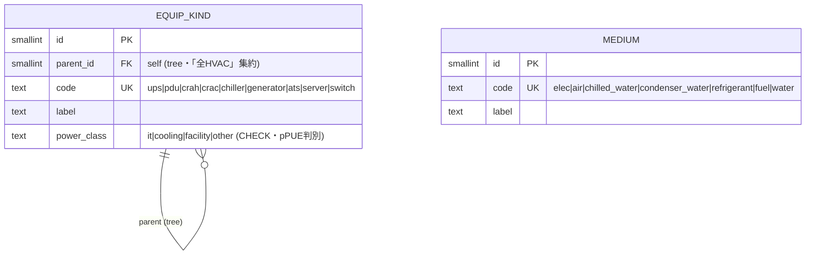
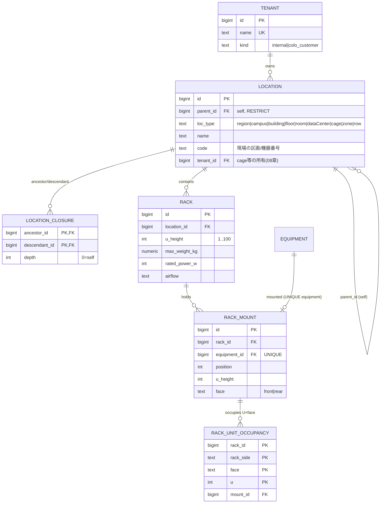
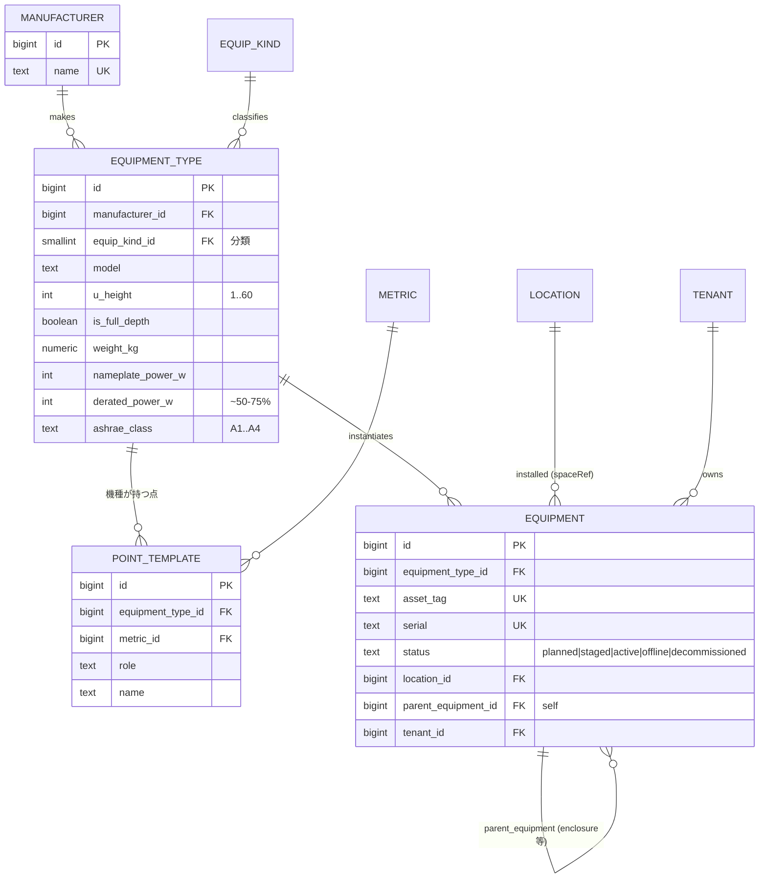
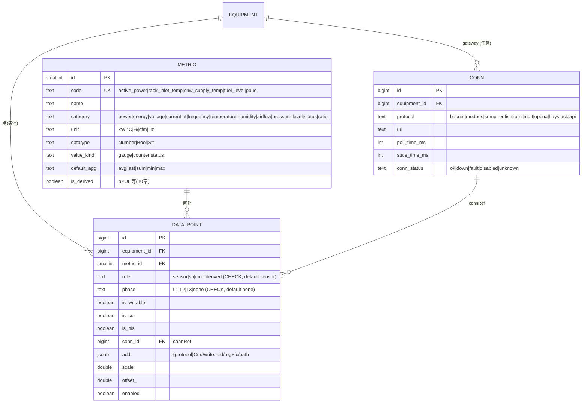
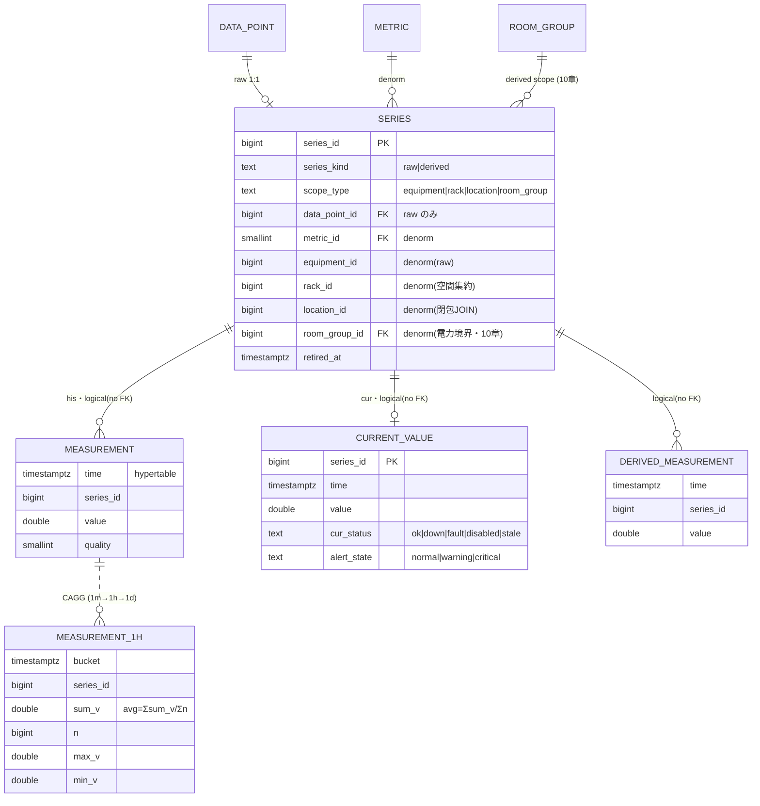
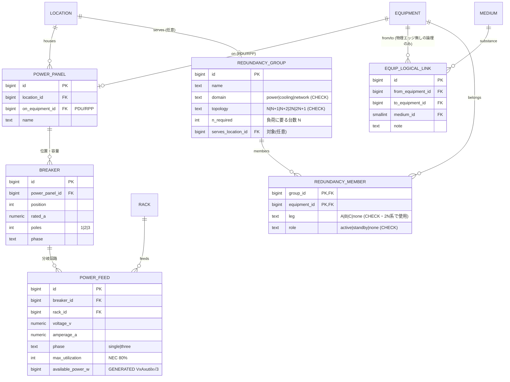
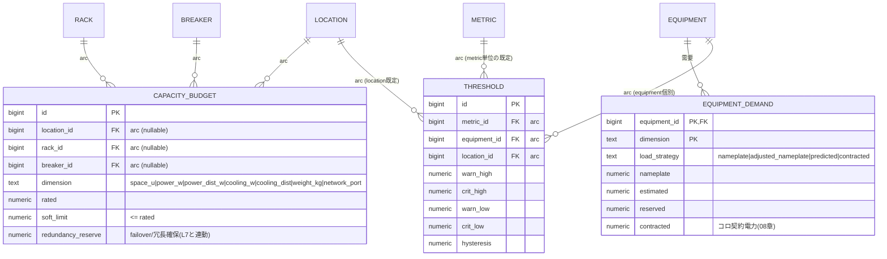
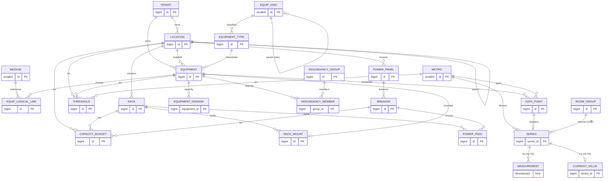

# 05. ER 図（Semantic-Typed DCIM 全体）

確定設計（[03章](./03-finalists.md)）のリレーショナルモデルを Mermaid ER 図で俯瞰する。03章はレイヤ別の詳細、
本章は**ドメインをまたぐ結節点**を中心に、最後に全体俯瞰を置く。DDL/制約の根拠は [03章](./03-finalists.md)。

> **凡例・前提**
> - 時系列（`measurement` / `measurement_1h` / `derived_measurement` / `current_value`）は **TimescaleDB** 側。
>   hypertable には **実 FK を張らない**（`series_id` の論理参照のみ＝図中 `logical(no FK)`・[09章](./09-portability.md)）。
> - `capacity_budget` / `threshold` のスコープは**排他アーク FK**（nullable FK 3列 + `CHECK num_nonnull=1`）。多態キー `(scope_type, scope_id)` は使わない。
> - 閉包（`location_closure` / 任意の `equip_kind_closure`）は再帰なし JOIN で部分木集約（`ltree` 不使用 LCD・DAG はオプション [02章D](./02-candidate-patterns.md)）。
> - **物理 path = 真実源、フローは導出**：`power_panel→breaker→power_feed` が connectivity の真実源。電力フロー / A系B系 / dual-cord は `v_equip_flow`（導出ビュー）で取得する。並行する別グラフを手で維持しない。

---

## 5.1 参照カタログ（L1）

分類用の小さな参照表は2つのみ。機器の種類（`equip_kind`）と媒体（`medium`）。汎用 def / DAG / Quantity / Phenomenon テーブルは持たない。



> `equip_kind` は機器分類ツリー（多重継承の実需が出たら閉包へ拡張・[02章D](./02-candidate-patterns.md)）。`medium` は L7 の冷却/電力フロー媒体に使う。
> role / phase / dimension / severity 等の固定小集合は各テーブルで **CHECK enum** とし、参照テーブルを作らない。

---

## 5.2 空間層（L2）

`location` 隣接リスト＝真実源 ＋ `location_closure`（`ltree` 不使用 LCD）。`rack` は固定アンカー。U 物理重なり禁止は
**占有U行＋複合UNIQUE**（拡張ゼロ LCD）。



```sql
CHECK ( loc_type IN ('region','campus') OR parent_id IS NOT NULL )      -- ルート以外は親必須
-- U: position + u_height - 1 <= rack.u_height は CONSTRAINT TRIGGER（親値参照）
-- フルデプス機器は front/rear 両面に占有U行 → 片面機器と必ず衝突（複合PKで原子的拒否）
```

---

## 5.3 資産層（L3）— Genome（equipment_type）→ 実機（equipment）

EcoStruxure の **Genome = 型番テンプレート** → 実機インスタンス化（NetBox 流 定義/実体分離）。`equip_kind` FK で意味づけ。
`point_template` は機種が持つ点の雛形で、実機作成時に `data_point`（L5）へ展開。



> `UNIQUE (manufacturer_id, model)` で型番一意、`serial`/`asset_tag` で個体一意。**「意味ある点の組合せ」はここ（機種）に在る** ── グローバルな意味カタログを作らない。

---

## 5.4 メトリック & 収集層（L4 + L5）

**L4** — 「何を測るか」は1つのフラットなカタログ。medium / position（吸気/排気・冷水往/還）はコードに織り込む
（`rack_inlet_temp` / `chw_supply_temp`）。旧3軸（quantity×phenomenon×func×duct）は廃止（[02章B](./02-candidate-patterns.md)）。

**L5** — 点（`data_point`）= ある機器のある metric を、ある**役割**（`role`）で、ある**相**（`phase`）で取得する設定。
`role` で sensor / sp（設定値）/ cmd（指令）/ derived を区別 ── 制御を見据えた一級の軸。



```sql
-- 1機器内で同義の点は1つ。キー列は全て NOT NULL（phase は 'none' センチネル）→ UNIQUE が確実に効く
UNIQUE (equipment_id, metric_id, role, phase)
-- 単位整合: metric 行が単位を1つ保持（読み値は単位を持たない）→「power に °C」は起こり得ない
```

---

## 5.5 時系列層（L6）— his / cur / 派生

his＝`measurement` hypertable、cur＝`current_value`。Narrow＋`series` 台帳（`series_id` だけ TSDB へ越境・FK 越境なし・[09章](./09-portability.md)）。



```sql
CHECK ( (series_kind='raw' AND data_point_id IS NOT NULL AND scope_type='equipment')
     OR (series_kind='derived' AND data_point_id IS NULL) )
```

> ロールアップ・派生 hypertable・部屋グループは [10章](./10-room-group-derived-metrics.md)。圧縮 `compress_segmentby=series_id`・retention は [09章](./09-portability.md)。

---

## 5.6 電力・冷却・冗長層（L7）

**物理 path が真実源**：`power_panel→breaker→power_feed` が connectivity の真実源。
電力フロー / A系B系 / dual-cord は `v_equip_flow`（**導出ビュー**）で取得する。並行する別グラフを手で維持しない。
物理エッジを持たない純論理（冷却空気の到達等）だけ `equip_logical_link` に明示。
冗長の**意図**は `redundancy_group` で第一級に持つ。



```sql
POWER_FEED: available_power_w = round(voltage_v*amperage_a*max_utilization/100.0
                                      * CASE WHEN phase='three' THEN 1.732 ELSE 1 END)::bigint  -- STORED
BREAKER:    UNIQUE (power_panel_id, position),  rated_a > 0
-- 電力フローは構造から導出（手で並行グラフを持たない）:
--   v_equip_flow = power_port/outlet/cable と feed→breaker→panel を辿る再帰ビュー（[04章]）
-- A/B 系: v_equip_flow を root まで辿り独立系統を判定。多用するなら equipment.power_side を非正規化(構成変更時に再計算)
-- dual-cord: equipment の各 PSU が繋がる outlet の side（A/B feed）から導出
-- redundancy 検証(intent×reality): 2N は leg=A/B が独立 root か(SPOF・[04章UC-5])、N+1 は 1台落ちても容量充足か(L8)
```

---

## 5.7 容量 & 監視層（L8 + L9）

**L8** — 容量5要素（空間/電力/電力分配/冷却/冷却分配）＋重量/ポート。スコープ（location/rack/breaker）は
**排他アーク FK**（多態キー廃止）で参照整合を担保。

**L9** — severity は informational/warning/critical、しきい値 high/low、hysteresis でチャタリング抑制。スコープは排他アーク FK。



```sql
-- 排他アーク: スコープ対象はちょうど1つ（多態キー(scope_type,scope_id)廃止・実FKで整合）
CAPACITY_BUDGET: CHECK ( num_nonnull(location_id, rack_id, breaker_id) = 1 )
THRESHOLD:       CHECK ( num_nonnull(metric_id, equipment_id, location_id) = 1 )
CHECK (crit_high IS NULL OR warn_high IS NULL OR crit_high >= warn_high)
-- 評価優先: equipment > location > metric既定。alert_state は current_value に同居(L6)
-- 過剰容量分類(spare/idle/safety/stranded/active・WP-150)・「予約 ≤ rated」はサービス層([04章][09章])
```

---

## 5.8 全体俯瞰（結節点のみ）

ドメイン間の結節点だけを示す俯瞰図。詳細属性は 5.1〜5.7 を参照。



---

## 5.9 図に表れない主要制約（再掲）

ER のカーディナリティ／FK では表せない、本設計の肝（詳細は [03章](./03-finalists.md)・[06章](./06-self-review.md)）:

| 種別 | 制約 | 実装 |
|------|------|------|
| 単位整合 | power に °C 不可 | `metric` 行が単位を1つ保持（読み値は単位を持たない） |
| 複合一意 | 機器内の点は同義で1つ | `DATA_POINT UNIQUE(equipment_id, metric_id, role, phase)`（全列 NOT NULL） |
| 役割区別 | 制御を見据えた一級の軸 | `data_point.role`（sensor/sp/cmd/derived） |
| ツリー | 「全 HVAC / 全 UPS」集約 | `EQUIP_KIND.parent_id` 親参照（読み多なら closure・DAG はオプション [02章D](./02-candidate-patterns.md)） |
| 複合一意 | U 物理重なり禁止 | `RACK_UNIT_OCCUPANCY (rack_id, rack_side, face, u)`（占有U行・拡張ゼロ） |
| 生成列 | 供給可能電力 = V×A×util×√3 | `POWER_FEED.available_power_w` bigint STORED |
| 複合一意 | ブレーカ位置・容量 | `BREAKER UNIQUE(power_panel_id, position)` + `rated_a > 0` |
| 排他アーク | 容量スコープの参照整合 | `CAPACITY_BUDGET CHECK(num_nonnull(location_id, rack_id, breaker_id)=1)` |
| 排他アーク | 監視スコープの参照整合 | `THRESHOLD CHECK(num_nonnull(metric_id, equipment_id, location_id)=1)` |
| 冗長意図と検証 | intent × reality | `redundancy_group` + member（leg/role）→ SPOF/容量で reality 検証 |
| 論理参照 | TSDB 越境 FK 不可 | `measurement`/`current_value` に実 FK を張らない（`series_id` 論理参照のみ） |
| 導出ビュー | 電力フロー・A/B系・dual-cord | `v_equip_flow`（物理 path からの再帰ビュー）。並行グラフを手で維持しない |
| トリガ/ビュー | ラック収まり / SPOF / ASHRAE / 予約≤定格 / stranded | サービス層（[04章](./04-validation-queries.md)・[09章](./09-portability.md)） |

> 検証クエリは [04章](./04-validation-queries.md)、部屋グループ/pPUE は [10章](./10-room-group-derived-metrics.md)、
> テナント/コロ拡張は [08章](./08-tenancy-colocation.md)。
