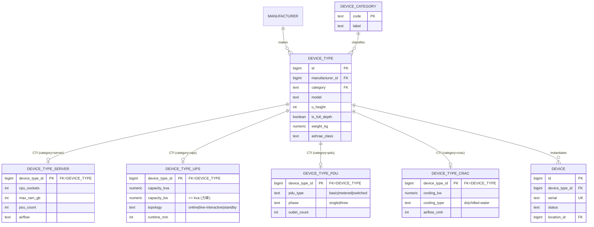
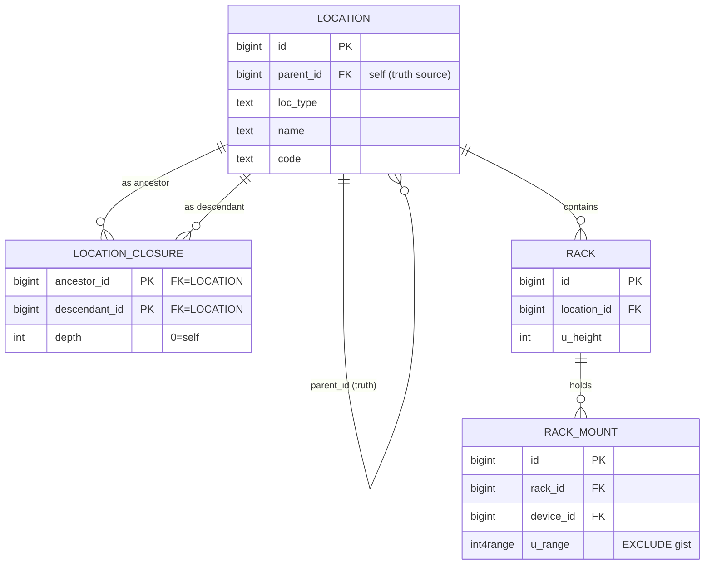
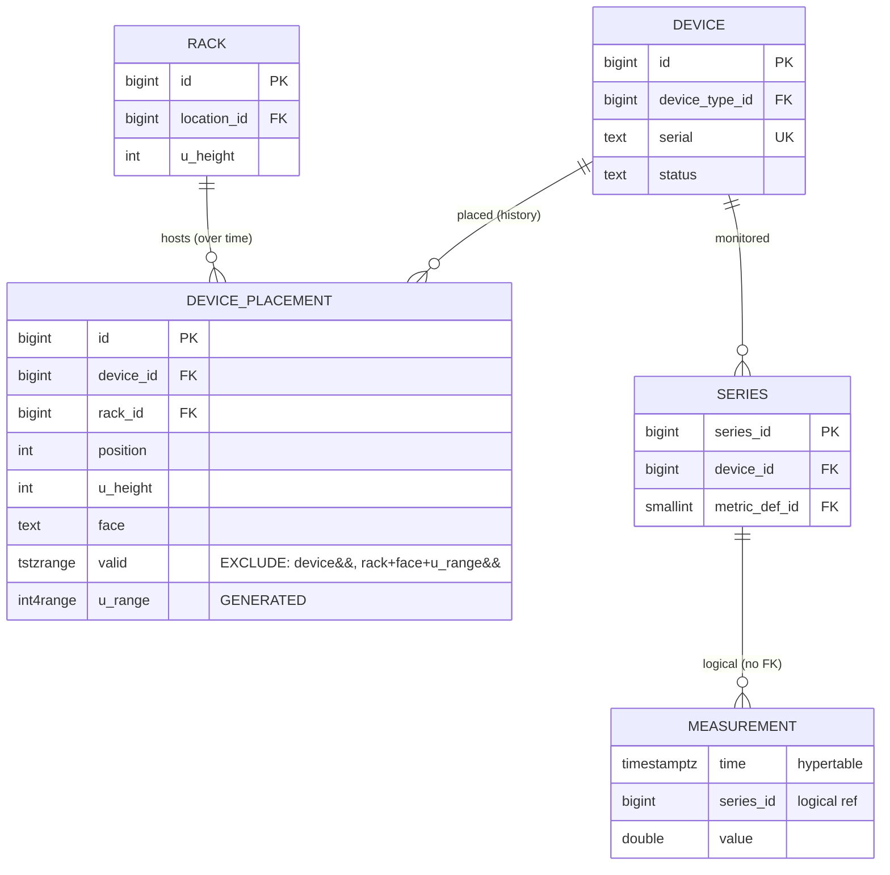
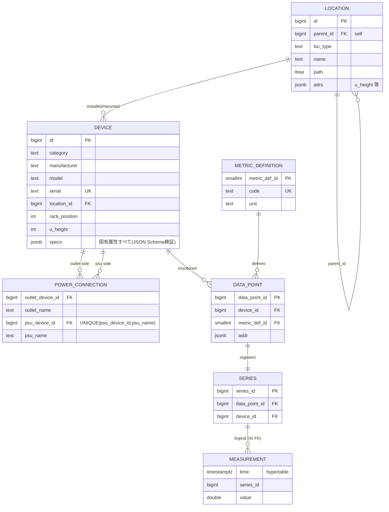

# 07. ER 図（他の有力 4 案）

[05-er-diagram.md](./05-er-diagram.md) は推奨案 **P05** の ER 図。本章は残る 4 案
（**P04 / P06 / P08 / P02**）を Mermaid ER 図で示す。各案は P05 との**差分が要点**なので、
差分エンティティを中心に描き、共通部分（テレメトリ `series`/`measurement`/CAGG、配線 `cable`/`cable_termination` 等）は
P05（[05 章](./05-er-diagram.md)）を参照する。

> 凡例は [05 章](./05-er-diagram.md) と同じ。点線 `..` は論理参照 / 派生 / CAGG。

---

## 7.1 P04 — NetBox 忠実・強整合（機器固有属性を CTI で型付け）

**差分**: 機器固有属性を `specs jsonb` でなく**カテゴリ別の子テーブル（Class Table Inheritance）**で型付け。
`device_type`（共通テンプレート）の下に `device_type_server` / `device_type_ups` / … が 0..1 で対応。
空間・配線・テレメトリは P05 と同じ。

- **特徴**: 固有属性が型付き列で `NOT NULL`/`CHECK`/`FK` フル（制約最強）。`category` と子テーブルの一致は
  CONSTRAINT TRIGGER で担保。**新カテゴリ追加 = 新テーブル + デプロイ**（可変性は P05 に劣る）。
- 06 章 A-1 の指摘（多態関連の厳格化）と相性が良い案。

---

## 7.2 P06 — 閉包テーブル読み最適化

**差分**: 空間階層を `ltree` 派生 path でなく**閉包テーブル `location_closure`** で表現。
祖先-子孫の全ペアを保持し、階層集約 JOIN が**再帰不要**で最速。`location`（隣接リスト＝真実源）は維持。

- **特徴**: 「ある building 配下の全ラック」が `JOIN location_closure ON ancestor_id=:building` の単純 JOIN（最速）。
  読み支配・多数同時ダッシュボードに最適。サブツリー移動でエッジ行を再生成（書込増幅）するのがコスト。
- 機器マスタ・配線・テレメトリは P05 と同一（`location.path ltree` を `location_closure` に置換するだけ）。
  P17（閉包 + JSONB ハイブリッド機器）にするなら 7.1 でなく [05 章](./05-er-diagram.md)の `DEVICE_TYPE.specs` を併用。

---

## 7.3 P08 — 時間軸正確 Temporal（搭載位置を Type-2 履歴化）

**差分**: `rack_mount`（現在位置のみ）を**有効期間付き `device_placement`（Type-2 SCD）**に置換。
機器移設をまたいでも、過去のラック別電力/温度を「サンプル時刻に有効だったマッピング」で正確に集計できる。

- **特徴**: 真の point-in-time。`EXCLUDE USING gist (device_id WITH =, valid WITH &&)` で同一機器の期間重複を禁止、
  `(rack_id, face, u_range, valid)` の排他で**時間込みの U 重なり**を禁止。
- 集約は CAGG にできない（時間範囲 JOIN が必要）ため、空間集約は**オンザフライ範囲 JOIN**または
  **analytics-batch でのマテリアライズ**（[03 章](./03-finalists.md) P08）。電力課金・エネルギー会計向け。
- 06 章 A-8 のフルデプスバグは、この案では `valid` を含む排他で面ごと 2 行表現にすると同時に解決できる。

---

## 7.4 P02 — JSONB 軽量 MVP

**差分**: テーブル数を最小化。空間は `location` のみ（Rack も統合、固有属性は `attrs jsonb`）、
機器は**単一テーブル + `specs jsonb`**、配線は電力/ネットの最小接続テーブル。
**テレメトリだけは P05 と同じ Narrow + series**（TS 整合の要なので妥協しない）。

- **特徴**: 可変性最大・実装/運用最小・移行容易。`u_height`/U 位置を `attrs`/列に持つが
  **EXCLUDE による重なり禁止は無し**（U 重なり・誤配線・冗長を DB で弾けない＝アプリ層頼み）。
- **小規模 / PoC / 単一テナント**向け。成長したら P05 へ段階移行（`device.specs` → 型付き列 + DeviceType 分離、
  `power_connection` → 種別別ポート + Cable 実体）。

---

## 7.5 4 案 ER の差分まとめ

| 案 | P05 からの ER 差分 | 追加/置換エンティティ |
|----|----|----|
| **P04** | 機器固有属性を CTI 化 | `DEVICE_TYPE_*`（server/ups/pdu/crac…）を `DEVICE_TYPE` に 0..1 で連結 |
| **P06** | 空間を閉包テーブル化 | `LOCATION_CLOSURE(ancestor, descendant, depth)` を追加（`path ltree` を置換） |
| **P08** | 搭載位置を Type-2 履歴化 | `RACK_MOUNT` → `DEVICE_PLACEMENT(valid tstzrange)` |
| **P02** | 単一テーブル + JSONB に簡素化 | `DEVICE(specs jsonb)`・`POWER_CONNECTION`（`DEVICE_TYPE`/種別別ポート/`CABLE` を省略） |

> いずれも 06 章のセルフレビュー指摘（多態関連の実 FK 化・語彙のルックアップ化・単位正規化・
> フルデプス排他バグ）は共通して適用すべき改修である。
