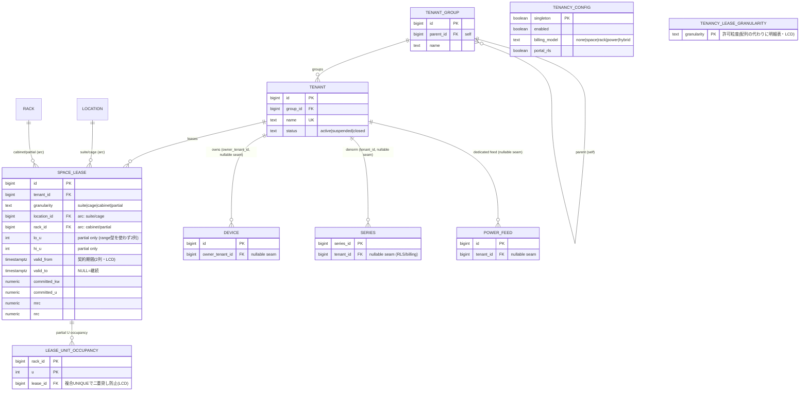

# 08. テナント / コロケーション拡張モジュール

「いろんな DC に提供するパッケージ」ゆえ、**テナント運用は顧客ごとに大きく異なる**
（自社専用のエンタープライズ DC / ホールセールのエリア貸し / リテールコロのラック・U 貸し / kW 販売）。
そこでテナント・賃貸・再課金を **コア（[03 章](./03-finalists.md) P05）から切り離した加算的（additive）オプションモジュール**として設計し、
**運用プロファイルで有効化・粒度を切り替える**。これが本章の「いい感じの区切り方」。

---

## 8.1 区切りの原則：コアは無改変、テナントは加算レイヤ

| 層 | 役割 | テナント無効時 |
|----|------|---------------|
| **コア（P05）** | 物理（location/rack/device）・配線・テレメトリ・集約 | そのまま完結。単一テナント DC はこれだけで動く |
| **テナントモジュール（本章）** | tenant 階層・賃貸（space_lease）・再課金・アクセス・データ分離 | テーブルを作らなければ存在しないのと同じ |

**コアへの接点（seam）は「nullable な列 3 つ」だけ**に絞る。これによりコアの DDL/クエリは
テナント有無で変わらず、モジュールを足す/外すが容易になる:

```sql
-- コア側に足す唯一の接点（すべて NULL 許容。テナント無効時は未使用のまま）
ALTER TABLE device      ADD COLUMN owner_tenant_id bigint;  -- 資産の所有者（コロ顧客）
ALTER TABLE series      ADD COLUMN tenant_id       bigint;  -- 再課金/RLS 用に非正規化
ALTER TABLE power_feed  ADD COLUMN tenant_id       bigint;  -- 専用フィードの帰属（任意）
```

> モジュール本体は **別スキーマ `tenancy`** に置くと物理的にも区切れる（`tenancy.tenant` 等）。
> 本章では簡潔さのため修飾を省く。FK はモジュール有効時のみ張る（無効構成では seam 列は単なる未使用列）。

---

## 8.2 運用プロファイル（顧客差をここで吸収）

顧客の運用を 4 プロファイルに整理し、**設定テーブルで宣言**する。粒度・課金モデル・ポータル有無を
データで切り替えるので、同一コードベースで全パターンに対応できる。

| プロファイル | 例 | 貸出粒度 | 課金 | ポータル(RLS) |
|------------|----|---------|------|--------------|
| **A. 単一運用者** | 自社・官公庁 DC | なし（`tenant`=部門タグのみ） | なし | 無効 |
| **B. ホールセール / エリア貸し** | ハイパースケール向け | suite / cage | 面積・kW | 任意 |
| **C. リテールコロ** | 一般コロ | cabinet / partial(U) | ラック・U・kWh 再課金 | 有効 |
| **D. パワー販売** | 高密度コロ | cage / cabinet | **kW コミット**中心 | 有効 |

```sql
CREATE TABLE tenancy_config (                 -- デプロイ1つにつき1行
    singleton boolean PRIMARY KEY DEFAULT true CHECK (singleton),
    enabled       boolean NOT NULL DEFAULT false,           -- モジュール自体の ON/OFF
    billing_model text NOT NULL DEFAULT 'space'
                  CHECK (billing_model IN ('none','space','rack','power','hybrid')),
    portal_rls    boolean NOT NULL DEFAULT false            -- テナントポータル提供有無
);
-- 許可する貸出粒度は配列(text[])を使わず明細テーブルで（LCD・MySQL移植可）
CREATE TABLE tenancy_lease_granularity (
    granularity text PRIMARY KEY
        CHECK (granularity IN ('suite','cage','cabinet','partial'))
);  -- 例: INSERT 'cage','cabinet'  → 許可粒度。space_lease 作成時にサービス層で照合
```

`space_lease` 作成時に「その粒度が `tenancy_lease_granularity`（許可粒度の明細表）に含まれるか」を
サービス層で検証すれば、**B の顧客にうっかり partial(U貸し) を作らせない**といった運用ガードもデータ駆動でかけられる。

---

## 8.3 テナント階層

```sql
CREATE TABLE tenant_group (        -- リセラー・親会社・部門などの階層
    id bigint GENERATED ALWAYS AS IDENTITY PRIMARY KEY,
    parent_id bigint REFERENCES tenant_group(id) ON DELETE RESTRICT,
    name text NOT NULL,
    UNIQUE (parent_id, name)
);
CREATE TABLE tenant (
    id bigint GENERATED ALWAYS AS IDENTITY PRIMARY KEY,
    group_id bigint REFERENCES tenant_group(id) ON DELETE SET NULL,
    name   text NOT NULL,
    status text NOT NULL DEFAULT 'active' CHECK (status IN ('active','suspended','closed')),
    UNIQUE (name)
);
-- seam 列に FK を張る（モジュール有効時）
ALTER TABLE device     ADD CONSTRAINT device_owner_fk
    FOREIGN KEY (owner_tenant_id) REFERENCES tenant(id) ON DELETE RESTRICT;
ALTER TABLE series     ADD CONSTRAINT series_tenant_fk
    FOREIGN KEY (tenant_id) REFERENCES tenant(id) ON DELETE SET NULL;
ALTER TABLE power_feed ADD CONSTRAINT feed_tenant_fk
    FOREIGN KEY (tenant_id) REFERENCES tenant(id) ON DELETE SET NULL;
```

- **A プロファイル**では `tenant` を「部門」として使うだけ（lease なし）。`tenant_group` で組織階層を表現。

---

## 8.4 賃貸（space_lease）— 粒度横断・期間付き

物理階層から分離した第一級エンティティ。粒度は **排他アーク**（[06 章 A-1](./06-self-review.md) で推奨した
多態回避＝実 FK 化）で表す。**cage は既存 `location`（`loc_type='cage'`）**に乗るので、配下の集約クエリが
そのまま効く。

> **LCD 化（[09章](./09-portability.md)）**: `tstzrange`/`int4range`/`EXCLUDE` を使わず、
> 期間は `valid_from`/`valid_to` の2列、U は `lo_u`/`hi_u` の2列、二重貸し防止は **占有U行 + 複合UNIQUE**で表現
> （MySQL でも同形）。期間重なりの厳密判定（valid 込み）はサービス層で担保する。

```sql
CREATE TABLE space_lease (
    id        bigint GENERATED ALWAYS AS IDENTITY PRIMARY KEY,   -- MySQL: AUTO_INCREMENT
    tenant_id bigint NOT NULL REFERENCES tenant(id) ON DELETE RESTRICT,
    granularity text NOT NULL CHECK (granularity IN ('suite','cage','cabinet','partial')),
    -- 排他アーク: suite/cage→location、cabinet/partial→rack
    location_id bigint REFERENCES location(id) ON DELETE RESTRICT,
    rack_id     bigint REFERENCES rack(id)     ON DELETE RESTRICT,
    lo_u int, hi_u int,                                    -- partial のときだけ（range型を使わず2列）
    valid_from timestamptz NOT NULL DEFAULT now(),         -- 契約期間（range型を使わず2列）
    valid_to   timestamptz,                                -- NULL=継続中、解約時に設定
    -- コミット（販売した容量）
    committed_kw      numeric(8,2) CHECK (committed_kw  >= 0),
    committed_u       int          CHECK (committed_u   >= 0),
    committed_area_m2 numeric(8,2) CHECK (committed_area_m2 >= 0),
    -- 課金
    mrc numeric(12,2), nrc numeric(12,2), billing_ref text,        -- 月額/初期/外部課金ID
    CHECK ( valid_to IS NULL OR valid_to > valid_from ),
    -- 粒度と参照先の整合（排他アーク）
    CHECK ( (granularity IN ('suite','cage')) = (location_id IS NOT NULL) ),
    CHECK ( (granularity IN ('cabinet','partial')) = (rack_id IS NOT NULL) ),
    CHECK ( (granularity = 'partial') = (lo_u IS NOT NULL AND hi_u IS NOT NULL) )
);
-- granularity が tenancy_lease_granularity（許可粒度の明細表）に含まれるかはサービス層で検証

-- シェアドラックの二重貸し防止（現に有効なリースのU占有を1行ずつ展開して複合UNIQUE）
-- ※「期間重なり」の厳密判定はサービス層で行い、ここは「現行有効な占有」の一意性を担保
CREATE TABLE lease_unit_occupancy (
    rack_id  bigint NOT NULL REFERENCES rack(id),
    u        int    NOT NULL,
    lease_id bigint NOT NULL REFERENCES space_lease(id) ON DELETE CASCADE,
    PRIMARY KEY (rack_id, u)          -- 同一ラックの同一Uは現行1リースのみ（partial/cabinet 混在も防止）
);
```

設計のキモ:
- **期間付き（`valid_from`/`valid_to`）**：解約・移転の履歴が残る。過去月の再課金（8.7）が正確で、P08(Temporal) と親和。
- **cage は location に同居**：`loc_type='cage'`（必要なら `suite` も loc_type 追加）。テナント区画の階層化も `location` の木でそのまま表現。
- **committed_* と実測の差＝販売余地**（8.7 のキャパシティ）。

---

## 8.5 所有 vs 設置の整合

- `device.owner_tenant_id` = 資産所有者（コロ顧客）。**床・ラックは DC 所有、中身はテナント所有**を表せる。
- **整合チェック（監視ビュー/トリガ）**：機器の設置位置（rack_mount → rack/location）を**覆う有効 lease のテナント**と
  `owner_tenant_id` が一致するか。不一致＝「他人の区画に置かれた機器」を検出。

```sql
-- 区画違反の検出（監視ビュー）: 機器の所有者が、その設置場所の有効リース先と異なる
-- LCD: 期間は valid_from/valid_to の2列比較、配下判定は location_closure JOIN（ltree廃止）
CREATE VIEW v_lease_placement_violation AS
SELECT d.id AS device_id, d.owner_tenant_id, rm.rack_id
FROM device d
JOIN rack_mount rm ON rm.device_id = d.id
JOIN rack rk ON rk.id = rm.rack_id
LEFT JOIN space_lease l
  ON l.valid_from <= now() AND (l.valid_to IS NULL OR l.valid_to > now())   -- 有効期間
 AND l.tenant_id = d.owner_tenant_id
 AND ( (l.granularity IN ('cabinet','partial') AND l.rack_id = rm.rack_id)  -- U範囲詳細はサービス層で判定
    OR (l.granularity IN ('suite','cage')
        AND EXISTS (SELECT 1 FROM location_closure lc
                    WHERE lc.ancestor_id = l.location_id
                      AND lc.descendant_id = rk.location_id)) )
WHERE d.owner_tenant_id IS NOT NULL AND l.id IS NULL;   -- 覆う自テナントのリースが無い
```

---

## 8.6 データ分離（ポータル提供時のみ・RLS）

`tenancy_config.portal_rls = true` の顧客だけ Row-Level Security を有効化する。

```sql
ALTER TABLE device ENABLE ROW LEVEL SECURITY;
CREATE POLICY tenant_isolation ON device
  USING (owner_tenant_id = current_setting('app.tenant_id', true)::bigint);
-- series も同様に tenant_id で。アプリは接続時に SET app.tenant_id = '<id>'
```

⚠️ **重要な落とし穴**：`measurement`（hypertable）に**直接 RLS を張ると continuous aggregate が壊れる**
（CAGG の定義元にポリシーがあると不可）。時系列のテナント絞り込みは **RLS でなく `series.tenant_id` を
JOIN/WHERE で**行う。RLS は `device`/`series`/構成系テーブルに限定する。

---

## 8.7 再課金・キャパシティ（テナント軸）

### テナント別 月次 kWh（[04 章 UC-1](./04-validation-queries.md) のテナント版）

`series.tenant_id`（非正規化）で割るだけ。共有環境は機器所有で按分、専用フィードは `power_feed.tenant_id`。

```sql
WITH per_series AS (
    SELECT s.tenant_id, s.series_id,
           average(rollup(d.stats)) AS avg_w, count(*) AS n_days
    FROM measurement_1d d
    JOIN series s USING (series_id)
    WHERE s.metric_def_id = (SELECT metric_def_id FROM metric_definition WHERE code='active_power')
      AND d.bucket >= date_trunc('month', :as_of)
      AND d.bucket <  date_trunc('month', :as_of) + INTERVAL '1 month'
      AND s.tenant_id IS NOT NULL
    GROUP BY s.tenant_id, s.series_id
)
SELECT tenant_id,
       sum(avg_w * n_days * 24) / 1000.0                              AS kwh_month,
       round((sum(avg_w * n_days * 24)/1000.0 * :jpy_per_kwh)::numeric) AS jpy_energy
FROM per_series
GROUP BY tenant_id;
```

### テナント別キャパシティ（コミット vs 実測 → 販売余地）

```sql
-- 契約電力(committed_kw) と 実測ピーク/平均 の対比。stranded = 売ったが使われていない容量
SELECT l.tenant_id,
       sum(l.committed_kw)                       AS committed_kw,
       (/* 上の per_series を kW 平均にした実測 */) AS used_kw_avg,
       sum(l.committed_kw) - (/* used */)        AS stranded_kw   -- 追加販売 or 是正の余地
FROM space_lease l
WHERE l.valid_from <= now() AND (l.valid_to IS NULL OR l.valid_to > now())
GROUP BY l.tenant_id;
```

### 販売可能在庫（vacant）

`rack.u_height` − 有効 partial lease の占有 U、`location` 内の未リース cage 等で「売れる区画」を一覧化。

---

## 8.8 付随モジュール（任意・さらに区切る）

| 機能 | 表 | いつ入れる |
|------|----|-----------|
| クロスコネクト | `cable` 両端に tenant、MMR=`loc_type='mmr'` | キャリア接続を売る場合 |
| アクセス制御 | `access_grant(tenant_id, location_id|rack_id, person_id, valid)` | ケージ入退室を管理する場合 |
| SLA/契約メタ | `lease_term`/`sla` を `space_lease` に紐付け | 契約管理を DCIM に寄せる場合 |

---

## 8.9 ER 図（テナントモジュール）



---

## 8.10 まとめ：どう「区切った」か

1. **コア無改変**：接点は nullable 列 3 つ（`device.owner_tenant_id` / `series.tenant_id` / `power_feed.tenant_id`）のみ。
   テナント無効構成では存在しないのと同じ。別スキーマ `tenancy` に隔離可。
2. **運用差は `tenancy_config` で宣言**：A 単一運用 / B エリア貸し / C リテールコロ / D パワー販売を、
   **許可粒度（`tenancy_lease_granularity`）・課金モデル・ポータル(RLS)** の組合せで表現。コードは共通。
3. **賃貸は粒度横断の 1 エンティティ**：`space_lease` の排他アーク + 期間(2列) + 占有行UNIQUE で
   suite/cage/cabinet/partial と二重貸し防止を一括。cage は既存 `location` に同居し集約が効く。
4. **再課金・キャパシティはテナント軸の派生**：既存 UC を `tenant_id` で割るだけ。コミット vs 実測で販売余地。

> これにより [06 章 B-7](./06-self-review.md)（マルチテナント/コロの浅さ）は **「分離可能モジュールとして解決方針あり」** に更新。
> 顧客ごとに違う運用は、**スキーマ分岐ではなく設定（プロファイル）で吸収**するのが本設計の肝。
