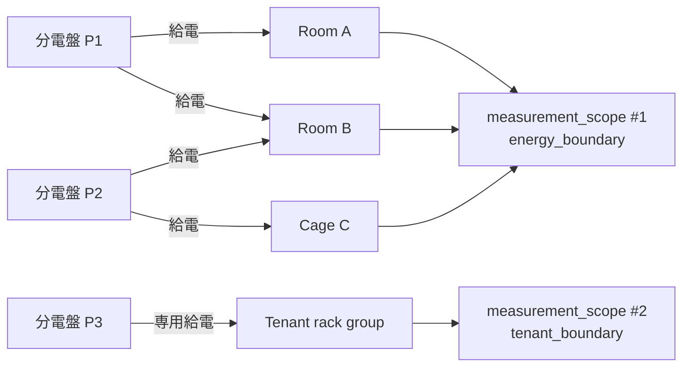
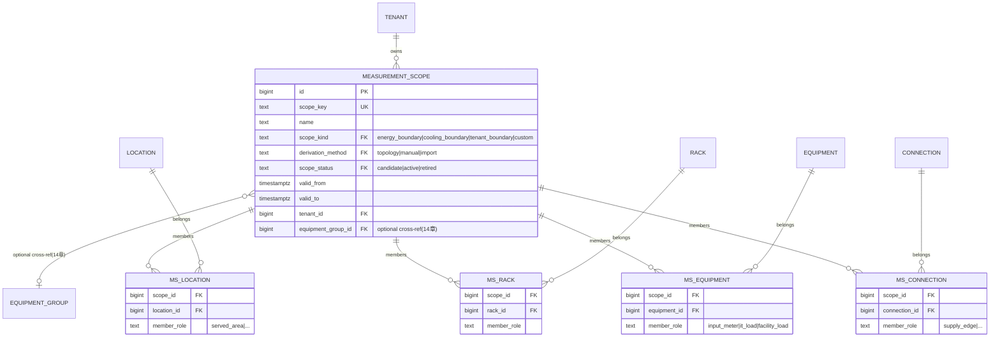
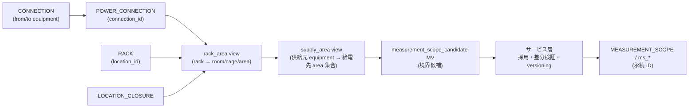
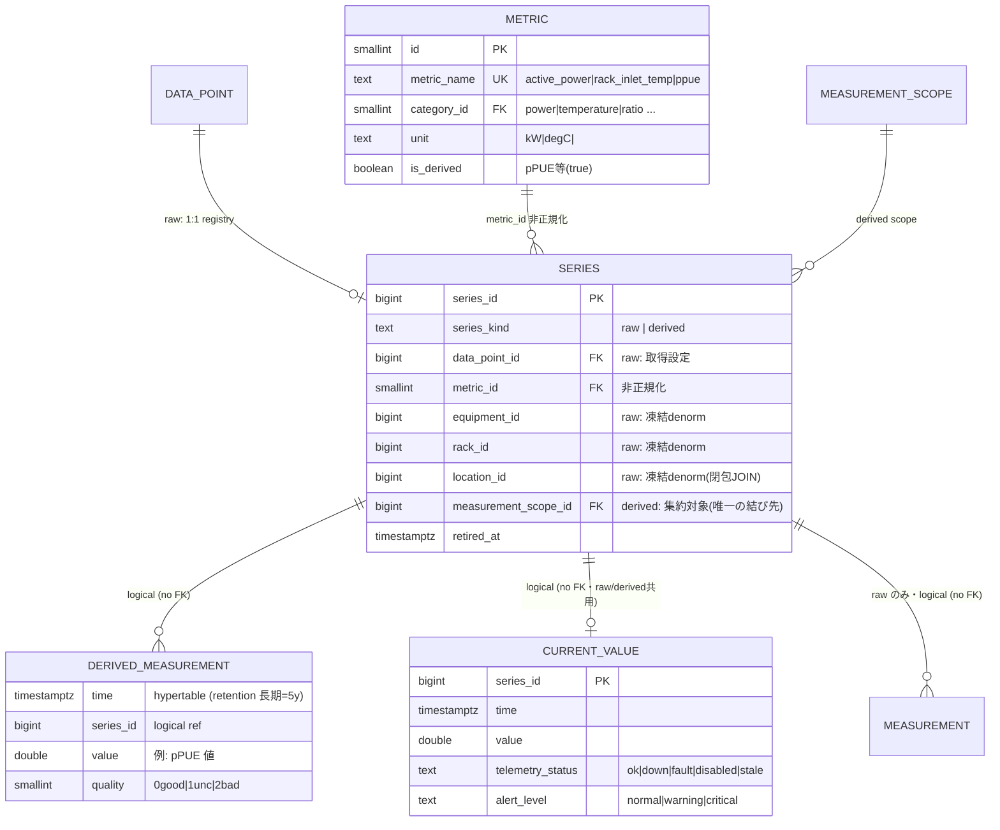
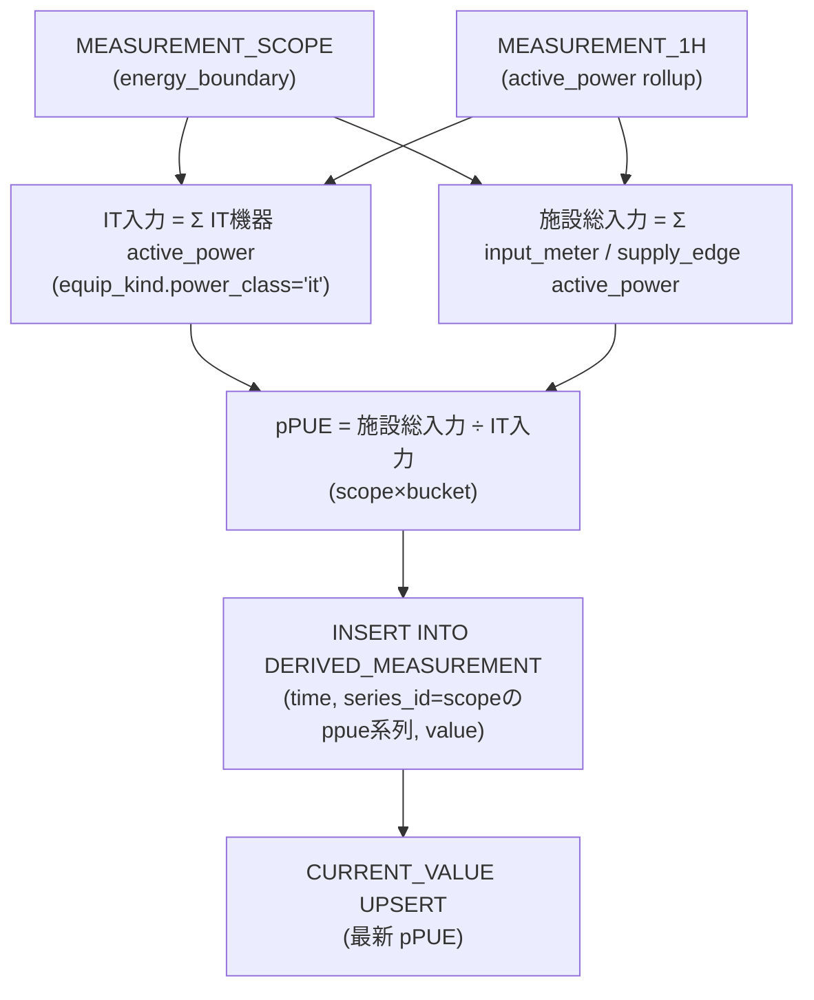

# 10. 計測スコープ & 派生メトリクス（pPUE 等の集計境界）

機器から採れた生テレメトリを集約した**派生値（pPUE など）を時系列に格納**するための拡張。
最大の論点は、pPUE のような比率指標が **"閉じた電力境界"** を要求すること。
この境界は物理 room と一致するとは限らず、cage、複数 room、ラック群、分電盤配下、テナント計測境界、
あるいはトポロジ由来の論理境界になる。

したがって製品版では、プロトタイプのように MV そのものへ値を紐づけない。
MV は候補生成・再計算キャッシュに留め、永続 ID を持つ **`measurement_scope`** を真実源にする。
pPUE は `data_point` ではなく、`measurement_scope` に紐づく **derived `series`** として管理する。

> **凡例・前提**
> - `data_point` は機器から収集する raw 点。機器に直接紐づかない値は `data_point` にしない。
> - 時系列（`measurement` / `derived_measurement` / `current_value`）は **TimescaleDB** 側。
>   hypertable には **実 FK を張らない**（`series_id` の論理参照のみ）。
> - 計測スコープは `location` 木のノードにしない。物理階層を壊さず、横断的な境界として持つ。
> - スコープメンバーは種別テーブル分割（`ms_location` / `ms_rack` / `ms_equipment` / `ms_connection`）で参照する。種別ごとに専用テーブルを持ち、FK 整合性を DB が担保する。`target_type + target_id` 型の多態キーは使わない。
> - スコープ候補の導出、pPUE 算出、メンバー更新は**サービス層**。PG 固有機能・トリガ依存なし。

---

## 10.1 なぜ room / MV ではなく measurement_scope か

pPUE = 施設総入力電力 ÷ IT 入力電力。
これが意味を持つのは、**境界に入る電力を漏れなく測れる**ときだけ。
分電盤が room A・B をまたぐと、盤入力を A だけに按分できない。
逆に cage やラック群だけで個別計量できる場合は、物理 room より小さい境界が正しいこともある。



- room 単体 pPUE を特別扱いしない。
- MV は `measurement_scope_candidate` の生成に使い、採用された境界は `measurement_scope` として永続化する。
- UI や履歴値は安定した `measurement_scope.id` に紐づく。MV の再生成で時系列の同一性が揺れない。

---

## 10.2 計測スコープ（Measurement Scope）

計測・派生 KPI の所属先を表す第一級エンティティ。
境界の構成要素は、location だけでなく rack / equipment / connection を指せる。
参照は種別テーブル分割（`ms_location` / `ms_rack` / `ms_equipment` / `ms_connection`）で型安全に持つ。



```sql
-- 種別テーブル分割: テーブルごとに実 FK を持つ（排他アーク・num_nonnulls 不要）
MS_LOCATION:   UNIQUE (scope_id, member_role, location_id)
MS_RACK:       UNIQUE (scope_id, member_role, rack_id)
MS_EQUIPMENT:  UNIQUE (scope_id, member_role, equipment_id)
MS_CONNECTION: UNIQUE (scope_id, member_role, connection_id)

-- 横断ビュー（任意）: 全メンバーを一覧する場合
CREATE VIEW measurement_scope_member AS
    SELECT scope_id, location_id, NULL::bigint AS rack_id,
           NULL::bigint AS equipment_id, NULL::bigint AS connection_id, member_role
      FROM ms_location
    UNION ALL
    SELECT scope_id, NULL, rack_id, NULL, NULL, member_role
      FROM ms_rack
    UNION ALL
    SELECT scope_id, NULL, NULL, equipment_id, NULL, member_role
      FROM ms_equipment
    UNION ALL
    SELECT scope_id, NULL, NULL, NULL, connection_id, member_role
      FROM ms_connection;
```

> 物理 room の集合だけを表すなら、`ms_location` テーブルのメンバーだけで足りる。
> 分電盤配下やテナント境界を正確に表す場合は、供給元 equipment（`ms_equipment`）や給電 connection（`ms_connection`）もメンバーにできる。
> `valid_from` / `valid_to` を持たせることで、過去の pPUE や再課金で「当時の境界」を再現できる。

### 候補生成（MV はここで使う）

トポロジから候補を作る処理は、プロトタイプ同様に MV / view / 一時表を使ってよい。
ただし、その結果を採用したら `measurement_scope` に UPSERT し、時系列は MV 名ではなく scope ID に紐づける。



---

## 10.3 派生メトリクスの格納（series 台帳の derived scope）

「pPUE を raw と同じ観測系列として扱いたい」という要件は、`data_point` ではなく `series` で満たす。
`metric` は「何の値か」（`ppue`）、`series` は「どのスコープの値か」、`derived_measurement` は「いつの値か」を持つ。



```sql
-- scope_type(多態判別)は廃止: derived は measurement_scope_id 一本に結ぶ（部屋/ラック単独集約もメンバー1個の scope で表す）
CHECK ( (series_kind='raw'     AND data_point_id IS NOT NULL AND measurement_scope_id IS NULL)
     OR (series_kind='derived' AND data_point_id IS NULL     AND measurement_scope_id IS NOT NULL) )

-- pPUE 等、同一スコープ内の同一派生 metric は1系列
-- PG: partial unique / LCD: 生成列 NULL-unique または derived_series 別表
UNIQUE (measurement_scope_id, metric_id) WHERE series_kind='derived';
```

> **整合ルール**: raw は機器由来なので `data_point_id` 必須。
> pPUE のような派生値は `data_point_id` を持たず、`measurement_scope_id` と `metric_id` で意味が決まる。
> `metric` に `metric_name='ppue'`, `metric_category.category_name='ratio'`, `unit=''`, `is_derived=true` を1行足すだけで、
> UI・最新値・ロールアップ・閾値評価は raw series と同じ枠組みを使える。

---

## 10.4 pPUE 算出フロー

計測スコープは電力境界が閉じるよう選ばれているため、入力電力はスコープに全帰属する。
1 時間バケットの電力ロールアップから比を計算し、`derived_measurement` に書き込む。



- **IT 入力**: スコープ内の IT 機器（`equip_kind.power_class='it'`）の `active_power` 合計。
- **施設総入力**: スコープの `input_meter` / `supply_edge` に対応する入力電力合計（+ 必要なら冷却機）。
- 電力点の特定は `series.metric_id` → `metric`（`metric_name='active_power'`）で行う（[03章 L3](./03-finalists.md)）。
- `ms_*` テーブルの `member_role` を使うと、分子・分母の対象をスコープ定義側で明示できる。
- 計算ジョブはサービス層で実行する。書き込み後は `current_value` / ロールアップ / 閾値評価を raw と同じ形で扱える。

---

## 10.5 図に表れない主要制約・留意点

| 種別 | 制約／留意点 | 実装・方針 |
|------|------------|-----------|
| 同一性 | 派生値の所属先 | MV ではなく `measurement_scope.id` に紐づける |
| スコープ構成 | メンバーは location/rack/equipment/connection | 種別テーブル分割（`ms_location` / `ms_rack` / `ms_equipment` / `ms_connection`） |
| 整合 | raw/derived の形状 | `series` の CHECK（raw⇒data_point必須、derived⇒data_point NULL） |
| 複合一意 | 派生系列の重複防止 | `(measurement_scope_id, metric_id) WHERE derived`（PG専用→LCD代替は [09章](./09-portability.md)） |
| 導出 | スコープ候補 = トポロジ由来 | `measurement_scope_candidate` MV + サービス層差分適用 |
| 履歴正確性 | 境界の時点固定 | `measurement_scope.valid_from/valid_to`。必要なら member も Type-2 SCD 化 |
| 集約制約 | pPUE 算出 | 行間集約のためサービス層の定期ジョブ（DB トリガに依存させない・[09章](./09-portability.md)） |

> **設計の効きどころ**:
> - **木を壊さない** — 計測スコープは `location` と独立し、物理 room や cage に一致しなくてもよい。
> - **MV に同一性を持たせない** — MV は候補生成、永続 ID は `measurement_scope`。
> - **派生値も普通の series** — `series_id` 空間を共有し、`current_value`・ロールアップ・閾値評価が raw と同じ枠組みで効く。
> - **data_point を歪めない** — 機器収集点は `data_point`、境界 KPI は `measurement_scope` + derived `series`。
> - **equipment_group との棲み分け** — scope は KPI 算出の閉じた境界（`member_role`: `input_meter` / `it_load`）。
>   group（[14 章](./14-logical-grouping.md)）は運用名（A系/B系）で機器・接続・ラックを束ねる汎用グループ。
>   scope → group のオプション FK `equipment_group_id` で「対応するグループ」を緩く参照できる。
