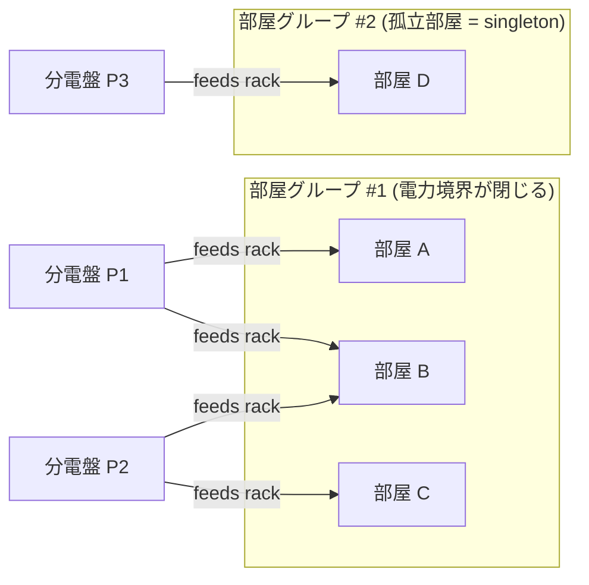
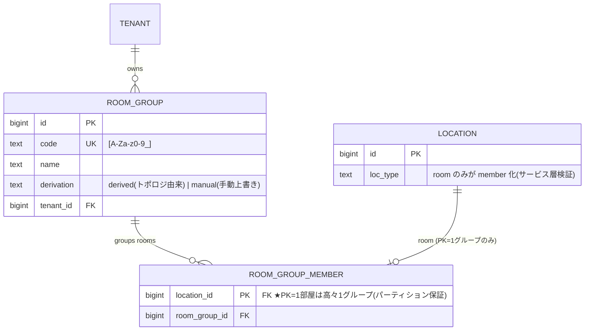
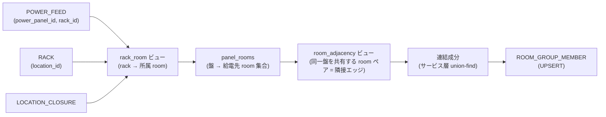
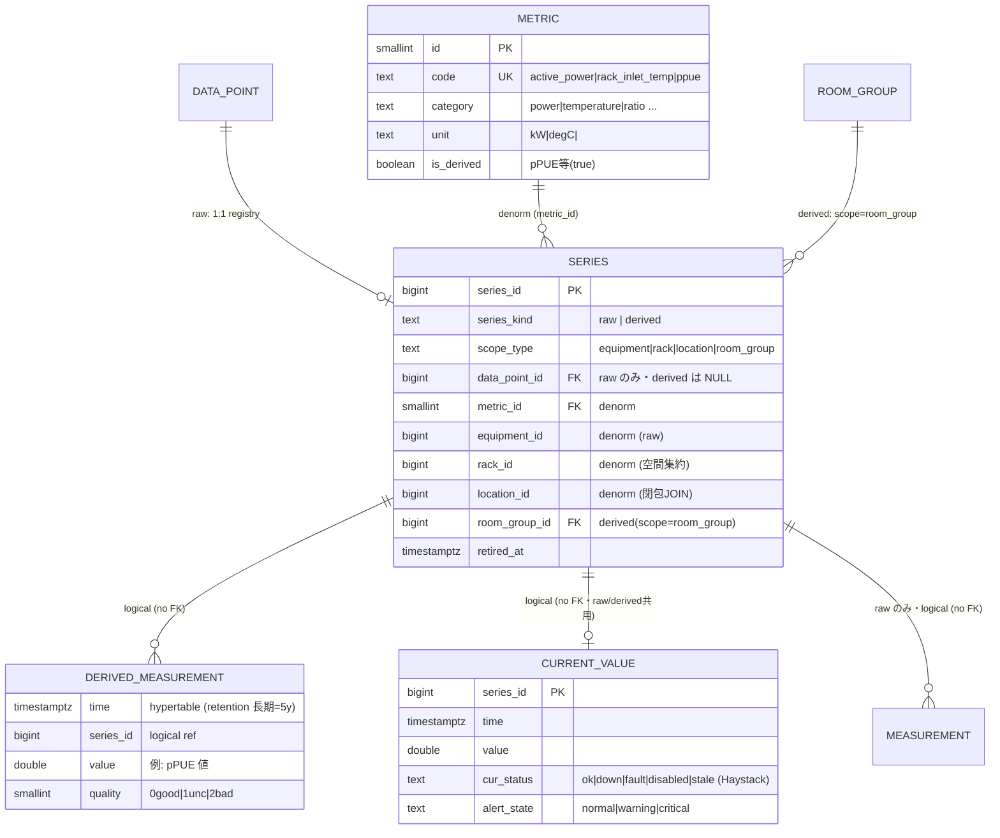
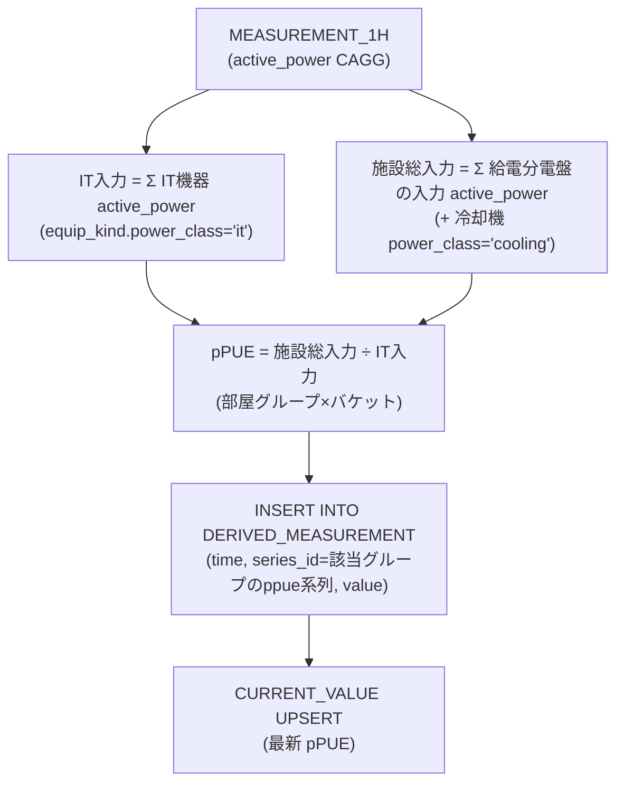
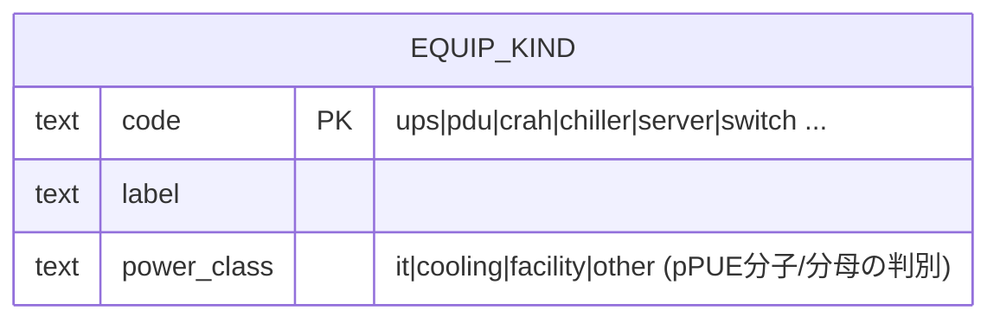

# 10. 部屋グループ & 派生メトリクス（pPUE 等の集計境界）

機器から採れた生テレメトリを集約した**派生値（pPUE など）を Point として時系列に格納**するための拡張。
最大の論点は「**pPUE のような比率指標は"閉じた電力境界"を要求する**」こと。パネル/PDU（`equip_kind`=panel 等の `equipment` ノード）が
部屋をまたいで給電していると部屋単体は電力境界として閉じないため、**同じパネル/PDU を共有する部屋を連結した
「部屋グループ」**を最小集計単位として導入する。確定設計（[03章](./03-finalists.md)）への加算モジュール。

> **凡例・前提**
> - 時系列（`measurement` / `derived_measurement` / `current_value`）は **TimescaleDB** 側。
>   hypertable には **実 FK を張らない**（`series_id` の論理参照のみ。図中 `logical(no FK)`）。
> - 部屋グループは `location` 木の**ノードにしない**。木と独立した**横断グルーピング表**
>   （木に入れると部屋がフロアとグループの 2 親を持って破綻する）。
> - 部屋グループは電力トポロジ（盤→feed→rack→room）の**連結成分から導出**してマテリアライズ
>   （`CablePath` キャッシュと同じく構成変更時に再計算）。手動上書きも許す。
> - LCD 維持：連結成分計算・pPUE 算出は**サービス層**。PG 固有機能・トリガ依存なし。

---

## 10.1 なぜ「部屋」でなく「部屋グループ」か

pPUE = 施設総入力電力 ÷ IT 入力電力。これが意味を持つのは、**境界に入る電力を漏れなく測れる**ときだけ。
分電盤が部屋 A・B をまたぐと、盤入力を A だけに按分できない → 部屋単体は境界として閉じない。
正しい最小単位は「**同じ分電盤を共有する部屋を連結した連結成分**」。



- P1 が A,B を、P2 が B,C を給電 → 推移的に連結し **{A,B,C} が 1 グループ**。
- どの盤とも共有しない D は **サイズ 1 の部屋グループ**（= 部屋そのもの）。
- → **部屋単体 pPUE を特別扱いしない**。孤立部屋は singleton グループになり、pPUE は**常に
  部屋グループ scope で統一的に計算**できる（境界の有無で分岐不要）。

---

## 10.2 部屋グループ（Room Group）

`location` 木に対する横断 M:N グルーピング。`room_group_member.location_id` を**主キー**にすることで
「**1 部屋は高々 1 グループ**」＝電力境界の分割不能性（パーティション）を DB が保証する。



> `location_id` を主キーにするのが肝。電力境界は重複できない＝部屋集合のパーティションなので、
> これだけで DB が排他を保証する（複合 UNIQUE もトリガも不要）。`location` が `loc_type='room'` で
> あることは跨表 CHECK 不可（LCD）のためサービス層／トリガで検証。
> 冷却境界など別系統で異なるグルーピングが要るようになったら、`group_type` 付きの汎用
> `LOCATION_GROUP` へ一般化できる（まずは電力 `room_group` を具体実装する方針）。

### 連結成分の導出（マテリアライズ）

トポロジから機械的に確定する。rack→room は `location_closure` で最近接の `room` 祖先へ畳む
（rack が `row` 配下でも room へ集約）。



- `room_adjacency`（= 同一盤を共有する部屋ペア）までは SQL ビューで導出。
- 連結成分の確定は**サービス層の union-find** を推奨（`WITH RECURSIVE` ラベル伝播でも可だが、
  トポロジ変更時のバッチ再計算なので union-find が単純・堅牢）。孤立部屋も singleton として割当。
- 結果を `ROOM_GROUP` / `ROOM_GROUP_MEMBER` に UPSERT。`feed`/`rack`/`panel` 変更時に再計算
  （`CablePath` キャッシュと同じ運用）。

---

## 10.3 派生メトリクスの格納（series 台帳の derived scope）

「機器から採れたデータを集約した値（pPUE）を **Point として** TimescaleDB に格納する」を満たす。
`series` 台帳は [03章 L6](./03-finalists.md) で **raw（機器点由来）/ derived（計算由来）** を native にサポート
（`series_kind` / `scope_type` / `room_group_id` を標準装備）。本章は派生 scope=`room_group` の使い方と、派生値専用
hypertable `derived_measurement` を定義する。pPUE は `metric` テーブルに `is_derived=true` で登録する
（`code='ppue'`, `category='ratio'`, `unit=''`・[03章 L4](./03-finalists.md)）。



```sql
CHECK ( (series_kind='raw' AND data_point_id IS NOT NULL AND scope_type='equipment')
     OR (series_kind='derived' AND data_point_id IS NULL) )
```

> **整合ルール（CHECK）**: `series_kind='raw'` ⇒ `data_point_id NOT NULL` かつ `scope_type='equipment'` /
> `series_kind='derived'` ⇒ `data_point_id NULL`（[03章 L6](./03-finalists.md)）。派生系列の重複防止は
> `(room_group_id, metric_id) WHERE series_kind='derived'` の部分 UNIQUE
> ── ❗ 部分 INDEX は **PG 専用**。MySQL 等への LCD 移植では「生成列で NULL-unique キー」か「別表 `derived_series`」で代替（[09章](./09-portability.md)）。
>
> **hypertable を分ける理由**: retention はテーブル単位のため「pPUE は 5 年・生は 30 日」を同一表で
> 両立できない。生テレメトリの firehose（短期・高圧縮）と計算 KPI（低頻度・長期）を分離する。
> `series_id` 空間は共有なので `CURRENT_VALUE` は raw/derived 両方を主キー 1 行参照で扱える。
>
> pPUE は `metric` に 1 行足すだけ（`code='ppue', category='ratio', unit='', is_derived=true`・[03章 L4](./03-finalists.md)）。
> 「生か派生か」は `series.series_kind` と `metric.is_derived` が持つので、集計ロジック側は汚さない。

---

## 10.4 pPUE 算出フロー（境界が閉じているので按分不要）

部屋グループは電力境界が閉じるよう選ばれているため、盤入力はグループに全帰属する。
1 時間バケットの電力 CAGG から比を計算し、`derived_measurement` に派生 Point として書き込む。



- **IT 入力**: グループ内 room の IT 機器（`equip_kind.power_class='it'`）の `active_power` 合計。
- **施設総入力**: グループに給電する分電盤の**入力電力**合計（+ グループに紐づく冷却機）。境界が
  閉じているので漏れ・二重計上なし。
- 電力点の特定は `series.metric_id` → `metric`（`code='active_power'`）で行う（[03章 L4](./03-finalists.md)）。
- continuous aggregate のスケジュールに合わせた定期ジョブ（サービス層）で回す。書き込み後は UI から
  他の Point と全く同じく `current_value` / ロールアップ経由で扱える。
- IT/施設の区別は `EQUIP_KIND` の **`power_class`**（`it`/`cooling`/`facility`/`other`・[03章 L1](./03-finalists.md)）で判定
  すると二重管理にならない（`series` にフラグを足すより綺麗）。



---

## 10.5 図に表れない主要制約・留意点

| 種別 | 制約／留意点 | 実装・方針 |
|------|------------|-----------|
| 一意 | 1 部屋は高々 1 部屋グループ（パーティション） | `ROOM_GROUP_MEMBER.location_id` を主キーに（拡張・トリガ不要） |
| 整合 | member は `loc_type='room'` のみ | 跨表 CHECK 不可（LCD）→ サービス層／トリガ検証 |
| 整合 | raw/derived の形状 | `series` の CHECK（raw⇒data_point必須/equipment、derived⇒data_point NULL） |
| 複合一意 | 派生系列の重複防止 | 部分 UNIQUE `(room_group_id, metric_id) WHERE derived`（PG専用→LCD代替は[09章](./09-portability.md)） |
| 導出 | 部屋グループ = 連結成分 | `room_adjacency` ビュー + サービス層 union-find（構成変更時に再計算） |
| 非正規化 | `series.room_group_id` の更新 | membership 変更時にバッチ更新（既存 `rack_id`/`location_id` 非正規化と同パターン・稀） |
| 集約制約 | pPUE 算出 | 行間集約のためサービス層の定期ジョブ（DB トリガに依存させない・[09章](./09-portability.md)） |
| 履歴正確性 | グループ membership の時点固定 | 電力課金等で過去の境界を正確に保ちたければ Type-2 SCD（`valid_from`/`valid_to` 2列・LCD）をグループにも適用 |

> **設計の効きどころ**:
> - **木を壊さない** — 部屋グループは `location_closure` と独立した横断 M:N。部屋は 2 親を持たない。
> - **境界の分割不能性を DB が保証** — `location_id` 主キー 1 つでパーティション制約を表現。
> - **派生値も普通の Point** — `series_id` 空間を共有し、`current_value`・ロールアップ・閾値評価が
>   raw と同じ枠組みで効く。生 vs KPI は hypertable と retention だけ分離。
> - **常に singleton 含めグループ scope で統一** — 閉じた部屋も singleton グループになり pPUE 計算が分岐不要。
