# DCIM スキーマ設計メモ

DCIM パッケージの永続化層をどう持つかのメモ。
構成・資産・配電・冷却・容量は RDBMS に置き、計測値の時系列は TSDB に逃がす。
ここではテーブル名と関係だけでなく、「どこまで DB で守り、どこからサービス層に任せるか」もあわせて整理する。

想定範囲は、商用データセンターから社内サーバールームまで。
EMS、BMS、IT 資産管理の境界をまたぐので、最初から少し広めに取る。
一方で、ERP、ITSM、CMMS、ESG 会計の代わりまではやらない。

---

## 1. 設計方針

一番大事なのは、「何でもタグで表せる IoT 台帳」にしないこと。
Haystack や Brick の考え方は参考にするが、データベース上では DCIM のドメインを型として持つ。

たとえば次のような事故は、できるだけアプリの注意力ではなくスキーマで止める。

- UPS の点に温度用の単位が紐づく
- 同じラック U に複数機器を置く
- 容量や閾値のスコープが、location なのか rack なのか曖昧になる
- type 系のカラムに自由入力の文字列が混ざる

ただし、すべてを DB 制約に押し込むわけではない。
「合計負荷がブレーカ容量を超えない」のような行またぎの検証は、サービス層の単一書き込み口で扱う。
DB トリガや PostgreSQL 固有機能に寄せすぎると、移植性と監査性が落ちるため。

### この設計で守るもの

| 方針 | この設計での置き方 |
|------|------------------|
| 機器や計測点は増える | `equipment_type` と `metric` をデータとして増やす。DDL 追加にしない |
| ドメイン制約は残す | 分類は参照テーブル、役割や状態は enum 参照 FK にする |
| TSDB と構成情報を混ぜない | TSDB へ渡すのは `series_id`。RDBMS 側の FK を TSDB に伸ばさない |
| PostgreSQL 専用にしない | `ltree`、範囲型、部分 UNIQUE などは使っても代替手段を持つ |
| コロケーションを後付けできる | `tenant` はコアに置き、lease や再課金は追加モジュールにする |

### 設計原則

| # | 原則 | 実装の置き場 |
|---|------|-------------|
| 1 | ドメイン実体は関係モデルで持つ | EAV や万能 `def` グラフは使わない |
| 2 | 接続の真実源は 1 つ | `connection` / `power_connection` を持ち、フローはビューで導出 |
| 3 | 時系列と構成情報は分ける | `series` 台帳だけが両者の接点 |
| 4 | 型番と実機を分ける | `equipment_type` から `equipment` を作る |
| 5 | 集約制約はサービス層で見る | 合計負荷、N+1 容量充足、期間重複など |
| 6 | 単純な誤登録は DB が拒否する | U 重なり、単位不整合、種別テーブル分割、`threshold.series_id` |
| 7 | 将来の制御点を塞がない | `data_point.point_role` と `is_writable` を持つ |
| 8 | 外部標準は境界で合わせる | Haystack/Brick 互換を内部モデルの中心に置かない |

---

## 2. 全体像

このメモでは、スキーマを 10 個の領域に分けて見る。
L1 から L9 までが DCIM のコアで、L10 は派生 KPI のための横断領域。

```
L1 空間                 location 木 + closure / rack / 配置履歴 / U 占有
L2 資産                 equip_kind / equipment_type(型番) → equipment(実機)
L3 メトリック           metric（何を測るか、単位、型、既定集約）
L4 収集                 data_point（機器 × metric × point_role × elec_phase）
L5 時系列               series 台帳 → measurement / derived_measurement / current_value
L6 電力・冷却・冗長     connection + power_connection / redundancy_group
L7 容量                 location_capacity / rack_capacity / equipment_demand
L8 監視                 threshold（series_id に紐づく）
L9 論理グループ         equipment_group + 種別 JOIN テーブル
L10 計測スコープ         measurement_scope + derived series
```

データの流れは大きく 2 本ある。

1. 場所 → ラック → 機器 → 点 → 時系列
2. 機器 → 接続 → 電力・冷却フロー → 冗長検証

容量、閾値、論理グループ、計測スコープはこの 2 本に横から掛かる。
全部を 1 枚の ER に詰めると読みにくいので、ここでは 3 図に分ける。

### 空間・資産・計測

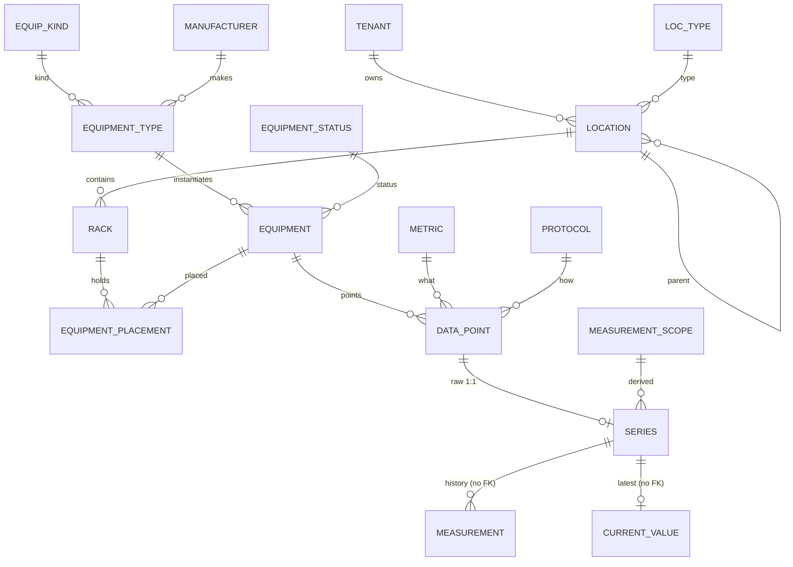

### 電力・冷却・冗長

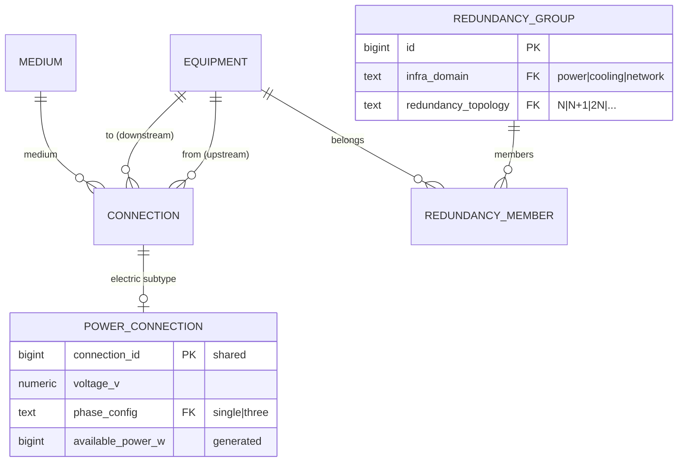

### 容量・監視・グループ

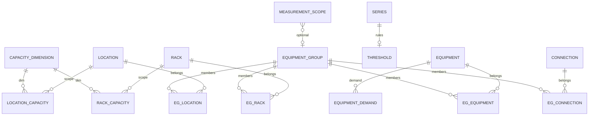

---

## 3. 各領域

### L1. 空間

`location` は region → campus → building → floor → room → cage → zone → row を表す木。
木の真実源は `parent_id` の隣接リストにして、配下集約のために `location_closure` を別に持つ。
`ltree` は便利だが、PostgreSQL 固有なのでコアには置かない。

`rack` は location の一種にはせず、専用テーブルにする。
ラックには U 高、最大重量、定格電力、エアフロー方向など、ラック固有の属性があるため。

ラック内の配置は `equipment_placement` に履歴として持つ。
現在どの U が埋まっているかは `rack_unit_occupancy` の物理行で表す。
`rack_id + rack_face + u` を主キーにすることで、同じ U の二重登録を INSERT 時点で止められる。

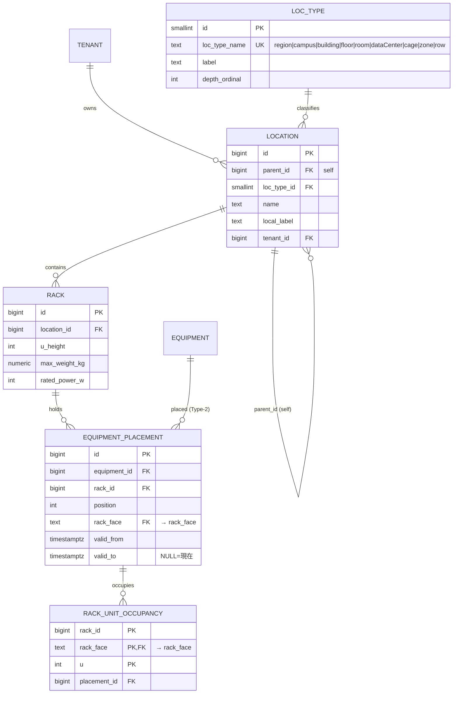

### L2. 資産

資産は、型番テンプレートと実機を分ける。
EcoStruxure IT の Genome に近い考え方で、`equipment_type` にメーカー、モデル、銘板電力、U 高、ASHRAE クラスなどを置く。
`equipment` はその実機インスタンスで、シリアル番号、資産タグ、状態、現在の設置先を持つ。

機器種別は `equip_kind` に寄せる。
`ups`、`pdu`、`crah`、`server`、`breaker` などを小さな分類木にしておくと、「全 HVAC」「全電力機器」のような集約がしやすい。
ブレーカも専用表にはせず、`equipment` の一種として扱う。
盤内位置や定格電流は breaker 用の任意属性に置く。

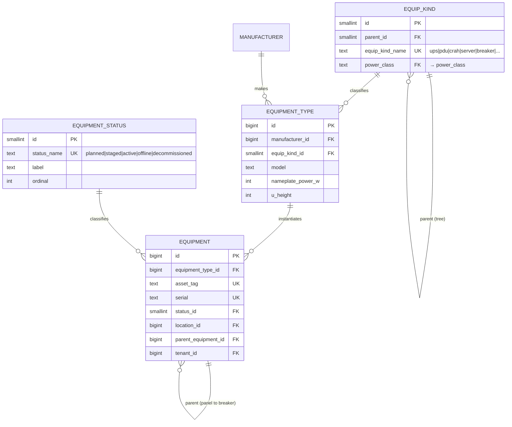

### L3. メトリック

`metric` は「何を測るか」のカタログ。
`active_power`、`rack_inlet_temp`、`chw_supply_temp` のような単位で 1 行にする。

位置や用途の差分は、無理にタグ分解せず `metric_name` に織り込む。
たとえば冷水往き温度と還り温度は、同じ `temperature` というカテゴリに属しつつ、`metric_name` は `chw_supply_temp` と `chw_return_temp` に分ける。
行数は増えるが、量・単位・既定集約が 1 行で読める。

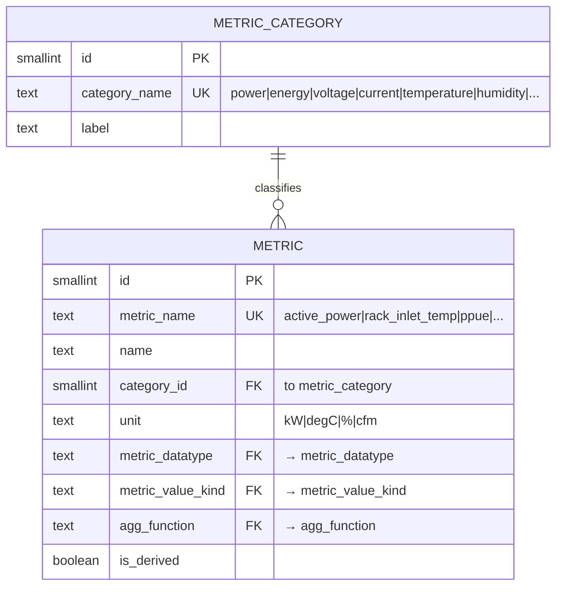

### L4. 収集

`data_point` は、機器が持つ metric の定義。
同じ温度でも、実測値、設定値、指令値は別の点になる。

プロトコルは `protocol` 参照テーブルにする。
BACnet、Modbus、SNMP、Redfish などが増えても、テーブル定義は変えない。

直接取得できない値（例: 電流×電圧→電力）も同じ `data_point` として扱う。
`protocol_id = NULL` にして、計算元と式を `addr` に記述する。
series は raw のまま。消費者から見ると直接取得の値と区別がつかない。

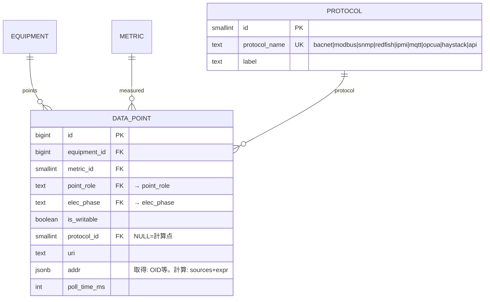

### L5. 時系列

RDBMS 側には `series` 台帳を置く。
TSDB 側の `measurement` や `current_value` は `series_id` だけを持ち、RDBMS の FK は張らない。

`series` には raw と derived の 2 種類がある。
raw は機器に紐づく値で、`data_point_id` を持つ。直接取得でも計算（V×A→W）でも raw。
derived は pPUE などの計算値で、`measurement_scope_id` を持つ。
この 2 つは CHECK で排他にする。

機器が移設されたあとも過去の月次レポートを当時の配置で見たいので、raw series には `equipment_id`、`rack_id`、`location_id` を取込時点のスナップショットとして持たせる。
用途転用があった場合は既存 series を書き換えず、`retired_at` を打って新しい series を作る。

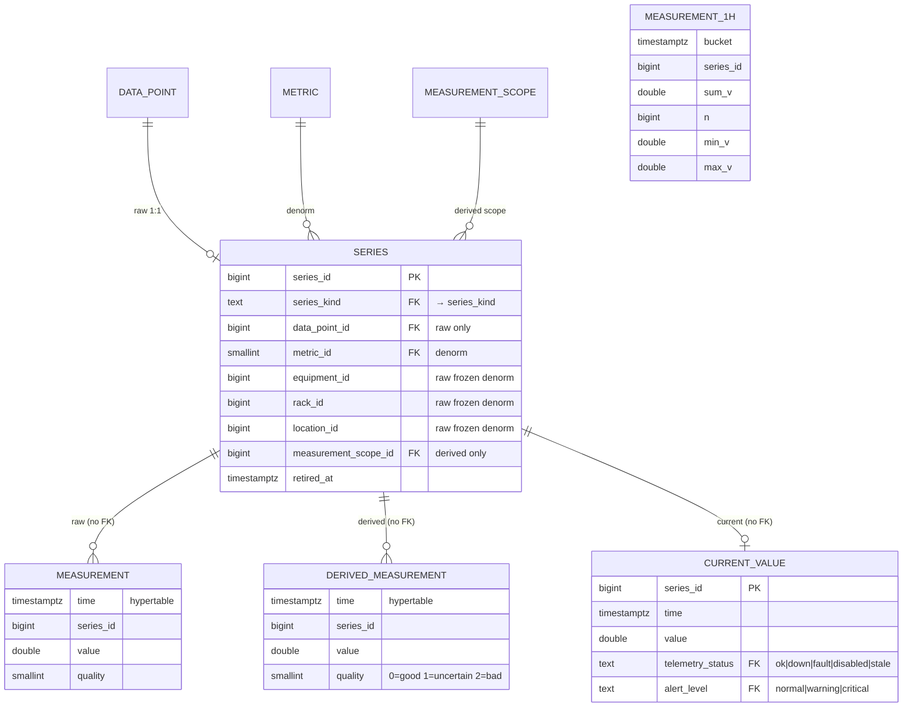

```sql
CHECK ( (series_kind='raw'     AND data_point_id IS NOT NULL AND measurement_scope_id IS NULL)
     OR (series_kind='derived' AND data_point_id IS NULL     AND measurement_scope_id IS NOT NULL) )
```

### L6. 電力・冷却・冗長

機器間の供給関係は `connection` の有向グラフで持つ。
電気、空気、冷水、燃料、データ線などは `medium` で分ける。
電気固有の電圧、相、定格電流、利用率は `power_connection` に分ける。
`connection` と `power_connection` は PK を共有する CTI パターン。

電力フローは保存しない。
受電 → 変圧器 → UPS → 分電盤 → PDU → ラック → サーバーという経路は、`connection` から再帰クエリやビューで導出する。

`redundancy_group` は物理接続ではなく、冗長の意図を表す。
たとえば「UPS-A と UPS-B で 2N」のように宣言し、実際に上流が独立しているかは `connection` グラフと突き合わせて検証する。

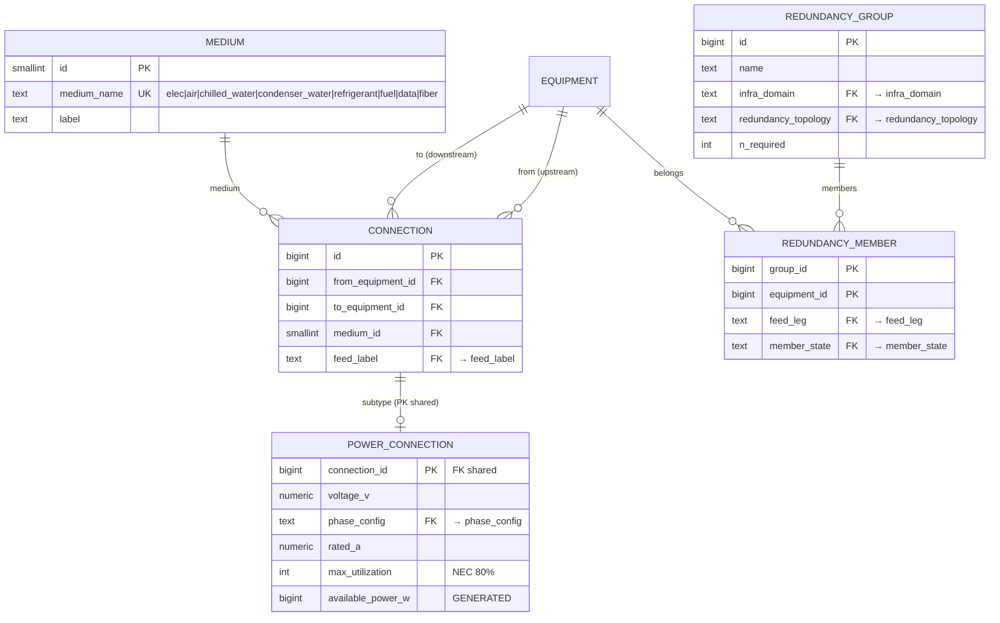

### L7. 容量

容量は、空間 U、電力、電力分配、冷却、冷却分配に、重量とポートを足して見る。
`capacity_dimension` で次元を固定し、`location_capacity` と `rack_capacity` がそれぞれの定格や上限を持つ。
`equipment_demand` が機器側の需要推定を持つ。

排他アーク（nullable FK + CHECK）ではなく、スコープごとにテーブルを分けた。
location と rack では容量の意味が異なり（ビル全体の冷却 vs ラック単位の U・電力）、将来カラムが分岐する可能性が高いため。

需要推定には銘板、補正銘板、予測、契約値などがある。
どれを使ったかは `load_strategy` に残す。
`stranded` は予約や見込みに対して実測が使っていない容量として計算する。

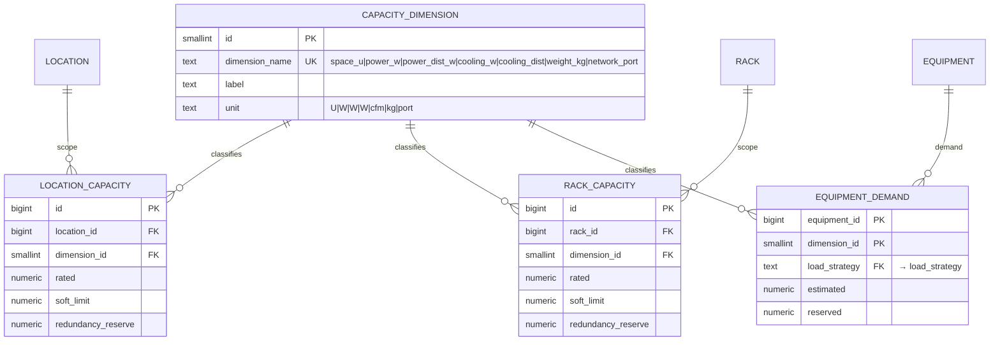

```sql
LOCATION_CAPACITY:
  UNIQUE (location_id, dimension_id)

RACK_CAPACITY:
  UNIQUE (rack_id, dimension_id)
```

### L8. 監視

閾値は `threshold` に置く。
対象は `series`。
評価対象の最新値も `current_value.series_id` なので、監視時に metric / location / equipment の優先順位を探さなくて済む。
metric や場所ごとの既定値が必要な場合は、series 作成時にテンプレートから具体的な threshold 行へ展開する。

`hysteresis` はチャタリング抑制のために持つ。
評価結果は `current_value.alert_level` に反映する。

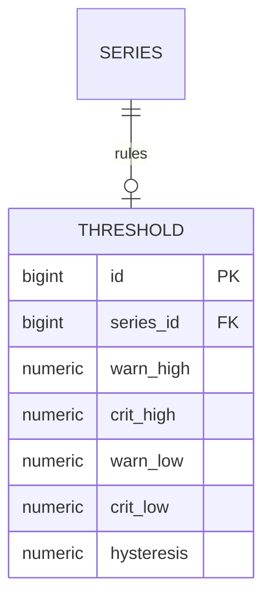

```sql
UNIQUE (series_id)
```

### L9. 論理グループ

`equipment_group` は、運用上の名前付きグループを表す。
たとえば A 系、B 系、北棟冷却ループ、特定プロジェクトのラック群など。
これは物理階層でも、冗長グループでも、KPI の計測境界でもない。

メンバーには equipment、connection、rack、location を入れられる。
connection を入れられる点が重要で、STS の合流点のように「機器」だけでは A/B を分けられない箇所を扱える。
また、ボトルネック回線の `available_power_w` を集計するときにも connection が必要になる。

メンバーは種別ごとに専用の JOIN テーブルに分ける。
排他アーク（nullable FK + CHECK）ではなく、テーブル分割で FK の型安全を保証する。
横断一覧が必要な場合は `equipment_group_member_v` ビュー（UNION ALL）で取得する。

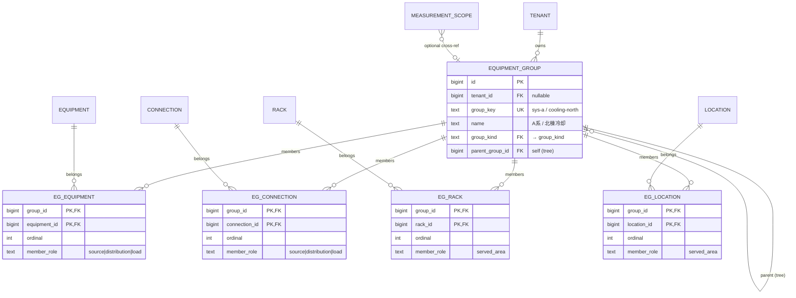

```sql
-- 横断ビュー
CREATE VIEW equipment_group_member_v AS
SELECT group_id, equipment_id, NULL::bigint AS connection_id,
       NULL::bigint AS rack_id, NULL::bigint AS location_id,
       ordinal, member_role, 'equipment' AS member_type
  FROM eg_equipment
UNION ALL
SELECT group_id, NULL, connection_id, NULL, NULL,
       ordinal, member_role, 'connection'
  FROM eg_connection
UNION ALL
SELECT group_id, NULL, NULL, rack_id, NULL,
       ordinal, member_role, 'rack'
  FROM eg_rack
UNION ALL
SELECT group_id, NULL, NULL, NULL, location_id,
       ordinal, member_role, 'location'
  FROM eg_location;
```

| 概念 | 答える問い | 主な用途 |
|------|------------|----------|
| `equipment_group` | A 系とは何か | 集計、可視化、影響分析、保守計画 |
| `measurement_scope` | pPUE の境界は何か | KPI 算出、再課金、履歴再現 |
| `redundancy_group` | 冗長の意図は何か | SPOF 検証、N+1/2N の妥当性確認 |

### L10. 計測スコープと派生メトリクス

pPUE は「施設総入力電力 ÷ IT 入力電力」だが、これを計算するには閉じた電力境界が必要になる。
その境界は room と一致するとは限らない。
分電盤が複数 room にまたがることもあるし、テナント cage やラック群だけで個別計量できる場合もある。

そこで `measurement_scope` を KPI 境界として独立させる。
メンバーには location、rack、equipment、connection を入れられ、`member_role` で `input_meter`、`it_load`、`facility_load` などを区別する。
境界の変更履歴は `valid_from` / `valid_to` で追う。

派生値は `data_point` にはしない。
機器から直接採る点ではないため、`series(series_kind='derived', measurement_scope_id=...)` として扱う。

メンバーは equipment_group と同様、種別ごとに専用の JOIN テーブルに分ける。
横断一覧は `measurement_scope_member_v` ビュー（UNION ALL）で取得する。

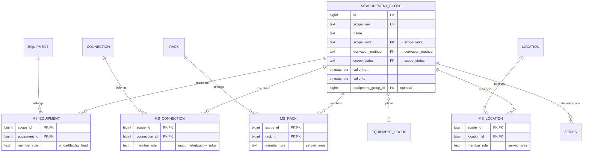

```sql
-- 横断ビュー
CREATE VIEW measurement_scope_member_v AS
SELECT scope_id, equipment_id, NULL::bigint AS connection_id,
       NULL::bigint AS rack_id, NULL::bigint AS location_id,
       member_role, 'equipment' AS member_type
  FROM ms_equipment
UNION ALL
SELECT scope_id, NULL, connection_id, NULL, NULL,
       member_role, 'connection'
  FROM ms_connection
UNION ALL
SELECT scope_id, NULL, NULL, rack_id, NULL,
       member_role, 'rack'
  FROM ms_rack
UNION ALL
SELECT scope_id, NULL, NULL, NULL, location_id,
       member_role, 'location'
  FROM ms_location;
```

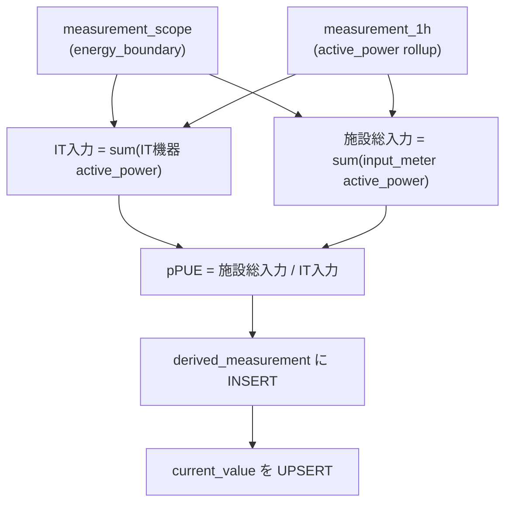

---

## 4. コロケーションとマルチテナント

`tenant` はコアに置く。
`location.tenant_id` と `equipment.tenant_id` は現在の割当や所有者をすばやく引くための列。
履歴や契約条件はコロケーションモジュール側に寄せる。

コロ固有の主なテーブルは次の通り。

- `space_lease`: cage、cabinet、partial U の賃貸。契約 kW、MRC/NRC、期間を持つ
- `equipment_ownership`: 資産所有者の履歴
- `tenancy_config`: 課金モデルや運用プロファイルの設定

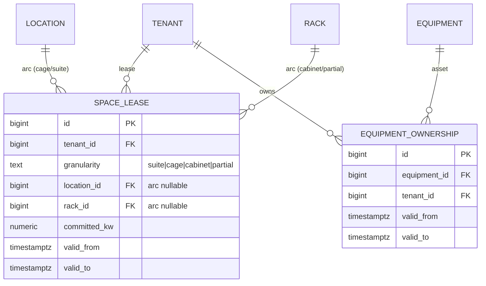

---

## 5. 移植性

方針は LCD、つまり最低限どの RDBMS でも持ちやすい形に寄せること。
PostgreSQL で実装する場合でも、移植不能な機能をスキーマの中心に置かない。

| やりたいこと | PG なら使いたくなるもの | この設計での基本形 |
|-------------|-------------------------|------------------|
| 階層クエリ | `ltree` | 親参照ツリー + closure テーブル |
| U 重なり防止 | `EXCLUDE` + `btree_gist` | 占有 U 行 + 複合主キー |
| 期間表現 | `tstzrange` | `valid_from` / `valid_to` |
| 条件付き UNIQUE | partial UNIQUE | 生成列 + UNIQUE、または別表 |
| 識別子形式の検査 | 正規表現演算子 | サービス層か DDL アダプタに閉じ込める |

TSDB も抽象化する。
アプリ側から見る操作は、append、range query、latest upsert、tier 定義、retention 定義くらいに絞る。
TimescaleDB と ClickHouse の違いはアダプタに閉じ込める。

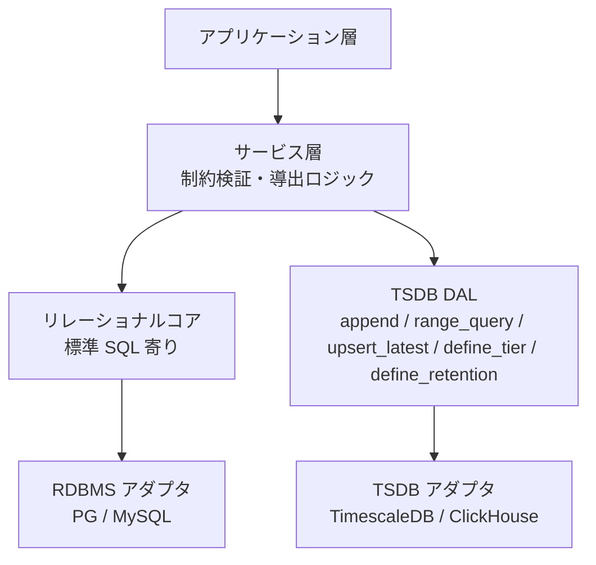

---

## 6. 型制約

type 系の自由入力は避ける。
よく増える分類は小マスタ参照テーブルにし、閉じた状態や役割は text PK の enum 参照テーブルにする。
`text CHECK IN (...)` は使わない。

### 参照テーブル

| テーブル | 主な参照元 | 値の例 |
|----------|------------|--------|
| `equip_kind` | `equipment_type.equip_kind_id` | `equip_kind_name`: ups, pdu, crah, server |
| `medium` | `connection.medium_id` | `medium_name`: elec, air, chilled_water |
| `metric` | `data_point.metric_id` | `metric_name`: active_power, rack_inlet_temp |
| `loc_type` | `location.loc_type_id` | `loc_type_name`: region, campus, room, cage |
| `equipment_status` | `equipment.status_id` | `status_name`: planned, active, offline |
| `protocol` | `data_point.protocol_id` | `protocol_name`: bacnet, modbus, snmp, redfish |
| `metric_category` | `metric.category_id` | `category_name`: power, energy, temperature |
| `capacity_dimension` | `location_capacity.dimension_id`, `rack_capacity.dimension_id` | `dimension_name`: space_u, power_w, cooling_w |

### enum 参照テーブル

| テーブル | カラム | 値 |
|----------|--------|----|
| `tenant` | `tenant_kind` | internal, colo_customer |
| `equipment_placement` | `rack_face` | front, rear |
| `rack_unit_occupancy` | `rack_face` | front, rear |
| `equip_kind` | `power_class` | it, cooling, facility, other |
| `metric` | `metric_datatype` | Number, Bool, Str |
| `metric` | `metric_value_kind` | gauge, counter, status |
| `metric` | `agg_function` | avg, last, sum, min, max |
| `data_point` | `point_role` | sensor, sp, cmd |
| `data_point` | `elec_phase` | L1, L2, L3, none |
| `series` | `series_kind` | raw, derived |
| `current_value` | `telemetry_status` | ok, down, fault, disabled, stale |
| `current_value` | `alert_level` | normal, warning, critical |
| `connection` | `feed_label` | A, B, N, N+1, 2N, none |
| `power_connection` | `phase_config` | single, three |
| `redundancy_group` | `infra_domain` | power, cooling, network |
| `redundancy_group` | `redundancy_topology` | N, N+1, N+2, 2N, 2N+1 |
| `redundancy_member` | `feed_leg` | A, B, C, none |
| `redundancy_member` | `member_state` | active, standby, none |
| `equipment_demand` | `load_strategy` | nameplate, adjusted_nameplate, predicted, contracted |
| `equipment_group` | `group_kind` | power_chain, cooling_loop, network_fabric, project, custom |
| `measurement_scope` | `scope_kind` | energy_boundary, cooling_boundary, tenant_boundary, custom |
| `measurement_scope` | `derivation_method` | topology, manual, import |
| `measurement_scope` | `scope_status` | candidate, active, retired |

---

## 7. 繰り返し使うパターン

### 種別テーブル分割

複数種類の実体をメンバーとして持つ関連テーブルは、種別ごとに専用の JOIN テーブルに分ける。
nullable FK + `CHECK (num_nonnulls(...) = 1)` の排他アークは使わない。

テーブル分割の利点:

- FK が NOT NULL になるため、型安全が DB レベルで保証される
- 種別追加が `CREATE TABLE` + ビュー更新で済み、既存テーブルの ALTER が不要
- 種別ごとにカラムを自由に持てる（将来の分岐に強い）

横断的にメンバー一覧を取る場合は UNION ALL ビューを用意する。

使う箇所は 3 つ。

- 容量: `location_capacity` / `rack_capacity`（スコープごとに独立テーブル）
- グループメンバー: `eg_equipment` / `eg_connection` / `eg_rack` / `eg_location`
- スコープメンバー: `ms_equipment` / `ms_connection` / `ms_rack` / `ms_location`

`threshold` は種別分割ではなく `series_id` に直結する。

### Type-2 SCD

`valid_from` / `valid_to` で、現在値と履歴を同じテーブルに持つ。
使う箇所は `equipment_placement`、`space_lease`、`equipment_ownership`、`measurement_scope`。

現在値を速く引きたいところには denorm 列を持つ。
履歴の正本は SCD 表に置く。

### 凍結非正規化

`series` には取込時点の equipment、rack、location をコピーする。
機器移設後も、過去データは当時の配置で集計できる。

### retire-not-mutate

時系列の意味が変わるときは既存 series を書き換えない。
旧 series に `retired_at` を入れ、新 series を作る。

### CTI

`connection` を基底にして、電気固有の属性は `power_connection` に分ける。
将来 `cooling_connection` が必要になっても、基底の関係は変えずに足せる。

### Genome

`equipment_type` は型番テンプレート、`equipment` は実機。
機種追加はデータ追加で済ませる。

---

## 8. 外部システムとの境界

DCIM 側は、現場の状態を持つ。
会計、ワークフロー、インシデント管理の正本にはならない。

| 領域 | DCIM 側で持つもの | 外部に寄せるもの |
|------|------------------|----------------|
| 資産管理 | asset_tag, serial, status, 配置 | 減価償却、購買、契約 |
| 障害管理 | alert_level, current_value | インシデント、RCA、SLA |
| 保守管理 | equipment の状態 | 作業指示、点検記録 |
| ESG | kWh 実績 | CO2 換算、Scope 1/2/3 |
| 物理セキュリティ | location の保護等級 | 入退室ログ |
| ネットワーク管理 | data/fiber の connection | IP、VLAN、BGP |

---

## 9. 代表ユースケース

| UC | 内容 | 使う領域 |
|----|------|----------|
| UC-1 | ビル月次電気代 | L1 closure + L5 measurement_1d |
| UC-2 | ラック吸気温度トレンド | L5 series.rack_id + rollup |
| UC-3 | 空き U 検索 | L1 rack_unit_occupancy の欠番 |
| UC-4 | 上流電源トレース | L6 connection の再帰クエリ |
| UC-5 | SPOF 検出 | L6 上流ルート + redundancy_group |
| UC-6 | 部屋総電力とホットスポット | L1 closure + L5 current_value + L8 alert_level |
| UC-7 | 容量: 定格 vs 予約 vs 実測 | L7 budget/demand + L5 |
| UC-G1 | A 系の総消費電力 | L9 group member + L5 current_value |
| UC-G2 | A 系のボトルネック回線 | L9 connection member + L6 available_power_w |

---

## 10. テーブル一覧

### コア

| 領域 | テーブル | 役割 |
|------|----------|------|
| L1 | `tenant` | テナント |
| L1 | `loc_type` | 空間種別 |
| L1 | `location` | 空間階層 |
| L1 | `location_closure` | 配下集約用の閉包 |
| L1 | `rack` | ラック |
| L1 | `equipment_placement` | 配置履歴 |
| L1 | `rack_unit_occupancy` | U 占有 |
| L2 | `equip_kind` | 機器種別 |
| L2 | `manufacturer` | メーカー |
| L2 | `equipment_type` | 型番テンプレート |
| L2 | `equipment_status` | 機器状態 |
| L2 | `point_template` | 型番が持つ点の雛形 |
| L2 | `equipment` | 実機 |
| L3 | `metric_category` | メトリックカテゴリ |
| L3 | `metric` | メトリックカタログ |
| L4 | `protocol` | 収集プロトコル |
| L4 | `data_point` | 収集点 |
| L5 | `series` | 系列台帳 |
| L5 | `measurement` | 生値 |
| L5 | `measurement_1m/1h/1d` | ロールアップ |
| L5 | `derived_measurement` | 派生値 |
| L5 | `current_value` | 最新値 |
| L6 | `medium` | 接続媒体 |
| L6 | `connection` | 機器間接続 |
| L6 | `power_connection` | 電気接続のサブタイプ |
| L6 | `cable` | 物理ケーブル |
| L6 | `redundancy_group` | 冗長意図 |
| L6 | `redundancy_member` | 冗長メンバー |
| L7 | `capacity_dimension` | 容量次元 |
| L7 | `location_capacity` | 場所容量定格 |
| L7 | `rack_capacity` | ラック容量定格 |
| L7 | `equipment_demand` | 需要推定 |
| L8 | `threshold` | 閾値 |
| L9 | `equipment_group` | 論理グループ |
| L9 | `eg_equipment` | グループメンバー（機器） |
| L9 | `eg_connection` | グループメンバー（接続） |
| L9 | `eg_rack` | グループメンバー（ラック） |
| L9 | `eg_location` | グループメンバー（場所） |
| L10 | `measurement_scope` | 計測境界 |
| L10 | `ms_equipment` | スコープメンバー（機器） |
| L10 | `ms_connection` | スコープメンバー（接続） |
| L10 | `ms_rack` | スコープメンバー（ラック） |
| L10 | `ms_location` | スコープメンバー（場所） |

### コロケーションモジュール

| テーブル | 役割 |
|----------|------|
| `space_lease` | 空間賃貸 |
| `lease_unit_occupancy` | 賃貸 U の重複防止 |
| `equipment_ownership` | 資産所有履歴 |
| `tenant_group` | テナント階層 |
| `tenancy_config` | 課金モデル設定 |
