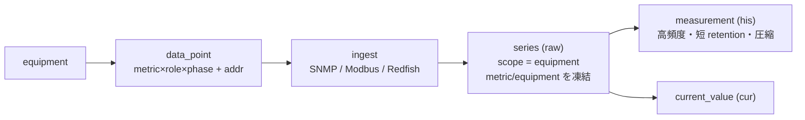
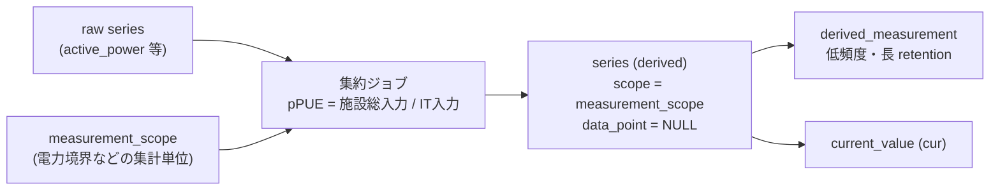

# 13. 生値 vs 集約/派生値 — テレメトリの扱いの違い

DCIM が扱う時系列値には**2種類**ある:

- **生値（raw）** — 機器から直接取得した観測値（有効電力・吸気温度・電流…）。
- **集約/派生値（derived）** — 生値を計算した結果（pPUE・部屋合計電力・ロールアップ…）。

両者は**読み出し側では同じ枠組み**（`series` 台帳・`current_value`・閾値評価）で扱えるが、**書き込み側の扱いは大きく異なる**。本章はその差分を整理する。関連: 点定義/系列は [03章 L4/L5](./03-finalists.md)、集計境界は [10章](./10-measurement-scope-derived-metrics.md)、検証クエリは [04章](./04-validation-queries.md)、保持/防火壁は [09章](./09-portability.md)。

---

## 1. 一覧で見る違い

| 観点 | 生値（raw） | 集約/派生値（derived） |
|---|---|---|
| 由来 | 機器から直接取得 | 生値を計算した結果（pPUE / ロールアップ等） |
| 生成主体 | **コレクタ**が SNMP/Modbus/Redfish 等でポーリング | **サービス層の定期ジョブ** / 連続集計（CAGG） |
| `data_point` | **あり**（equipment×metric×role×phase ＋ 取得アドレス） | **なし**（`data_point_id = NULL`） |
| `series.series_kind` | `raw` | `derived` |
| `series.scope_type` | `equipment` | `measurement_scope`（または rack/location） |
| 意味の源 | `metric_id` ＋ `equipment_id`（取込時点で凍結） | `metric_id` ＋ `measurement_scope_id` |
| 格納 hypertable | `measurement`（高頻度・短 retention・圧縮） | `derived_measurement`（低頻度・長 retention） |
| 最新値 | `current_value`（**共通**） | `current_value`（**共通**） |
| 書き込み周期 | ポーリング間隔（秒オーダー） | バケット周期（分〜時） |
| 欠測・品質 | あり得る（`quality` を記録） | 入力が揃った時だけ算出（NULL 伝播に注意） |
| ライフサイクル | 凍結 denorm ＋ retire-not-mutate ＋ `data_point` は `ON DELETE SET NULL` | `measurement_scope` の `valid_from/valid_to` に従う |

> **要点**: 生値は「**どう取るか**（data_point）」を持ち機器に紐づく。派生値は「**どの境界の計算か**（measurement_scope）」を持ち、取得設定（data_point）を**持たない**。

---

## 2. 生値（raw）のパイプライン

機器 → 取得設定（`data_point`）→ 取込 → `series(raw)` → 履歴＋最新値。



- `data_point` が「どの機器のどの metric を、どの role/phase で、どのアドレスから取るか」を持つ。
- `series(raw)` は機器スコープで、`metric_id`/`equipment_id`/`rack_id`/`location_id` を**取込時点で凍結**（機器が移設しても過去集約がズレない・[03章 L5](./03-finalists.md)）。
- 値の本体は `measurement`（hypertable）、最新は `current_value`。

---

## 3. 集約/派生値（derived）のパイプライン

生値を**サービス層のジョブ**が読み、境界（`measurement_scope`）ごとに計算 → `series(derived)` → 専用 hypertable。



- 入力は raw の `measurement`（または `measurement_1h` 等のロールアップ）。
- `series(derived)` は **`data_point` を持たず**、`measurement_scope_id` ＋ `metric_id`（`is_derived=true` の metric、例 `ppue`）で意味が決まる（[10章](./10-measurement-scope-derived-metrics.md)）。
- 値は `derived_measurement`（raw と**別 hypertable・別 TTL**。pPUE は長期保持・低頻度なので raw の firehose と分ける・[09章](./09-portability.md)）。

---

## 4. なぜ扱いが分かれるのか（3つの理由）

1. **取得 vs 計算** — raw は「取得設定（data_point）」を要し機器に紐づく。derived は計算結果で、取得設定が**そもそも存在しない**（`data_point_id = NULL`）。
2. **頻度と保持が逆** — raw は高頻度・短期・高圧縮の firehose、derived は低頻度・長期の KPI。retention/圧縮設定が衝突するので**別 hypertable**に分ける。
3. **意味の結び先が違う** — raw は `equipment`（凍結）、derived は `measurement_scope`（横断境界）。単一の location ノードに収まらない「閉じた電力境界」等を表すため。

---

## 5. 書き込みは別、読み出しは共通

**書き込み（生成）**は完全に別系統:

| | 書き込み主体 | トリガ |
|---|---|---|
| raw | ingest コレクタ | ポーリング/プッシュ |
| derived | サービス層ジョブ / CAGG | スケジュール（バケット確定後） |

**読み出し（消費）は共通枠**:

```sql
-- pPUE も普通の点と同じく current_value / series で引ける
SELECT cv.value AS ppue_now
FROM series s
JOIN current_value cv ON cv.series_id = s.series_id
JOIN metric m ON m.id = s.metric_id AND m.code = 'ppue'
WHERE s.measurement_scope_id = :scope_id;
```

- UI・ダッシュボード・閾値評価・ロールアップは **raw か derived かを意識しない**。`series_id` 空間を共有するため、`current_value` も両方を 1 行参照で扱える。
- これが「pPUE 等の集約値も **Point として**扱いたい」を満たす設計（[10章](./10-measurement-scope-derived-metrics.md)）。

---

## 6. 整合制約（どちらの系列かを DB が保証）

```sql
-- series: raw は data_point 必須で scope=equipment、derived は data_point なし
CHECK ( (series_kind='raw'     AND data_point_id IS NOT NULL AND measurement_scope_id IS NULL)
     OR (series_kind='derived' AND data_point_id IS NULL) )
-- scope=measurement_scope なら scope id 必須
CHECK ( scope_type <> 'measurement_scope' OR measurement_scope_id IS NOT NULL )
-- 派生系列の重複防止（境界×metric で1本）
UNIQUE (measurement_scope_id, metric_id) WHERE series_kind='derived'   -- PG / LCD代替は09章
```

---

## 7. ライフサイクルの違い（移設・撤去・境界変更）

| 事象 | raw の扱い | derived の扱い |
|---|---|---|
| 機器が移設 | series の凍結 denorm は旧位置のまま。意味を変える転用なら **retire-not-mutate**（旧 series retire＋新 series） | 影響なし（scope は境界であって機器ではない） |
| 機器/data_point を撤去 | `series.data_point_id` は **`ON DELETE SET NULL`**（CASCADE 不可）。series は残し履歴を保つ | 影響なし |
| 集計境界が変わる | — | `measurement_scope` の `valid_from/valid_to`（Type-2）。系列は永続 `measurement_scope.id` に紐づくので同一性が揺れない（[10章](./10-measurement-scope-derived-metrics.md)） |

---

## 8. pPUE の一気通貫例

1. **raw**: グループ内 IT 機器の `active_power`（`equip_kind.power_class='it'`）と、給電する施設機器の `active_power` を、それぞれ `data_point` → `series(raw, scope=equipment)` → `measurement` で収集。
2. **境界**: 電力の閉じた集計単位を `measurement_scope`（`scope_kind='energy_boundary'`）として定義。
3. **集約ジョブ**: 1時間バケットで `pPUE = Σ施設総入力 / ΣIT入力` を算出。
4. **derived**: `series(derived, scope=measurement_scope, metric=ppue, data_point=NULL)` に書き、`derived_measurement` ＋ `current_value` を更新。
5. **読み**: UI は他の点と同じく `current_value` / ロールアップで pPUE を表示。

> まとめ: **生値＝「機器 × data_point」起点**、**派生値＝「境界 × 計算」起点**。
> 書き込み系統は別だが、`series` 台帳に集約することで**読み出しは完全に共通**になる。
