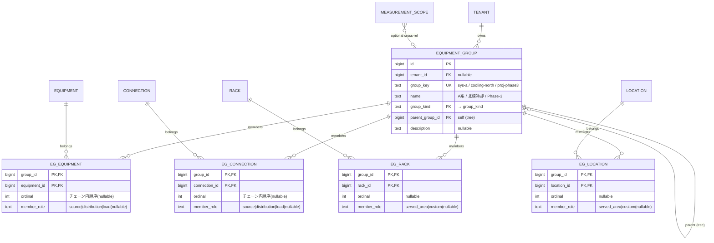

# 14. 論理グルーピング（equipment_group）

「A系」「B系」「北棟冷却ループ」「Phase-3 デプロイ対象」——
物理階層（location 木）にも冗長意図（redundancy_group）にも KPI 境界（measurement_scope）にも収まらない、
**運用上の名前付き論理グループ**を表す拡張。

---

## 14.1 なぜ既存概念では足りないか

### 3 つの「グループ的概念」の比較

```
                  equipment_group         measurement_scope         redundancy_group
─────────────────────────────────────────────────────────────────────────────────────
問い              「A系とは何か」           「pPUEの境界は何か」       「冗長の意図は何か」
メンバー対象      種別 JOIN テーブル          種別 JOIN テーブル          equipment のみ
                  （eg_equipment/            （ms_equipment/
                   eg_connection/             ms_connection/
                   eg_rack/eg_location）      ms_rack/ms_location）
メンバー属性      member_role:              member_role:              feed_leg: A / B / C / none
                  source / distribution /   input_meter / it_load /   member_state: active /
                  load / served_area        facility_load /           standby / none
                                            supply_edge / served_area
時間軸            現在（メンバー追加/削除） valid_from/valid_to        現在
                                            （Type-2 的）
参照元            ダッシュボード/           series(derived)           SPOF 検証クエリ
                  影響分析/保守計画          （KPI 算出）
典型例            「UPS-A → Panel-A →       「3F energy_boundary:     「UPS-A, UPS-B で
                   PDU-A1,A2 とその回線      入力メーター conn-X,      2N 冗長」
                   と給電先ラック群」         IT負荷 PDU-A1,A2」
```

### 統合しない理由

**理由 1 — member_role の語彙が異なる。**

measurement_scope のメンバーは KPI 計算式への入力役割（`input_meter` = pPUE の分母に入る計測点、
`it_load` = 分子に入る IT 負荷）を持つ。
equipment_group のメンバーはチェーン内の運用位置（`source` = 電源、`distribution` = 配電、
`load` = 負荷）を持つ。同じ equipment でも `member_role` が異なる。

**理由 2 — ライフサイクルが異なる。**

measurement_scope は `valid_from` / `valid_to` を持ち、境界変更時に新バージョンを作る（Type-2 的）。
過去の pPUE は「当時の境界」に紐づく必要がある。
equipment_group は基本的に「現在の構成」を表し、メンバーの追加/削除で変更する。

**理由 3 — 参照の方向が異なる。**

derived `series` は `measurement_scope_id` を FK で持ち、KPI 算出に厳密な境界定義を要求する。
equipment_group への参照はクエリ時の JOIN であり、FK で結ぶのはダッシュボード/アプリケーション層。

**理由 4 — 制約が異なる。**

measurement_scope は**閉じた電力境界**である必要がある（入力電力を漏れなく測れる）。
equipment_group にはそのような制約がない。「A系のラック群」は電力境界として閉じていなくてもよい。

### redundancy_group との関係

`redundancy_group` は冗長の**意図**を宣言する（「UPS-A と UPS-B で 2N」）。
メンバーは **equipment のみ**で、`feed_leg`（A/B/C）と `member_state`（active/standby）を持つ。
SPOF 検証（[04 章 UC-5](./04-validation-queries.md)）に特化している。

equipment_group は冗長意図を持たない。代わりに、A系に属する**全構成要素**（機器・接続・ラック・区画）を
名前付きで束ね、集計・可視化・影響分析・保守計画に使う。

```
redundancy_group:  UPS-A ←──member──→ [group: "UPS冗長", topology: 2N]
                   UPS-B ←──member──→ [同上]

equipment_group:   UPS-A ──→ [group: "A系"]
                   Panel-A ──→ [同上]
                   conn(UPS-A→Panel-A) ──→ [同上]
                   PDU-A1, PDU-A2 ──→ [同上]
                   rack-R1..R3 ──→ [同上]
```

## 14.2 設計

### ER

メンバーは種別ごとに専用の JOIN テーブルに分ける。
排他アーク（nullable FK + CHECK）ではなく、テーブル分割で FK の型安全を保証する。
横断一覧が必要な場合は `equipment_group_member_v` ビュー（UNION ALL）で取得する。



### SQL 制約

```sql
-- 各テーブルの PK が (group_id, xxx_id) の複合キーなので、
-- 同一グループ内の重複は PK で自動的に防止される。
-- 追加の CHECK 制約は不要。

-- 横断ビュー
CREATE VIEW equipment_group_member_v AS
SELECT group_id, equipment_id, NULL::bigint AS connection_id,
       NULL::bigint AS rack_id, NULL::bigint AS location_id,
       ordinal, member_role, 'equipment' AS member_type
  FROM eg_equipment
UNION ALL
SELECT group_id, NULL, connection_id, NULL, NULL,
       ordinal, member_role, 'connection'
  FROM eg_connection
UNION ALL
SELECT group_id, NULL, NULL, rack_id, NULL,
       ordinal, member_role, 'rack'
  FROM eg_rack
UNION ALL
SELECT group_id, NULL, NULL, NULL, location_id,
       ordinal, member_role, 'location'
  FROM eg_location;
```

### measurement_scope との橋渡し

```sql
-- measurement_scope にオプションの FK を追加
ALTER TABLE measurement_scope ADD COLUMN
    equipment_group_id  BIGINT REFERENCES equipment_group(id);
-- NULL 許可。「このスコープはこのグループに対応する」
-- テナント境界スコープ等はグループと無関係なので NULL のまま
```

これにより:

1. A系を equipment_group として定義 → 運用（集計・可視化・保守計画）に使う
2. A系の pPUE が必要になったら → measurement_scope を作り `equipment_group_id` で紐付け
3. measurement_scope 側のメンバーには KPI 計算固有の `member_role`（`input_meter` 等）を別途付ける
4. **グループのメンバーとスコープのメンバーは一致する必要がない**
   （スコープの方が狭い場合: A系全体の中で計測可能な部分だけがスコープ）

---

## 14.3 connection をメンバーに含める理由

「機器だけグループ化すれば、機器間の接続は暗黙的にカバーできるのでは？」
——答えは **No**。以下の 3 パターンで暗黙ルールが破綻する。

### パターン 1: 合流点（STS）

```
UPS-A ─[conn-A]→ STS ←[conn-B]─ UPS-B
                   │
                [conn-out]→ Panel
```

- `conn-A` は A系、`conn-B` は B系、`conn-out` は「どちらでもない」か「両方」
- STS 自体は A系にも B系にも属さない（または両方に属する）
- 「グループ内の equipment 間の connection は暗黙所属」ルールでは
  STS が A系・B系どちらかに入った瞬間、conn-A も conn-B も同じグループに入ってしまう

### パターン 2: ボトルネック分析

「A系の給電容量のボトルネックはどこか？」= A系内の connection の `available_power_w` の最小値。
connection がメンバーでなければ、「A系の機器 → その間の connection を推定」というアプリロジックが必要。
明示的にメンバーに含めれば:

```sql
SELECT MIN(pc.available_power_w) AS bottleneck_w
  FROM eg_connection egc
  JOIN power_connection pc ON pc.connection_id = egc.connection_id
 WHERE egc.group_id = :a_sys_group_id;
```

### パターン 3: 保守計画

「A系を停電保守する際に切断すべき接続は？」
connection がメンバーとして明示されていれば、作業指示書に直接リスト化できる。

---

## 14.4 将来のメンバー種別追加

### 現在の対象種別

種別 JOIN テーブル: `eg_equipment` / `eg_connection` / `eg_rack` / `eg_location`

### 追加候補の蓋然性

| 候補 | 蓋然性 | 理由 | 判定 |
|------|--------|------|------|
| data_point | 低 | equipment 経由で到達可能 | 不要 |
| series | 低 | equipment → data_point 経由で到達可能 | 不要 |
| cable | 低 | connection と 1:1（cable_id FK）。connection で代用 | 不要 |
| circuit（将来） | 中 | ISP回線群をグループ化。ただしスキーマ未実装 | 実装時に検討 |
| device_port（将来） | 低 | equipment 経由で到達可能 | 不要 |
| measurement_scope | 低 | 逆方向の FK で解決済み | 不要 |
| equipment_group（入れ子） | — | `parent_group_id` で解決済み | 不要 |

**結論: 当面は 4 種で十分。**

### 追加が必要になったときの手順

```sql
-- 例: circuit テーブルが新設され、グループに含めたい場合

-- 1. circuit テーブルを作成
CREATE TABLE circuit (
    id BIGINT PRIMARY KEY,
    ...
);

-- 2. 種別 JOIN テーブルを新設
CREATE TABLE eg_circuit (
    group_id   BIGINT NOT NULL REFERENCES equipment_group(id),
    circuit_id BIGINT NOT NULL REFERENCES circuit(id),
    ordinal    INT,
    member_role TEXT,
    PRIMARY KEY (group_id, circuit_id)
);

-- 3. UNION ALL ビューに追加
CREATE OR REPLACE VIEW equipment_group_member_v AS
  ... -- 既存 4 テーブル
UNION ALL
SELECT group_id, NULL, NULL, NULL, NULL, circuit_id,
       ordinal, member_role, 'circuit'
  FROM eg_circuit;
```

既存テーブルの ALTER は不要。measurement_scope 側も同じパターンで `ms_circuit` を追加する。

### 代替パターンの検討と却下

| パターン | 長所 | 短所 | 採否 |
|----------|------|------|------|
| **種別 JOIN テーブル（採用）** | FK が NOT NULL で型安全、種別追加は CREATE TABLE + ビュー更新のみ、既存テーブルの ALTER 不要 | UNION ALL ビューが必要、横断一覧はビュー経由 | **採用** |
| 排他アーク FK | FK 整合性、標準 SQL（`num_nonnulls` CHECK）、スーパーテーブル不要 | nullable FK、種別追加時に ALTER TABLE + CHECK 更新が必要 | 却下 |
| content_type + object_id | 列追加不要 | FK 強制不可、型安全なし、LCD 原則（DB 制約でドメイン担保）に反する | 却下 |

---

## 14.5 検証クエリ

### UC-G1: A系の現在の総消費電力

```sql
SELECT eg.name,
       SUM(cv.value) AS total_active_power_kw
  FROM equipment_group eg
  JOIN eg_equipment ege ON ege.group_id = eg.id
  JOIN equipment e ON e.id = ege.equipment_id
  JOIN data_point dp ON dp.equipment_id = e.id
  JOIN metric m ON m.id = dp.metric_id
  JOIN series s ON s.data_point_id = dp.id
  JOIN current_value cv ON cv.series_id = s.series_id
 WHERE eg.group_key = 'sys-a'
   AND m.metric_name = 'active_power'
   AND dp.point_role = 'sensor'
   AND s.retired_at IS NULL
   AND cv.telemetry_status = 'ok'
 GROUP BY eg.name;
```

### UC-G2: A系のボトルネック回線（最小 available_power_w）

```sql
SELECT e_from.asset_tag AS from_equip,
       e_to.asset_tag   AS to_equip,
       pc.available_power_w AS bottleneck_w
  FROM eg_connection egc
  JOIN connection c ON c.id = egc.connection_id
  JOIN power_connection pc ON pc.connection_id = c.id
  JOIN equipment e_from ON e_from.id = c.from_equipment_id
  JOIN equipment e_to   ON e_to.id   = c.to_equipment_id
 WHERE egc.group_id = (SELECT id FROM equipment_group WHERE group_key = 'sys-a')
 ORDER BY pc.available_power_w ASC
 LIMIT 1;
```

### UC-G3: A系に属するラック一覧と各ラックの空きU

```sql
SELECT r.id, l.name AS room, r.u_height,
       r.u_height - COUNT(DISTINCT ruo.u) AS free_u
  FROM eg_rack egr
  JOIN rack r ON r.id = egr.rack_id
  JOIN location l ON l.id = r.location_id
  LEFT JOIN rack_unit_occupancy ruo ON ruo.rack_id = r.id
 WHERE egr.group_id = (SELECT id FROM equipment_group WHERE group_key = 'sys-a')
 GROUP BY r.id, l.name, r.u_height;
```

### UC-G4: あるグループの全メンバー種別横断一覧

```sql
-- equipment_group_member_v ビューを使用
SELECT v.ordinal,
       v.member_role,
       v.member_type,
       CASE v.member_type
            WHEN 'equipment'  THEN e.asset_tag
            WHEN 'connection' THEN 'conn:'||c.id::text
            WHEN 'rack'       THEN 'rack:'||r.id::text
            WHEN 'location'   THEN l.name
       END AS member_label
  FROM equipment_group_member_v v
  LEFT JOIN equipment e  ON e.id = v.equipment_id
  LEFT JOIN connection c ON c.id = v.connection_id
  LEFT JOIN rack r       ON r.id = v.rack_id
  LEFT JOIN location l   ON l.id = v.location_id
 WHERE v.group_id = :group_id
 ORDER BY v.ordinal NULLS LAST;
```

### UC-G5: A系の停電影響分析（A系給電先の全機器）

```sql
-- A系の connection 経由で給電される全機器（グループ外含む）
WITH a_sys_connections AS (
    SELECT c.id, c.to_equipment_id
      FROM eg_connection egc
      JOIN connection c ON c.id = egc.connection_id
     WHERE egc.group_id = :a_sys_group_id
)
SELECT DISTINCT e.id, e.asset_tag, e.serial, et.model
  FROM a_sys_connections ac
  JOIN equipment e ON e.id = ac.to_equipment_id
  JOIN equipment_type et ON et.id = e.equipment_type_id;
```

---

## 14.6 図に表れない主要制約・留意点

| 種別 | 制約／留意点 | 実装・方針 |
|------|------------|-----------|
| 棲み分け | measurement_scope との分離 | 別テーブル。scope → group のオプション FK で橋渡し |
| 棲み分け | redundancy_group との分離 | 冗長意図は redundancy_group、運用グルーピングは equipment_group |
| 種別テーブル分割 | メンバー対象は equipment/connection/rack/location | 種別ごとに `eg_equipment` / `eg_connection` / `eg_rack` / `eg_location` を分離。将来の種別追加は CREATE TABLE + ビュー更新 |
| 重複防止 | 同一グループ内の同一対象 | 各テーブルの複合 PK `(group_id, xxx_id)` で自動防止 |
| 横断一覧 | 全メンバーの種別横断取得 | `equipment_group_member_v` ビュー（UNION ALL） |
| 階層 | グループの入れ子 | `parent_group_id`（自己参照・隣接リスト）。「A系-1F」「A系-2F」 |
| テナント | グループの所有 | `tenant_id` nullable。テナント横断グループも可 |
| ordinal | チェーン内の順序 | nullable。順序が意味を持つ場合（パワーチェーン）のみ使用 |
| member_role | メンバーの位置 | nullable・自由テキスト。KPI 用の `member_role`（measurement_scope 側）とは別 |

---

## 14.7 設計判断まとめ

| 判断 | 採用 | 理由 |
|------|------|------|
| measurement_scope と統合しない | **別テーブル** | `member_role` 語彙・ライフサイクル・制約が異なる |
| redundancy_group と統合しない | **別テーブル** | 冗長意図は equipment のみ対象。グループは 4 種 |
| connection をメンバーに含める | **含める** | 合流点・ボトルネック分析・保守計画に必要 |
| rack / location をメンバーに含める | **含める** | 「A系が給電するラック群」「A系の担当フロア」を表現 |
| メンバー種別の拡張方式 | **種別 JOIN テーブル + UNION ALL ビュー** | FK が NOT NULL で型安全、種別追加は CREATE TABLE + ビュー更新のみ |
| scope → group の関係 | **オプション FK** | 1:1 ではない場合がある。アプリ層で緩く結ぶ |
| グループの階層 | **parent_group_id（自己参照）** | location 木・equip_kind 木と同じパターン |
